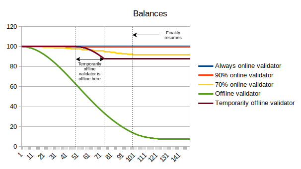

# Ethereum 2.0 Altair Beacon chain changes

This is an annotated version of the Altair beacon chain spec. 

_See also: the [annotated sync protocol spec](./sync-protocol.md)._

## Table of contents

<!-- TOC -->
<!-- START doctoc generated TOC please keep comment here to allow auto update -->
<!-- DON'T EDIT THIS SECTION, INSTEAD RE-RUN doctoc TO UPDATE -->

- [Introduction](#introduction)
- [Custom types](#custom-types)
- [Constants](#constants)
  - [Participation flag indices](#participation-flag-indices)
  - [Incentivization weights](#incentivization-weights)
  - [Misc](#misc)
- [Configuration](#configuration)
  - [Updated penalty values](#updated-penalty-values)
  - [Sync committee](#sync-committee)
  - [Misc](#misc-1)
  - [Domain types](#domain-types)
- [Containers](#containers)
  - [Modified containers](#modified-containers)
    - [`BeaconBlockBody`](#beaconblockbody)
    - [`BeaconState`](#beaconstate)
  - [New containers](#new-containers)
    - [`SyncAggregate`](#syncaggregate)
    - [`SyncCommittee`](#synccommittee)
- [Helper functions](#helper-functions)
  - [`Predicates`](#predicates)
    - [`eth2_fast_aggregate_verify`](#eth2_fast_aggregate_verify)
  - [Misc](#misc-2)
    - [`add_flag`](#add_flag)
    - [`has_flag`](#has_flag)
  - [Beacon state accessors](#beacon-state-accessors)
    - [`get_next_sync_committee_indices`](#get_next_sync_committee_indices)
    - [`get_next_sync_committee`](#get_next_sync_committee)
    - [`get_base_reward_per_increment`](#get_base_reward_per_increment)
    - [`get_base_reward`](#get_base_reward)
    - [`get_unslashed_participating_indices`](#get_unslashed_participating_indices)
    - [`get_attestation_participation_flag_indices`](#get_attestation_participation_flag_indices)
    - [`get_flag_index_deltas`](#get_flag_index_deltas)
    - [Modified `get_inactivity_penalty_deltas`](#modified-get_inactivity_penalty_deltas)
  - [Beacon state mutators](#beacon-state-mutators)
    - [Modified `slash_validator`](#modified-slash_validator)
  - [Block processing](#block-processing)
    - [Modified `process_attestation`](#modified-process_attestation)
    - [Modified `process_deposit`](#modified-process_deposit)
    - [Sync committee processing](#sync-committee-processing)
  - [Epoch processing](#epoch-processing)
    - [Justification and finalization](#justification-and-finalization)
    - [Inactivity scores](#inactivity-scores)
    - [Rewards and penalties](#rewards-and-penalties)
    - [Slashings](#slashings)
    - [Participation flags updates](#participation-flags-updates)
    - [Sync committee updates](#sync-committee-updates)
- [Initialize state for pure Altair testnets and test vectors](#initialize-state-for-pure-altair-testnets-and-test-vectors)

<!-- END doctoc generated TOC please keep comment here to allow auto update -->
<!-- /TOC -->

## Introduction

Altair is the first hard fork of the Ethereum beacon chain. Its main features are:

* "**Sync committees**", which allow light clients to easily sync up with the header chain with very low computational and data cost. The goal is to make a light client easy and efficient enough that it can be run inside any environment (mobile device, embedded hardware, browser extension, and even inside another smart-contract-capable blockchain)
* **Incentive accounting reforms**. This includes a few changes:
    * Storing actions that were taken during the current and previous epoch in a more efficient bitfield format instead of storing `PendingAttestation` objects, reducing spec complexity
    * Making the "inactivity leak" quadratic _per validator_ instead of quadratic globally, and in particular make it insignificant for validators that are participating >80% of the time. For example, pre-Altair, if a chain stops finalizing for 2 eeks, fully inactive validators lose ~11.8% of their balance and validators active 75% of the time lose ~3.1%. Post-Altair, the fully inactive validator's loss would be ~15.4% but the 75% active validator's loss would only be ~0.3%. This makes inactivity leaks more forgiving to honest-but-imperfect validators.
    * Bug fixes to reward accounting (eg. giving proposers a ~1/8 share of _all_ rewards instead of just a ~1/8 share of one small piece of rewards, and ensuring that the rewards under perfect performance actually do add up to the full base reward)
* **Penalty parameter updates**, making both inactivity leaks and slashing somewhat more punitive than pre-Altair, though still less punitive than their eventually-intended values.

### Aside: validator duties, rewards and penalties

One of the main conceptual reworks of Altair is redesigning how validators are rewarded and penalized to make these incentives more systematic and easy to reason about. Validators are rewarded for fulfilling **duties** - tasks that they are assigned as part of the job of being a validator. These duties come in two types:

* **Attestation duties**: duties to make an attestation in every epoch that gets included quickly and attests to the correct chain
* **Non-attestation duties**: tasks that are not connected to attesting and that any individual validator gets assigned to more rarely.

In Altair, the complete list of duties is:

* **`TIMELY_HEAD`**: submit an attestation that correctly identifies the head of the chain, and gets included on chain in the next slot
* **`TIMELY_TARGET`**: submit an attestation that correctly identifies the Casper FFG target, and gets included within `EPOCH_LENGTH` slots
* **`TIMELY_SOURCE`**: submit an attestation that correctly identifies the Casper FFG source, and gets included within `sqrt(EPOCH_LENGTH)` slots
* **Sync committee participation**: if you are part of a sync committee, submit the sync committee signature
* **Proposing**: propose a block if you are assigned to do so

The total theoretical long-run average reward per epoch that a validator can get is determined by the [`get_base_reward`](#get_base_reward) function. Note that this is the maximum long-run average, _not_ the maximum reward in any given epoch. In particular, rewards for submitting sync committee signatures and for proposing are typically much larger than the base reward, but any given validator only gets those rewards during the very infrequent epochs during which they are assigned to those tasks.

The base reward is split up into pieces where each piece is allocated to one of these duties:


Each piece is represented as a fraction `X / WEIGHT_DENOMINATOR`, where `WEIGHT_DENOMINATOR = 64`; the `X` values for the various pieces sum up to 64, making up a full base reward.

Note that if a duty is assigned a `X / WEIGHT_DENOMINATOR` share of the pie, that does not necessarily mean that a validator who fulfills that duty is guaranteed to get exactly that fraction times the base reward. Actually experienced rewards can diverge from the `X / WEIGHT_DENOMINATOR` fraction for a few reasons:

1. The validator fulfills that duty imperfectly, and it's their fault (eg. they are offline for some time)
2. The validator fulfills that duty imperfectly, and it's _not_ their fault (eg. they cannot get their attestation or sync committee signature included within a slot because the _next_ proposer is offline or poorly connected)
3. Validator rewards for fulfilling an attestation duty are proportional to the percentage of all validators who fulfill that duty (eg. if only 80% of validators fulfill the duty then the reward for each validator that does is multiplied by `0.8`)
4. Validators' rewards from probabilistically assigned duties (proposal and sync committee participation) may diverge due to random variance. For example, if there are 1000 validators, then they have a `1/1000` chance to propose per slot (so on average `0.032` proposals per epoch)

(2) and (3) have the same property: that a validator's rewards can be reduced by other validators' failure to participate. This is a deliberate mechanic that was added to discourage censorship and inter-validator attacks (see [this paper on discouragement attacks](https://raw.githubusercontent.com/ethereum/research/master/papers/discouragement/discouragement.pdf) for why this is valuable).

There is one reward that falls outside this scheme: slashing whistleblower rewards. These rewards are treated separately because they are irregular (we don't know ahead of time how many slashings there will be), and they don't contribute to issuance (because the slashing whistleblower reward is counterbalanced by a much larger slashing penalty suffered by whoever was slashed).

## Custom types

| Name | SSZ equivalent | Description |
| - | - | - |
| `ParticipationFlags` | `uint8` | a succinct representation of 8 boolean participation flags |

We will maintain a byte array to store which actions a validator has successfully taken during a given epoch, so that we can calculate finality and other global statistics and reward or penalize validators at the end of the epoch. Each validator gets 8 bits: 3 for each of their [**attestation duties**](#aside-validator-duties-rewards-and-penalties), and 5 not-yet-used bits for duties that may be added in the future.

## Constants

### Participation flag indices

| Name | Value |
| - | - |
| `TIMELY_HEAD_FLAG_INDEX` | `0` |
| `TIMELY_SOURCE_FLAG_INDEX` | `1` |
| `TIMELY_TARGET_FLAG_INDEX` | `2` |

These are the positions in the `ParticipationFlags` bitfield at which we track whether or not each validator fulfilled that particular duty in the current and previous epoch.

### Incentivization weights

| Name | Value |
| - | - |
| `TIMELY_HEAD_WEIGHT` | `uint64(14)` |
| `TIMELY_SOURCE_WEIGHT` | `uint64(14)` |
| `TIMELY_TARGET_WEIGHT` | `uint64(26)` |
| `SYNC_REWARD_WEIGHT` | `uint64(2)` |
| `PROPOSER_WEIGHT` | `uint64(8)` |
| `WEIGHT_DENOMINATOR` | `uint64(64)` |

Reward weights for each duty (see [here](#aside-validator-duties-rewards-and-penalties) for a more detailed description of this concept).

### Aside: what is the break-even uptime?

Assume there are two kinds of validators, (i) fully functioning online validators, and (ii) offline validators, with portion `p` fully functioning and online. Then, a fully functioning online validator's reward will be roughly `B * (50/64 * p + 14/64 * p**2)`, where `B` is the max possible reward. This can be analyzed as follows.

First, consider the `56/64` attestation rewards and ignore the `8/64` proposer rewards. All of these rewards get multiplied by `p` because of the collective reward mechanism (see [this section](https://github.com/ethereum/annotated-spec/blob/master/phase0/beacon-chain.md#helpers) for the reasoning behind collective rewards). However, the `14/64` of that corresponding to the `TIMELY_HEAD_WEIGHT` gets multiplied by `p` again because you can only get timely head rewards if they are included in the next block, so if after you attest the next proposer is missing you cannot get those rewards (fortunately, the timely head duty is [exempt from penalties](https://github.com/ethereum/consensus-specs/blob/dev/specs/altair/beacon-chain.md#get_flag_index_deltas). Hence, so far we have `42/64 * p + 14/64 * p**2`.

Now, we add proposer rewards. Proposer rewards are a fraction of the rewards of the attestations you are including. In this case, because you are the proposer, we don't need to worry about the possibility of missing proposers, and so you're just getting all revenue multiplied by `p`. So adding proposer rewards, we're up to `50/64 * p + 14/64 * p**2`.

If you are offline, then your rewards are roughly `-42/64 * B` (failing a timely head duty or a proposer duty [does not trigger] a penalty), unless `p < 2/3` in which case you quickly lose much more because of an inactivity leak.

If you are offline with probability `q`, then your rewards are `B * [(50/64 * p + 14/64 * p**2) * q - 42/64 * (1-q)]`, which simplifies to `B * [(42/64 + 50/64 * p + 14/64 * p**2) * q - 42/64]`. If `p` and `q` are both close to 1, then this simplifies to `B * (1 - 106/64 * (1-q) - 78/64 * (1-p))`. Hence, if _all_ other nodes are online, the uptime at which you break even is `42/106` (~39.6%). The break-even uptime for _the whole network_ (so, the minimum profitable uptime if you assume that _all_ nodes have that uptime, ie. `p = q`) is 2/3 (because at `p = 2/3` the reward is ~B * 0.2 and at `p < 2/3` the inactivity leak starts).

### Misc

| Name | Value |
| - | - |
| `G2_POINT_AT_INFINITY` | `BLSSignature(b'\xc0' + b'\x00' * 95)` |
| `PARTICIPATION_FLAG_WEIGHTS` | `[TIMELY_SOURCE_WEIGHT, TIMELY_TARGET_WEIGHT, TIMELY_HEAD_FLAG_INDEX]` |

## Configuration

### Updated penalty values

This patch updates a few configuration values to move penalty parameters closer to their final, maximum security values.

*Note*: The spec does *not* override previous configuration values but instead creates new values and replaces usage throughout.

| Name | Value |
| - | - |
| `INACTIVITY_PENALTY_QUOTIENT_ALTAIR` | `uint64(3 * 2**24)` (= 50,331,648) |
| `MIN_SLASHING_PENALTY_QUOTIENT_ALTAIR` | `uint64(2**6)` (= 64) |
| `PROPORTIONAL_SLASHING_MULTIPLIER_ALTAIR` | `uint64(2)` |

* The inactivity penalty quotient is reduced by 25% from `2**26` to `3 * 2**24`. This should reduce the time that it takes for balances to leak by ~13.4% (as time-to-leak is proportional to the _square root_ of this quotient).
* The minimum slashing penalty quotient is decreased from 128 to 64. This quotient is the minimum fraction of your total balance that a slashed validator will lose, so this change increases the minimum slashing penalty from 0.25 ETH to 0.5 ETH
* The proportional slashing multiplier is increased from 1 to 2, meaning that the slashing penalty will now be _double_ the percentage of other validators that were slashed within 18 days of that validator. For example, if you are slashed and within 18 days [in both directions] 7% of other validators are also slashed, pre-Altair your slashing penalty would have been 7%, post-Altair it would be 14%.

### Misc

**See [the sync protocol spec](./sync-protocol.md) for a description of what sync committees are and how the light client sync protocol works.**

| Name | Value |
| - | - |
| `SYNC_COMMITTEE_SIZE` | `uint64(2**9)` (= 512) |
| `EPOCHS_PER_SYNC_COMMITTEE_PERIOD` | `Epoch(2**8)` (= 256) | epochs | ~27 hours |

The sync committee is set to 512 validators, a relatively large and conservative size (compared to attestation and later shard proposal committees) to ensure safety. A sync committee is chosen once every ~1 day. Shorter periods would increase data load on light clients as they would need to sync more frequently, and longer periods would leave open too much opportunity to discover and corrupt committee members; ~1 day was chosen as the happy medium that fares reasonably well on both dimensions.

### Misc

| Name | Value |
| - | - |
| `INACTIVITY_SCORE_BIAS` | `uint64(4)` |
| `INACTIVITY_SCORE_RECOVERY RATE` | `uint64(16)` |

See [the later section on inactivity penalty calculation](#modified-get_inactivity_penalty_deltas) for details on inactivity scores.

### Domain types

| Name | Value |
| - | - |
| `DOMAIN_SYNC_COMMITTEE` | `DomainType('0x07000000')` |
| `DOMAIN_SYNC_COMMITTEE_SELECTION_PROOF` | `DomainType('0x08000000')` |
| `DOMAIN_CONTRIBUTION_AND_PROOF` | `DomainType('0x09000000')` |

## Containers

### Modified containers

#### `BeaconBlockBody`

```python
class BeaconBlockBody(Container):
    randao_reveal: BLSSignature
    eth1_data: Eth1Data  # Eth1 data vote
    graffiti: Bytes32  # Arbitrary data
    # Operations
    proposer_slashings: List[ProposerSlashing, MAX_PROPOSER_SLASHINGS]
    attester_slashings: List[AttesterSlashing, MAX_ATTESTER_SLASHINGS]
    attestations: List[Attestation, MAX_ATTESTATIONS]
    deposits: List[Deposit, MAX_DEPOSITS]
    voluntary_exits: List[SignedVoluntaryExit, MAX_VOLUNTARY_EXITS]
    # [New in Altair]
    sync_aggregate: SyncAggregate
```

The beacon block body now contains a [`SyncAggregate` object](#syncaggregate), which is a fairly standard BLS aggregate signature (a BLS signature plus a bitfield of who participated) signed by the sync committee. Note that the `SyncAggregate` would also be separately broadcasted over the wire for light clients; it's included on-chain only so that validators who contributed to the signature can be rewarded.

#### `BeaconState`

```python
class BeaconState(Container):
    # Versioning
    genesis_time: uint64
    genesis_validators_root: Root
    slot: Slot
    fork: Fork
    # History
    latest_block_header: BeaconBlockHeader
    block_roots: Vector[Root, SLOTS_PER_HISTORICAL_ROOT]
    state_roots: Vector[Root, SLOTS_PER_HISTORICAL_ROOT]
    historical_roots: List[Root, HISTORICAL_ROOTS_LIMIT]
    # Eth1
    eth1_data: Eth1Data
    eth1_data_votes: List[Eth1Data, EPOCHS_PER_ETH1_VOTING_PERIOD * SLOTS_PER_EPOCH]
    eth1_deposit_index: uint64
    # Registry
    validators: List[Validator, VALIDATOR_REGISTRY_LIMIT]
    balances: List[Gwei, VALIDATOR_REGISTRY_LIMIT]
    # Randomness
    randao_mixes: Vector[Bytes32, EPOCHS_PER_HISTORICAL_VECTOR]
    # Slashings
    slashings: Vector[Gwei, EPOCHS_PER_SLASHINGS_VECTOR]  # Per-epoch sums of slashed effective balances
    # Participation
    previous_epoch_participation: List[ParticipationFlags, VALIDATOR_REGISTRY_LIMIT]  # [Modified in Altair]
    current_epoch_participation: List[ParticipationFlags, VALIDATOR_REGISTRY_LIMIT]  # [Modified in Altair]
    # Finality
    justification_bits: Bitvector[JUSTIFICATION_BITS_LENGTH]  # Bit set for every recent justified epoch
    previous_justified_checkpoint: Checkpoint
    current_justified_checkpoint: Checkpoint
    finalized_checkpoint: Checkpoint
    # Inactivity
    inactivity_scores: List[uint64, VALIDATOR_REGISTRY_LIMIT]  # [New in Altair]
    # Sync
    current_sync_committee: SyncCommittee  # [New in Altair]
    next_sync_committee: SyncCommittee  # [New in Altair]
```

The beacon state commits to the current sync committee and the next sync committee so that light clients that have accepted a block header can easily authenticate the sync committee for the next period. Without this feature, it would be difficult to do so, as it would require a computation on the entire validator set to determine the active validator list, and even after that point require a Merkle branch for each committee member. See [the sync protocol doc](./sync-protocol.md) for more details.

### New containers

#### `SyncAggregate`

```python
class SyncAggregate(Container):
    sync_committee_bits: Bitvector[SYNC_COMMITTEE_SIZE]
    sync_committee_signature: BLSSignature
```

#### `SyncCommittee`

```python
class SyncCommittee(Container):
    pubkeys: Vector[BLSPubkey, SYNC_COMMITTEE_SIZE]
    aggregate_pubkey: BLSPubkey
```

We store not just each individual pubkey, but also the sum of all the pubkeys. This is done so that when sync committees have a very high level of participation, few elliptic curve additions are required to verify the signature: you can just start with the sum and _subtract out_ all the pubkeys that did not participate.

## Helper functions

### `Predicates`

#### `eth2_fast_aggregate_verify`

```python
def eth2_fast_aggregate_verify(pubkeys: Sequence[BLSPubkey], message: Bytes32, signature: BLSSignature) -> bool:
    """
    Wrapper to ``bls.FastAggregateVerify`` accepting the ``G2_POINT_AT_INFINITY`` signature when ``pubkeys`` is empty.
    """
    if len(pubkeys) == 0 and signature == G2_POINT_AT_INFINITY:
        return True
    return bls.FastAggregateVerify(pubkeys, message, signature)
```

There are a few minor discrepancies between how the IETF BLS signature standard handles signatures and the needs of the eth2 protocol; to deal with this, in a few cases we need to wrap the IETF standard to replace its behavior with our own preferred behavior. Here, the important case is that multi-verification in the IETF standard does not support the empty signature as a valid signature for an empty aggregate, but in our use cases it's critically important to be able to support the empty case (in case no sync committee members at all get their signatures included).

### Misc

#### `add_flag`

```python
def add_flag(flags: ParticipationFlags, flag_index: int) -> ParticipationFlags:
    """
    Return a new ``ParticipationFlags`` adding ``flag_index`` to ``flags``.
    """
    flag = ParticipationFlags(2**flag_index)
    return flags | flag
```

#### `has_flag`

```python
def has_flag(flags: ParticipationFlags, flag_index: int) -> bool:
    """
    Return whether ``flags`` has ``flag_index`` set.
    """
    flag = ParticipationFlags(2**flag_index)
    return flags & flag == flag
```

### Beacon state accessors

#### `get_sync_committee_indices`

```python
def get_next_sync_committee_indices(state: BeaconState) -> Sequence[ValidatorIndex]:
    """
    Return the sequence of sync committee indices (which may include duplicate indices)
    for the next sync committee, given a ``state`` at a sync committee period boundary.

    Note: Committee can contain duplicate indices for small validator sets (< SYNC_COMMITTEE_SIZE + 128)
    """
    epoch = Epoch(get_current_epoch(state) + 1)

    MAX_RANDOM_BYTE = 2**8 - 1
    active_validator_indices = get_active_validator_indices(state, epoch)
    active_validator_count = uint64(len(active_validator_indices))
    seed = get_seed(state, epoch, DOMAIN_SYNC_COMMITTEE)
    i = 0
    sync_committee_indices: List[ValidatorIndex] = []
    while len(sync_committee_indices) < SYNC_COMMITTEE_SIZE:
        shuffled_index = compute_shuffled_index(uint64(i % active_validator_count), active_validator_count, seed)
        candidate_index = active_validator_indices[shuffled_index]
        random_byte = hash(seed + uint_to_bytes(uint64(i // 32)))[i % 32]
        effective_balance = state.validators[candidate_index].effective_balance
        if effective_balance * MAX_RANDOM_BYTE >= MAX_EFFECTIVE_BALANCE * random_byte:
            sync_committee_indices.append(candidate_index)
        i += 1
    return sync_committee_indices
```

This is the core function that computes the sync committee that will be active in the epoch _after_ the current epoch. **Note that this function should ONLY be called _once_, when sync committees are updated; actually reading the sync committee for all other purposes is done with the logic in [the sync committee processing method](#sync-committee-processing)**. This function works as follows:

* Compute the active validator indices at the next epoch.
* Walk through the shuffled indices based on the seed at the next epoch (that is, go through `compute_shuffled_index(0)`, `compute_shuffled_index(1)`, etc.). For each index, accept that validator with probability `B/32` where `B` is their effective balance.

Note that the probability of being accepted is proportional to your balance. Because of this, there is no need for participation rewards to be proportional to balance, and there is also no need for the light client fork choice rule to care about the balances of sync committee members. Additionally, note that the sync committee is always filled to its maximum size. If the validator count is too low to fill the sync committee with a single pass, this algorithm wraps around and walks through the shuffled validator set multiple times. If needed, the same validator may even be accepted multiple times into the sync committee.

#### `get_next_sync_committee`

```python
def get_next_sync_committee(state: BeaconState) -> SyncCommittee:
    """
    Return the *next* sync committee for a given ``state``.

    ``SyncCommittee`` contains an aggregate pubkey that enables
    resource-constrained clients to save some computation when verifying
    the sync committee's signature.

    ``SyncCommittee`` can also contain duplicate pubkeys, when ``get_next_sync_committee_indices``
    returns duplicate indices. Implementations must take care when handling
    optimizations relating to aggregation and verification in the presence of duplicates.

    Note: This function should only be called at sync committee period boundaries by ``process_sync_committee_updates``
    as ``get_next_sync_committee_indices`` is not stable within a given period.
    """
    indices = get_next_sync_committee_indices(state)
    pubkeys = [state.validators[index].pubkey for index in indices]
    aggregate_pubkey = bls.AggregatePKs(pubkeys)
    return SyncCommittee(pubkeys=pubkeys, aggregate_pubkey=aggregate_pubkey)
```

This function computes a `SyncCommittee` object, which is an SSZ representation of the public keys contained in a sync committee. It contains the pubkey of each member of the sync committee, plus an aggregate (the sum of all the pubkeys) to make signature verification easier in that case where almost everyone participates in a sync committee signature and so you only need to subtract out a few non-participants to generate the group public key.

#### `get_base_reward_per_increment`

```python
def get_base_reward_per_increment(state: BeaconState) -> Gwei:
    return Gwei(EFFECTIVE_BALANCE_INCREMENT * BASE_REWARD_FACTOR // integer_squareroot(get_total_active_balance(state)))
```

The `get_base_reward` function is being re-factored for Altair to make it cleaner. The key changes are:

1. Split up the logic into `get_base_reward_per_increment`, a function that outputs the reward for a hypothetical 1 ETH validator, and a simplified `get_base_reward` that just multiplies the base-reward-per-increment by the amount of ETH in the validator's effective balance. This was done because sync committee reward logic needs to use `get_base_reward_per_increment` as a standalone function.
2. The output of `get_base_reward` now represents the _entire_ theoretical maximum expected long-term reward, and not merely one component of it as before. This was done to make it easier to reason about validator rewards.

#### `get_base_reward`

*Note*: The function `get_base_reward` is modified with the removal of `BASE_REWARDS_PER_EPOCH` and the use of increment based accounting.

```python
def get_base_reward(state: BeaconState, index: ValidatorIndex) -> Gwei:
    """
    Return the base reward for the validator defined by ``index`` with respect to the current ``state``.

    Note: A validator can optimally earn one base reward per epoch over a long time horizon.
    This takes into account both per-epoch (e.g. attestation) and intermittent duties (e.g. block proposal
    and sync committees).
    """
    increments = state.validators[index].effective_balance // EFFECTIVE_BALANCE_INCREMENT
    return Gwei(increments * get_base_reward_per_increment(state))
```

#### `get_unslashed_participating_indices`

```python
def get_unslashed_participating_indices(state: BeaconState, flag_index: int, epoch: Epoch) -> Set[ValidatorIndex]:
    """
    Return the set of validator indices that are both active and unslashed for the given ``flag_index`` and ``epoch``.
    """
    assert epoch in (get_previous_epoch(state), get_current_epoch(state))
    if epoch == get_current_epoch(state):
        epoch_participation = state.current_epoch_participation
    else:
        epoch_participation = state.previous_epoch_participation
    active_validator_indices = get_active_validator_indices(state, epoch)
    participating_indices = [i for i in active_validator_indices if has_flag(epoch_participation[i], flag_index)]
    return set(filter(lambda index: not state.validators[index].slashed, participating_indices))
```

A major feature of Altair is reforming how we keep track of which validators fulfilled which duties during an epoch so we can reward them and compute finality.

There are many subtle considerations in doing this correctly. The easiest approach to solve this problem that a naive observer might think of is to simply give validators their reward and track progress toward finality directly in the state. However, this suffers from three key problems:

1. It does not prevent validators from getting their attestations included twice (preventing that would require some kind of bitfield _anyway_)
2. It does not have an easy path to allow rewards to be proportional to total participation levels (a feature that we want to keep to discourage censorship and inter-validator attacks)
3. It would require random-access updates to validator balances, which are expensive. A random-access update requires re-computing a Merkle branch, or up to 22 hashes per validator per epoch. Updating balances at the end of an epoch in a batch, on the other hand, simply re-computes the entire balance tree, costing ~1/4 hashes per validator per epoch (each balance is 8 bytes, a chunk is 32 bytes, an N-chunk Merkle tree requires N-1 hashes to recompute)

The pre-Altair approach to solve these problems was to avoid doing any attestation processing (except signature verification) immediately and instead store `PendingAttestation` objects, keeping the important data in the attestations received during an epoch in the state (and adding information about when they were received to keep track of timeliness). These `PendingAttestation` objects would be processed all at once at the end of the epoch.

The Altair approach is more efficient: it stores a bitfield (1 byte per active validator) and updates the bitfield immediately when a validator fulfills a duty. We avoid the issues with random-access updates that would arise if we had immediately updated _balances_ because in the Altair approach the bitfield is stored _in shuffled order_. That is, the `ParticipationFlags` of the validators in the same committee are stored beside each other. This ensures the real-time cost of updating this bitfield is only ~1/32 hashes per validator (slightly more if there are two attestations for the same committee, but never too much more).

#### `get_attestation_participation_flag_indices`

```python
def get_attestation_participation_flag_indices(state: BeaconState,
                                               data: AttestationData,
                                               inclusion_delay: uint64) -> Sequence[int]:
    """
    Return the flag indices that are satisfied by an attestation.
    """
    if data.target.epoch == get_current_epoch(state):
        justified_checkpoint = state.current_justified_checkpoint
    else:
        justified_checkpoint = state.previous_justified_checkpoint

    # Matching roots
    is_matching_source = data.source == justified_checkpoint
    is_matching_target = is_matching_source and data.target.root == get_block_root(state, data.target.epoch)
    is_matching_head = is_matching_target and data.beacon_block_root == get_block_root_at_slot(state, data.slot)
    assert is_matching_source

    participation_flag_indices = []
    if is_matching_source and inclusion_delay <= integer_squareroot(SLOTS_PER_EPOCH):
        participation_flag_indices.append(TIMELY_SOURCE_FLAG_INDEX)
    if is_matching_target and inclusion_delay <= SLOTS_PER_EPOCH:
        participation_flag_indices.append(TIMELY_TARGET_FLAG_INDEX)
    if is_matching_head and inclusion_delay == MIN_ATTESTATION_INCLUSION_DELAY:
        participation_flag_indices.append(TIMELY_HEAD_FLAG_INDEX)

    return participation_flag_indices
```

This function determines which subset of duties an attestation has satisfied.

#### `get_flag_index_deltas`

```python
def get_flag_index_deltas(state: BeaconState, flag_index: int, weight: uint64) -> Tuple[Sequence[Gwei], Sequence[Gwei]]:
    """
    Return the deltas for a given ``flag_index`` scaled by ``weight`` by scanning through the participation flags.
    """
    rewards = [Gwei(0)] * len(state.validators)
    penalties = [Gwei(0)] * len(state.validators)
    unslashed_participating_indices = get_unslashed_participating_indices(state, flag_index, get_previous_epoch(state))
    increment = EFFECTIVE_BALANCE_INCREMENT  # Factored out from balances to avoid uint64 overflow
    unslashed_participating_increments = get_total_balance(state, unslashed_participating_indices) // increment
    active_increments = get_total_active_balance(state) // increment
    for index in get_eligible_validator_indices(state):
        base_reward = get_base_reward(state, index)
        if index in unslashed_participating_indices:
            if is_in_inactivity_leak(state):
                # This flag reward cancels the inactivity penalty corresponding to the flag index
                rewards[index] += Gwei(base_reward * weight // WEIGHT_DENOMINATOR)
            else:
                reward_numerator = base_reward * weight * unslashed_participating_increments
                rewards[index] += Gwei(reward_numerator // (active_increments * WEIGHT_DENOMINATOR))
        else:
            penalties[index] += Gwei(base_reward * weight // WEIGHT_DENOMINATOR)
    return rewards, penalties
```

This function computes the rewards and penalties for fulfilling (or failing to fulfill) a particular duty. The fundamental structure is identical to pre-Altair rewards: if `X` is the maximum reward for fulfilling a duty and `p` is the portion of validators that fulfilled it, then fulfilling the duty gets you a reward of `p * X` and failing to fulfill it gets you a penalty of `X`. If an inactivity leak is active, the reward drops to `0` (ie. the benefit for fulfilling the duty during a leak is _only_ the ability to avoid penalties).

The main change from pre-Altair is the `weight // WEIGHT_DENOMINATOR` factor, reflecting that the `base_reward` now refers to the maximum _total_ reward and not the maximum _per-duty_ reward as it did pre-Altair (notice that this new structure also gives us more flexibility to assign different rewards to different duties).

#### Modified `get_inactivity_penalty_deltas`

*Note*: The function `get_inactivity_penalty_deltas` is modified in the selection of matching target indices
and the removal of `BASE_REWARDS_PER_EPOCH`.

```python
def get_inactivity_penalty_deltas(state: BeaconState) -> Tuple[Sequence[Gwei], Sequence[Gwei]]:
    """
    Return the inactivity penalty deltas by considering timely target participation flags and inactivity scores.
    """
    rewards = [Gwei(0) for _ in range(len(state.validators))]
    penalties = [Gwei(0) for _ in range(len(state.validators))]
    if is_in_inactivity_leak(state):
        previous_epoch = get_previous_epoch(state)
        matching_target_indices = get_unslashed_participating_indices(state, TIMELY_TARGET_FLAG_INDEX, previous_epoch)
        for index in get_eligible_validator_indices(state):
            for (_, weight) in get_flag_indices_and_weights():
                # This inactivity penalty cancels the flag reward corresponding to the flag index
                penalties[index] += Gwei(get_base_reward(state, index) * weight // WEIGHT_DENOMINATOR)
            if index not in matching_target_indices:
                penalty_numerator = state.validators[index].effective_balance * state.inactivity_scores[index]
                penalty_denominator = INACTIVITY_SCORE_BIAS * INACTIVITY_PENALTY_QUOTIENT_ALTAIR
                penalties[index] += Gwei(penalty_numerator // penalty_denominator)
    return rewards, penalties
```

The way that the inactivity leak works in Altair has been significantly reformed. The most significant reform is that pre-Altair the inactivity leak for a validator in a given epoch was proportional to a _global_ variable equal to the number of epochs since the last time the chain finalized, whereas post-Altair the inactivity leak in a given epoch is proportional to a _per-validator_ variable called the _inactivity score_.

For _fully inactive_ validators, the effect is the same: during each epoch that a validator is inactive and the chain fails to finalize, the inactivity score increases by a fixed number, and so the _total_ loss after `N` epochs is proportional to the area-under-the-triangle `N**2/2`. For _perfectly active_ validators, the effect again is the same: both pre-Altair and post-Altair, validators that fulfill their duties perfectly suffer no losses.

The difference is for _imperfectly active validators_. The inactivity score's behavior is specified by [this function](#inactivity-scores):

* If a validator fails to submit an attestation with the correct source and target, their inactivity score goes up by 4. If they successfully submit an attestation with the correct source and target, their inactivity score drops by 1
* If the chain has recently finalized, each validator's score drops by 16.

If a validator participates correctly more than 80% of the time, their inactivity score and penalties will remain very close to zero. Validators that miss more than 20% of epochs will see their inactivity scores rise, though the penalties will be _far_ smaller for validators that miss ~20-40% og epochs than for validators that miss all of their epochs. Note that the leak now continues for a short time after the chain resumes finalizing, reducing the chance that the chain gets stuck hovering around the 2/3 level and frequently switching between finalizing and non-finalizing modes.

Here is an example of a serious leak, with five validators showing different behavior: (i) always online, (ii) consistently online 90% of the time, (iii) consistently online 70% of the time, (iv) temporarily offline for a short period, and (v) offline the whole time:

<center>

<br>

<br>
</center>

Notice that the fully offline validator suffers _far higher_ losses than the others. The 90%-online validator's losses are tiny and barely visible on the graph: you can see the red line slightly below the blue line on the graph if you peek carefully. After the chain resumes finalizing, the 70%-online validator leaks for a little bit more (also barely noticeable on the graph) but their inactivity score quickly drops to zero; the fully offline validator, on the other hand, leaks considerably more even after the chain resumes finalizing.

### Beacon state mutators

#### Modified `slash_validator`

*Note*: The function `slash_validator` is modified to use `MIN_SLASHING_PENALTY_QUOTIENT_ALTAIR` and use `PROPOSER_WEIGHT` when calculating the proposer reward.

```python
def slash_validator(state: BeaconState,
                    slashed_index: ValidatorIndex,
                    whistleblower_index: ValidatorIndex=None) -> None:
    """
    Slash the validator with index ``slashed_index``.
    """
    epoch = get_current_epoch(state)
    initiate_validator_exit(state, slashed_index)
    validator = state.validators[slashed_index]
    validator.slashed = True
    validator.withdrawable_epoch = max(validator.withdrawable_epoch, Epoch(epoch + EPOCHS_PER_SLASHINGS_VECTOR))
    state.slashings[epoch % EPOCHS_PER_SLASHINGS_VECTOR] += validator.effective_balance
    decrease_balance(state, slashed_index, validator.effective_balance // MIN_SLASHING_PENALTY_QUOTIENT_ALTAIR)

    # Apply proposer and whistleblower rewards
    proposer_index = get_beacon_proposer_index(state)
    if whistleblower_index is None:
        whistleblower_index = proposer_index
    whistleblower_reward = Gwei(validator.effective_balance // WHISTLEBLOWER_REWARD_QUOTIENT)
    proposer_reward = Gwei(whistleblower_reward * PROPOSER_WEIGHT // WEIGHT_DENOMINATOR)
    increase_balance(state, proposer_index, proposer_reward)
    increase_balance(state, whistleblower_index, Gwei(whistleblower_reward - proposer_reward))
```

### Block processing

```python
def process_block(state: BeaconState, block: BeaconBlock) -> None:
    process_block_header(state, block)
    process_randao(state, block.body)
    process_eth1_data(state, block.body)
    process_operations(state, block.body)  # [Modified in Altair]
    process_sync_aggregate(state, block.body.sync_aggregate)  # [New in Altair]
```

#### Modified `process_attestation`

*Note*: The function `process_attestation` is modified to do incentive accounting with epoch participation flags.

```python
def process_attestation(state: BeaconState, attestation: Attestation) -> None:
    data = attestation.data
    assert data.target.epoch in (get_previous_epoch(state), get_current_epoch(state))
    assert data.target.epoch == compute_epoch_at_slot(data.slot)
    assert data.slot + MIN_ATTESTATION_INCLUSION_DELAY <= state.slot <= data.slot + SLOTS_PER_EPOCH
    assert data.index < get_committee_count_per_slot(state, data.target.epoch)

    committee = get_beacon_committee(state, data.slot, data.index)
    assert len(attestation.aggregation_bits) == len(committee)

    # Participation flag indices
    participation_flag_indices = get_attestation_participation_flag_indices(state, data, state.slot - data.slot)

    # Verify signature
    assert is_valid_indexed_attestation(state, get_indexed_attestation(state, attestation))

    # Update epoch participation flags
    if data.target.epoch == get_current_epoch(state):
        epoch_participation = state.current_epoch_participation
    else:
        epoch_participation = state.previous_epoch_participation

    proposer_reward_numerator = 0
    for index in get_attesting_indices(state, data, attestation.aggregation_bits):
        for flag_index, weight in enumerate(PARTICIPATION_FLAG_WEIGHTS):
            if flag_index in participation_flag_indices and not has_flag(epoch_participation[index], flag_index):
                epoch_participation[index] = add_flag(epoch_participation[index], flag_index)
                proposer_reward_numerator += get_base_reward(state, index) * weight

    # Reward proposer
    proposer_reward_denominator = (WEIGHT_DENOMINATOR - PROPOSER_WEIGHT) * WEIGHT_DENOMINATOR // PROPOSER_WEIGHT
    proposer_reward = Gwei(proposer_reward_numerator // proposer_reward_denominator)
    increase_balance(state, get_beacon_proposer_index(state), proposer_reward)
```

The main difference between this code and pre-Altair code is that here we replace the pre-Altair `PendingAttestation` logic with the much cleaner `ParticipationFlags` logic.

#### Aside: proposer rewards in Altair

Note also some new special logic for the proposer rewards: the proposer reward for a duty is the attester reward for that duty, multiplied by the _proposer reward as a fraction of everything but the proposer reward_.

The mathematical reasoning here is subtle. Here is the chart for how rewards are allocated in Altair (not including whistleblower-related rewards as those fall outside the base reward schema). All rewards add up to a theoretical max of a full `base_reward`. `7/8` of the chart is allocated to non-proposal duties. The remaining `1/8` is allocated to proposer rewards, and is split up proportionately to the rewards for the thing that the proposer is including.


For example, we can focus on the `TIMELY_HEAD` duty. If you as a validator make an attestation to the correct head, and get it included in the next slot, you get the `TIMELY_HEAD` reward: `12/64` of a base reward. But we could instead think of it as _`12/56` of the non-proposal rewards_, where in turn the non-proposal rewards account for `56/64` (or `7/8`) of the whole pie. The proposer slice of the pie is allocated in the same proportions as the non-proposer slice of the pie: the proposer that _includes_ your timely-head attestation gets _`12/56` of the proposal rewards_ as a reward for doing so. If everyone (including the proposers) perform perfectly at everything, the non-proposer rewards add up to `56/64` of the base reward, and the proposer rewards themselves add up to `56/56` of the `8/64` proposer share (ie. the entire remaining `8/64` of the base reward), and so the combined rewards to everyone are exactly a full base reward.

#### Modified `process_deposit`

*Note*: The function `process_deposit` is modified to initialize `inactivity_scores`, `previous_epoch_participation`, and `current_epoch_participation`.

```python
def process_deposit(state: BeaconState, deposit: Deposit) -> None:
    # Verify the Merkle branch
    assert is_valid_merkle_branch(
        leaf=hash_tree_root(deposit.data),
        branch=deposit.proof,
        depth=DEPOSIT_CONTRACT_TREE_DEPTH + 1,  # Add 1 for the List length mix-in
        index=state.eth1_deposit_index,
        root=state.eth1_data.deposit_root,
    )

    # Deposits must be processed in order
    state.eth1_deposit_index += 1

    pubkey = deposit.data.pubkey
    amount = deposit.data.amount
    validator_pubkeys = [validator.pubkey for validator in state.validators]
    if pubkey not in validator_pubkeys:
        # Verify the deposit signature (proof of possession) which is not checked by the deposit contract
        deposit_message = DepositMessage(
            pubkey=deposit.data.pubkey,
            withdrawal_credentials=deposit.data.withdrawal_credentials,
            amount=deposit.data.amount,
        )
        domain = compute_domain(DOMAIN_DEPOSIT)  # Fork-agnostic domain since deposits are valid across forks
        signing_root = compute_signing_root(deposit_message, domain)
        # Initialize validator if the deposit signature is valid
        if bls.Verify(pubkey, signing_root, deposit.data.signature):
            state.validators.append(get_validator_from_deposit(state, deposit))
            state.balances.append(amount)
            state.previous_epoch_participation.append(ParticipationFlags(0b0000_0000))
            state.current_epoch_participation.append(ParticipationFlags(0b0000_0000))
            state.inactivity_scores.append(uint64(0))
    else:
        # Increase balance by deposit amount
        index = ValidatorIndex(validator_pubkeys.index(pubkey))
        increase_balance(state, index, amount)
```

#### Sync committee processing

```python
def process_sync_aggregate(state: BeaconState, aggregate: SyncAggregate) -> None:
    # Verify sync committee aggregate signature signing over the previous slot block root
    committee_pubkeys = state.current_sync_committee.pubkeys
    participant_pubkeys = [pubkey for pubkey, bit in zip(committee_pubkeys, aggregate.sync_committee_bits) if bit]
    previous_slot = max(state.slot, Slot(1)) - Slot(1)
    domain = get_domain(state, DOMAIN_SYNC_COMMITTEE, compute_epoch_at_slot(previous_slot))
    signing_root = compute_signing_root(get_block_root_at_slot(state, previous_slot), domain)
    assert eth2_fast_aggregate_verify(participant_pubkeys, signing_root, aggregate.sync_committee_signature)

    # Compute participant and proposer rewards
    total_active_increments = get_total_active_balance(state) // EFFECTIVE_BALANCE_INCREMENT
    total_base_rewards = Gwei(get_base_reward_per_increment(state) * total_active_increments)
    max_participant_rewards = Gwei(total_base_rewards * SYNC_REWARD_WEIGHT // WEIGHT_DENOMINATOR // SLOTS_PER_EPOCH)
    participant_reward = Gwei(max_participant_rewards // SYNC_COMMITTEE_SIZE)
    proposer_reward = Gwei(participant_reward * PROPOSER_WEIGHT // (WEIGHT_DENOMINATOR - PROPOSER_WEIGHT))

    # Apply participant and proposer rewards and non-participant penalties
    all_pubkeys = [v.pubkey for v in state.validators]
    committee_indices = [ValidatorIndex(all_pubkeys.index(pubkey)) for pubkey in state.current_sync_committee.pubkeys]
    for participant_index, participation_bit in zip(committee_indices, sync_aggregate.sync_committee_bits):
        if participation_bit:
            increase_balance(state, participant_index, participant_reward)
            increase_balance(state, get_beacon_proposer_index(state), proposer_reward)
        else:
            decrease_balance(state, participant_index, participant_reward)
```

This function verifies that the sync committee included in the block is correct, and computes and applies the rewards for participants. The signature verification logic is simple: sync committee members are expected to sign the block header, and the signing root is computed from the block header root and the domain (much like all BLS signatures in the beacon chain protocol sign messages with domains attached for anti-replay-rpotection reasons). The signature is verified against the subset of sync committee members that participated, which can be determined from the sync committee and the bitfield.

There is some subtlety in correctly computing the rewards. The goal is for maximum possible total sync committee rewards to equal `2/64` of the base reward for the _total_ validator set (so that _in the long term, on average_, a perfectly participating validator gets `2/64` of the base reward per epoch for their sync committee participation). The base reward itself is per-epoch, and sync committees are per-slot, so to get the total reward per-slot, we take the total base reward and further divide it by `SLOTS_PER_EPOCH`. This gives us `max_participant_rewards`, the maximum possible combined reward to the whole sync committee in one slot.

We get the `participant_reward` (the reward to each participant) by dividing the `max_participant_rewards` by the size of the committee. Proposer rewards for including signatures are set to `8/56` of the rewards for producing the signatures, [just like in the rest of the protocol](#aside-proposer-rewards-in-altair).

Note the decision to apply online rewards _and_ offline penalties for sync committee membership. This decision was taken because it reduces the variance in rewards that a validator gets, while keeping the same incentive for participating vs not participating.

### Epoch processing

```python
def process_epoch(state: BeaconState) -> None:
    process_justification_and_finalization(state)  # [Modified in Altair]
    process_inactivity_updates(state)  # [New in Altair]
    process_rewards_and_penalties(state)  # [Modified in Altair]
    process_registry_updates(state)
    process_slashings(state)  # [Modified in Altair]
    process_eth1_data_reset(state)
    process_effective_balance_updates(state)
    process_slashings_reset(state)
    process_randao_mixes_reset(state)
    process_historical_roots_update(state)
    process_participation_flag_updates(state)  # [New in Altair]
    process_sync_committee_updates(state)  # [New in Altair]
```

#### Justification and finalization

*Note*: The function `process_justification_and_finalization` is modified to adapt to the new participation records.

```python
def process_justification_and_finalization(state: BeaconState) -> None:
    # Initial FFG checkpoint values have a `0x00` stub for `root`.
    # Skip FFG updates in the first two epochs to avoid corner cases that might result in modifying this stub.
    if get_current_epoch(state) <= GENESIS_EPOCH + 1:
        return
    previous_indices = get_unslashed_participating_indices(state, TIMELY_TARGET_FLAG_INDEX, get_previous_epoch(state))
    current_indices = get_unslashed_participating_indices(state, TIMELY_TARGET_FLAG_INDEX, get_current_epoch(state))
    total_active_balance = get_total_active_balance(state)
    previous_target_balance = get_total_balance(state, previous_indices)
    current_target_balance = get_total_balance(state, current_indices)
    weigh_justification_and_finalization(state, total_active_balance, previous_target_balance, current_target_balance)
```

The `weigh_justification_and_finalization` function, unchanged from pre-Altair, actually checks justification and finality of epochs and adds records to the state as needed. This outer `process_justification_and_finalization` function is modified to remove the pre-Altair complicated logic for computing participants from `PendingAttestation` records, and instead simply sums the balances of all validators with a 1 in the right place of their participation bitfields.

#### Inactivity scores

*Note*: The function `process_inactivity_updates` is new.

```python
def process_inactivity_updates(state: BeaconState) -> None:
    # Score updates based on previous epoch participation, skip genesis epoch
    if get_current_epoch(state) == GENESIS_EPOCH:
        return

    for index in get_eligible_validator_indices(state):
        # Increase inactivity score of inactive validators
        if index in get_unslashed_participating_indices(state, TIMELY_TARGET_FLAG_INDEX, get_previous_epoch(state)):
            state.inactivity_scores[index] -= min(1, state.inactivity_scores[index])
        else:
            state.inactivity_scores[index] += INACTIVITY_SCORE_BIAS
        # Decrease the score of all validators for forgiveness when not during a leak
        if not is_in_inactivity_leak(state):
            state.inactivity_scores[index] -= min(INACTIVITY_SCORE_RECOVERY_RATE, state.inactivity_scores[index])
```

See [here](#modified-get_inactivity_penalty_deltas) for what this function is doing and how it is used.

#### Rewards and penalties

*Note*: The function `process_rewards_and_penalties` is modified to support the incentive accounting reforms.

```python
def process_rewards_and_penalties(state: BeaconState) -> None:
    # No rewards are applied at the end of `GENESIS_EPOCH` because rewards are for work done in the previous epoch
    if get_current_epoch(state) == GENESIS_EPOCH:
        return

    flag_indices_and_numerators = get_flag_indices_and_weights()
    flag_deltas = [get_flag_index_deltas(state, index, numerator) for (index, numerator) in flag_indices_and_numerators]
    deltas = flag_deltas + [get_inactivity_penalty_deltas(state)]
    for (rewards, penalties) in deltas:
        for index in range(len(state.validators)):
            increase_balance(state, ValidatorIndex(index), rewards[index])
            decrease_balance(state, ValidatorIndex(index), penalties[index])
```

#### Slashings

*Note*: The function `process_slashings` is modified to use `PROPORTIONAL_SLASHING_MULTIPLIER_ALTAIR`.

```python
def process_slashings(state: BeaconState) -> None:
    epoch = get_current_epoch(state)
    total_balance = get_total_active_balance(state)
    adjusted_total_slashing_balance = min(sum(state.slashings) * PROPORTIONAL_SLASHING_MULTIPLIER_ALTAIR, total_balance)
    for index, validator in enumerate(state.validators):
        if validator.slashed and epoch + EPOCHS_PER_SLASHINGS_VECTOR // 2 == validator.withdrawable_epoch:
            increment = EFFECTIVE_BALANCE_INCREMENT  # Factored out from penalty numerator to avoid uint64 overflow
            penalty_numerator = validator.effective_balance // increment * adjusted_total_slashing_balance
            penalty = penalty_numerator // total_balance * increment
            decrease_balance(state, ValidatorIndex(index), penalty)
```

#### Participation flags updates

*Note*: The function `process_participation_flag_updates` is new.

```python
def process_participation_flag_updates(state: BeaconState) -> None:
    state.previous_epoch_participation = state.current_epoch_participation
    state.current_epoch_participation = [ParticipationFlags(0b0000_0000) for _ in range(len(state.validators))]
```

This function ensures that a new participation flags array gets initialized for each new epoch, and that the array for the current epoch becomes the array for the previous epoch when appropriate. The logic is the same to the logic of how `PendingAttestation` lists were updated at epoch boundaries pre-Altair.

#### Sync committee updates

*Note*: The function `process_sync_committee_updates` is new.

```python
def process_sync_committee_updates(state: BeaconState) -> None:
    next_epoch = get_current_epoch(state) + Epoch(1)
    if next_epoch % EPOCHS_PER_SYNC_COMMITTEE_PERIOD == 0:
        state.current_sync_committee = state.next_sync_committee
        state.next_sync_committee = get_sync_committee(state, next_epoch + EPOCHS_PER_SYNC_COMMITTEE_PERIOD)
```

When a new sync committee period starts, compute the committee 1 period in the future and save it in the state. Also, move the prior next committee into the position of the current committee (as with the start of a new period, the "next" committee _becomes_ the "current" committee).

## Initialize state for pure Altair testnets and test vectors

This helper function is only for initializing the state for pure Altair testnets and tests.

*Note*: The function `initialize_beacon_state_from_eth1` is modified: (1) using `ALTAIR_FORK_VERSION` as the current fork version, (2) utilizing the Altair `BeaconBlockBody` when constructing the initial `latest_block_header`, and (3) adding initial sync committees.

```python
def initialize_beacon_state_from_eth1(eth1_block_hash: Bytes32,
                                      eth1_timestamp: uint64,
                                      deposits: Sequence[Deposit]) -> BeaconState:
    fork = Fork(
        previous_version=GENESIS_FORK_VERSION,
        current_version=ALTAIR_FORK_VERSION,  # [Modified in Altair]
        epoch=GENESIS_EPOCH,
    )
    state = BeaconState(
        genesis_time=eth1_timestamp + GENESIS_DELAY,
        fork=fork,
        eth1_data=Eth1Data(block_hash=eth1_block_hash, deposit_count=uint64(len(deposits))),
        latest_block_header=BeaconBlockHeader(body_root=hash_tree_root(BeaconBlockBody())),
        randao_mixes=[eth1_block_hash] * EPOCHS_PER_HISTORICAL_VECTOR,  # Seed RANDAO with Eth1 entropy
    )

    # Process deposits
    leaves = list(map(lambda deposit: deposit.data, deposits))
    for index, deposit in enumerate(deposits):
        deposit_data_list = List[DepositData, 2**DEPOSIT_CONTRACT_TREE_DEPTH](*leaves[:index + 1])
        state.eth1_data.deposit_root = hash_tree_root(deposit_data_list)
        process_deposit(state, deposit)

    # Process activations
    for index, validator in enumerate(state.validators):
        balance = state.balances[index]
        validator.effective_balance = min(balance - balance % EFFECTIVE_BALANCE_INCREMENT, MAX_EFFECTIVE_BALANCE)
        if validator.effective_balance == MAX_EFFECTIVE_BALANCE:
            validator.activation_eligibility_epoch = GENESIS_EPOCH
            validator.activation_epoch = GENESIS_EPOCH

    # Set genesis validators root for domain separation and chain versioning
    state.genesis_validators_root = hash_tree_root(state.validators)

    # [New in Altair] Fill in sync committees
    state.current_sync_committee = get_sync_committee(state, get_current_epoch(state))
    state.next_sync_committee = get_sync_committee(state, get_current_epoch(state) + EPOCHS_PER_SYNC_COMMITTEE_PERIOD)

    return state
```

