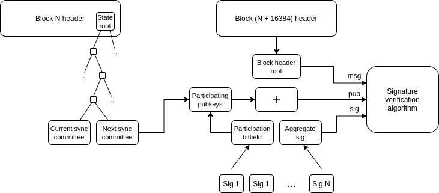

# Minimal Light Client

**Notice**: This document is a work-in-progress for researchers and implementers.

## Table of contents

<!-- TOC -->
<!-- START doctoc generated TOC please keep comment here to allow auto update -->
<!-- DON'T EDIT THIS SECTION, INSTEAD RE-RUN doctoc TO UPDATE -->

- [Introduction](#introduction)
- [Constants](#constants)
- [Configuration](#configuration)
  - [Misc](#misc)
- [Containers](#containers)
  - [`LightClientSnapshot`](#lightclientsnapshot)
  - [`LightClientUpdate`](#lightclientupdate)
  - [`LightClientStore`](#lightclientstore)
- [Helper functions](#helper-functions)
  - [`get_subtree_index`](#get_subtree_index)
- [Light client state updates](#light-client-state-updates)
    - [`validate_light_client_update`](#validate_light_client_update)
    - [`apply_light_client_update`](#apply_light_client_update)
    - [`process_light_client_update`](#process_light_client_update)

<!-- END doctoc generated TOC please keep comment here to allow auto update -->
<!-- /TOC -->

## Introduction

The **sync committee** is the "flagship feature" of the Altair hard fork. This is a committee of 512 validators that is randomly selected every **sync committee period (~2 days)**, and while a validator is part of the currently active sync committee they are expected to continually sign the block header that is the new head of the chain at each slot.

The purpose of the sync committee is to allow **light clients** to keep track of the chain of beacon block headers. The other two duties that involve signing block headers, block proposal and block attestation, do not work for this function because computing the proposer or attesters at a given slot requires a calculation on the entire active validator set, which light clients do not have access to (if they did, they would not be light!). Sync committees, on the other hand, are (i) updated infrequently, and (ii) saved directly in the beacon state, allowing light clients to verify the sync committee with a Merkle branch from a block header that they already know about, and use the public keys in the sync committee to directly authenticate signatures of more recent blocks.

This diagram shows the basic procedure by which a light client learns about more recent blocks:



We assume a light client already has a block header at slot `N`, in period `X = N // 16384`. The light client wants to authenticate a block header somewhere in period `X+1`. The steps the light client needs to take are as follows:

1. Use a Merkle branch to verify the `next_sync_committee` in the slot `N` post-state. This is the sync committee that will be signing block headers during period `X+1`.
2. Download the aggregate signature of the newer header that the light client is trying to authenticate. This can be found in the child block of the newer block, or the information could be grabbed directly from the p2p network.
3. Add together the public keys of the subset of the sync committee that participated in the aggregate signature (the bitfield in the signature will tell you who participated)
4. Verify the signature against the combined public key and the newer block header. If verification passes, the new block header has been successfully authenticated!

The minimum cost for light clients to track the chain is only about 25 kB per two days: 24576 bytes for the 512 48-byte public keys in the sync committee, plus a few hundred bytes for the aggregate signature, the light client header and the Merkle branch. Of course, closely following the chain at a high level of granularity does require more data bandwidth as you would have to download each header you're verifying (plus the signature for it).

The extremely low cost for light clients is intended to help make the beacon chain light client friendly for extremely constrained environments. Such environments include mobile phones, embedded IoT devices, in-browser wallets and other blockchains (for cross-chain bridges).

## Constants

| Name | Value |
| - | - |
| `FINALIZED_ROOT_INDEX` | `get_generalized_index(BeaconState, 'finalized_checkpoint', 'root')` |
| `NEXT_SYNC_COMMITTEE_INDEX` | `get_generalized_index(BeaconState, 'next_sync_committee')` |

These values are the [generalized indices](https://github.com/ethereum/eth2.0-specs/blob/dev/ssz/merkle-proofs.md#generalized-merkle-tree-index) for the finalized checkpoint and the next sync committee in a `BeaconState`. A generalied index is a way of referring to a position of an object in a Merkle tree, so that the Merkle proof verification algorithm knows what path to check the hashes against.

## Configuration

### Misc

| Name | Value |
| - | - |
| `MIN_SYNC_COMMITTEE_PARTICIPANTS` | `1` |

Light clients will ignore aggregate signatures with exactly zero participants (duh).

## Containers

### `LightClientSnapshot`

```python
class LightClientSnapshot(Container):
    # Beacon block header
    header: BeaconBlockHeader
    # Sync committees corresponding to the header
    current_sync_committee: SyncCommittee
    next_sync_committee: SyncCommittee
```

The `LightClientSnapshot` represents the light client's view of the most recent block header that the light client is convinced is securely part of the chain. The light client stores the header itself, so that the light client can then ask for Merkle branches to authenticate transactions and state against the header. The light client also stores the current and next sync committees, so that it can verify the sync committee signatures of newer proposed headers.

### `LightClientUpdate`

```python
class LightClientUpdate(Container):
    # Update beacon block header
    header: BeaconBlockHeader
    # Next sync committee corresponding to the header
    next_sync_committee: SyncCommittee
    next_sync_committee_branch: Vector[Bytes32, floorlog2(NEXT_SYNC_COMMITTEE_INDEX)]
    # Finality proof for the update header
    finality_header: BeaconBlockHeader
    finality_branch: Vector[Bytes32, floorlog2(FINALIZED_ROOT_INDEX)]
    # Sync committee aggregate signature
    sync_committee_bits: Bitvector[SYNC_COMMITTEE_SIZE]
    sync_committee_signature: BLSSignature
    # Fork version for the aggregate signature
    fork_version: Version
```

A `LightClientUpdate` is an object passed over the wire (could be over a p2p network or through a client-server setup) which contains all of the information needed to convince a light client to accept a newer block header. The information included is:

* **`header`**: the header that the light client will accept if the `LightClientUpdate` is valid.
* **`next_sync_committee`**: if the `header` is in a newer sync committee period than the header in the light client's current `LightClientSnapshot`, then if the light client decides to accept this header it will need to know the new header's `next_sync_committee` so that it will be able to accept headers in even later periods. So the `LightClientUpdate` itself provides this sync committee.
* **`next_sync_committee_branch`**: the Merkle branch that authenticates the `next_sync_committee`
* **`finality_header`**: if nonempty, the header whose signature is being verified (if empty, the signature of the `header` itself is being verified)
* **`finality_branch`**: the Merkle branch that authenticates that the `header` actually is the header corresponding to the _finalized root_ saved in the `finality_header` (if the `finality_header` is empty, the `finality_branch` is empty too)
* **`sync_committee_bits`**: a bitfield showing who participated in the sync committee
* **`sync_committee_signature`**: the signature
* **`fork_version`**: needed to mix in to the data being signed (will be different across different hard forks and between mainnet and testnets)

### `LightClientStore`

```python
@dataclass
class LightClientStore(object):
    snapshot: LightClientSnapshot
    valid_updates: Set[LightClientUpdate]
```

The `LightClientStore` is the _full_ "state" of a light client, and includes:

* A `snapshot`, reflecting a block header that a light client accepts as **finalized** (note: this is a different, and usually weaker, notion of finality than beacon chain finality). The sync committees in the state of this header are used to authenticate any new incoming headers.
* A list of `valid_updates`, reflecting _speculative_ recent block headers (that is: recent block headers that have strong support, and will _probably_ continue to be part of the chain, but still have some small risk of being reverted)

The `snapshot` can be updated in two ways:

1. If the light client sees a valid `LightClientUpdate` containing a `finality_header`, and with at least 2/3 of the sync committee participating, it accepts the `update.header` as the new snapshot header. Note that the light client uses the signature to verify `update.finality_header` (which would in practice often be one of the most recent blocks, and not yet finalized), and then uses the Merkle branch _from_ the `update.finality_header` _to_ the finalized checkpoint in its post-state to verify the `update.header`. If `update.finality_header` is a valid block, then `update.header` actually is finalized.
2. If the light client sees no valid updates via method (1) for a sufficiently long duration (specifically, the length of one sync committee period), it simply accepts the speculative header in `valid_updates` with the most signatures as finalized.

(2) allows the light client to keep advancing even during periods of extended non-finality, though at the cost that during a long non-finality period the light client's safety is vulnerable to network altency of ~2 days (full clients' safety is only vulnerable to network latency on the order of weeks).

## Helper functions

### `get_subtree_index`

```python
def get_subtree_index(generalized_index: GeneralizedIndex) -> uint64:
    return uint64(generalized_index % 2**(floorlog2(generalized_index)))
```

From a generalized index, return an integer whose bits, in least-to-greatest-place-value order, represent the Merkle path (0 = "left", 1 = "right", going from bottom to top) to get from a leaf to the root of a tree. Passed into the Merkle tree verification function used in other parts of the beacon chain spec.

## Light client state updates

A light client maintains its state in a `store` object of type `LightClientStore` and receives `update` objects of type `LightClientUpdate`. Every `update` triggers `process_light_client_update(store, update, current_slot)` where `current_slot` is the current slot based on some local clock.

#### `validate_light_client_update`

```python
def validate_light_client_update(snapshot: LightClientSnapshot,
                                 update: LightClientUpdate,
                                 genesis_validators_root: Root) -> None:
    # Verify update slot is larger than snapshot slot
    assert update.header.slot > snapshot.header.slot

    # Verify update does not skip a sync committee period
    snapshot_period = compute_epoch_at_slot(snapshot.header.slot) // EPOCHS_PER_SYNC_COMMITTEE_PERIOD
    update_period = compute_epoch_at_slot(update.header.slot) // EPOCHS_PER_SYNC_COMMITTEE_PERIOD
    assert update_period in (snapshot_period, snapshot_period + 1)

    # Verify update header root is the finalized root of the finality header, if specified
    if update.finality_header == BeaconBlockHeader():
        signed_header = update.header
        assert update.finality_branch == [Bytes32() for _ in range(floorlog2(FINALIZED_ROOT_INDEX))]
    else:
        signed_header = update.finality_header
        assert is_valid_merkle_branch(
            leaf=hash_tree_root(update.header),
            branch=update.finality_branch,
            depth=floorlog2(FINALIZED_ROOT_INDEX),
            index=get_subtree_index(FINALIZED_ROOT_INDEX),
            root=update.finality_header.state_root,
        )

    # Verify update next sync committee if the update period incremented
    if update_period == snapshot_period:
        sync_committee = snapshot.current_sync_committee
        assert update.next_sync_committee_branch == [Bytes32() for _ in range(floorlog2(NEXT_SYNC_COMMITTEE_INDEX))]
    else:
        sync_committee = snapshot.next_sync_committee
        assert is_valid_merkle_branch(
            leaf=hash_tree_root(update.next_sync_committee),
            branch=update.next_sync_committee_branch,
            depth=floorlog2(NEXT_SYNC_COMMITTEE_INDEX),
            index=get_subtree_index(NEXT_SYNC_COMMITTEE_INDEX),
            root=update.header.state_root,
        )

    # Verify sync committee has sufficient participants
    assert sum(update.sync_committee_bits) >= MIN_SYNC_COMMITTEE_PARTICIPANTS

    # Verify sync committee aggregate signature
    participant_pubkeys = [pubkey for (bit, pubkey) in zip(update.sync_committee_bits, sync_committee.pubkeys) if bit]
    domain = compute_domain(DOMAIN_SYNC_COMMITTEE, update.fork_version, genesis_validators_root)
    signing_root = compute_signing_root(signed_header, domain)
    assert bls.FastAggregateVerify(participant_pubkeys, signing_root, update.sync_committee_signature)
```

This function has 5 parts:

1. **Basic validation**: confirm that the `update.header` is newer than the snapshot header, and that it does not skip more than 1 sync committee period.
2. **Verify Merkle branch of header** - confirm that the `update.header` actually is the header that corresponds to the finalized root in the post-state of `update.finality_header` (and so if the `update.finality_header` is valid, the `update.header` is finalized). This check is only done if the `update.finality_header` is provided.
3. **Verify Merkle branch of sync committee** - if the `update.header` is in a newer sync period than the snapshot header, check that the `next_sync_committee` provided in the snapshot is correct by verifying the Merkle branch (if the `update.header` is not in a newer sync period, it's ok to leave the `next_sync_committee` empty).
4. **More basic validation**: confirm that the sync committee has more than zero participants.
5. **Verify the signature**: remember that if the `update.finality_header` is provided, the signature that we are expecting is a valid signature of the `update.finality_header`; otherwise, we are expecting a valid signature of the `update.header`.

#### `apply_light_client_update`

```python
def apply_light_client_update(snapshot: LightClientSnapshot, update: LightClientUpdate) -> None:
    snapshot_period = compute_epoch_at_slot(snapshot.header.slot) // EPOCHS_PER_SYNC_COMMITTEE_PERIOD
    update_period = compute_epoch_at_slot(update.header.slot) // EPOCHS_PER_SYNC_COMMITTEE_PERIOD
    if update_period == snapshot_period + 1:
        snapshot.current_sync_committee = snapshot.next_sync_committee
        snapshot.next_sync_committee = update.next_sync_committee
    snapshot.header = update.header
```

This function is called only when it is time to update that snapshot header: either (1) when a new header is provided that corresponds to a finalized checkpoint of another header, or (2) after the timeout. In addition to simply updating the header, we also update the sync committees in the snapshot.

#### `process_light_client_update`

```python
def process_light_client_update(store: LightClientStore, update: LightClientUpdate, current_slot: Slot,
                                genesis_validators_root: Root) -> None:
    validate_light_client_update(store.snapshot, update, genesis_validators_root)
    store.valid_updates.add(update)

    update_timeout = SLOTS_PER_EPOCH * EPOCHS_PER_SYNC_COMMITTEE_PERIOD
    if (
        sum(update.sync_committee_bits) * 3 >= len(update.sync_committee_bits) * 2
        and update.finality_header != BeaconBlockHeader()
    ):
        # Apply update if (1) 2/3 quorum is reached and (2) we have a finality proof.
        # Note that (2) means that the current light client design needs finality.
        # It may be changed to re-organizable light client design. See the on-going issue eth2.0-specs#2182.
        apply_light_client_update(store.snapshot, update)
        store.valid_updates = set()
    elif current_slot > store.snapshot.header.slot + update_timeout:
        # Forced best update when the update timeout has elapsed
        apply_light_client_update(store.snapshot,
                                  max(store.valid_updates, key=lambda update: sum(update.sync_committee_bits)))
        store.valid_updates = set()
```

The main function for processing a light client update. We first validate that it is correct; if it is correct, we at the very least save it as a speculative update. We then check if one of the two conditions for updating the snapshot is satisfied; if it is, then we update the snapshot.
