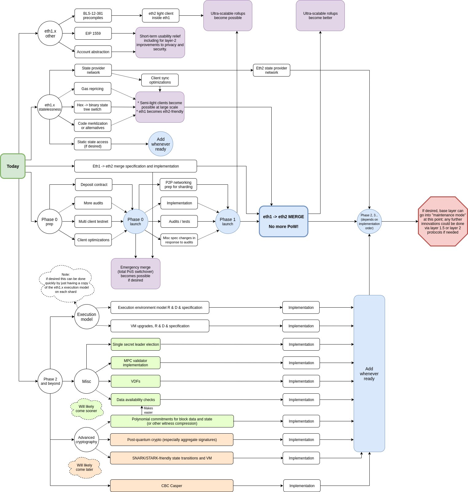
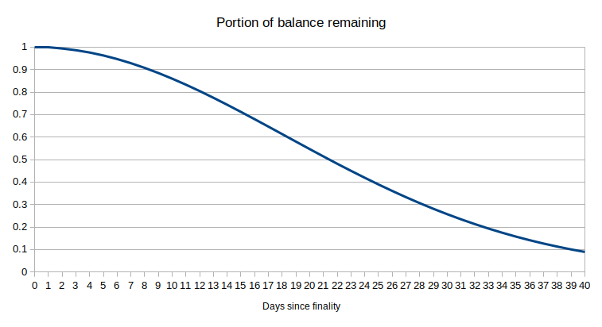

# Vitalik's Annotated Ethereum 2.0 Spec

**Notice**: This document was written in July-Aug 2020.

In addition to this work, I highly recommend Ben Edgington's [annotated spec](https://benjaminion.xyz/eth2-annotated-spec/), and [Danny Ryan's "Phase 0 for Humans"](https://notes.ethereum.org/@djrtwo/Bkn3zpwxB). This spec is more focused on design rationale issues; reading both is worthwhile for a better understanding of the eth2 protocol.

## Table of contents

<!-- START doctoc generated TOC please keep comment here to allow auto update -->
<!-- DON'T EDIT THIS SECTION, INSTEAD RE-RUN doctoc TO UPDATE -->


- [Introduction](#introduction)
  - [What are proof of stake and sharding and why do they matter?](#what-are-proof-of-stake-and-sharding-and-why-do-they-matter)
  - [How does eth2 sharding work?](#how-does-eth2-sharding-work)
  - [How does eth2 proof of stake work?](#how-does-eth2-proof-of-stake-work)
  - [Phases](#phases)
- [Organization and type system](#organization-and-type-system)
- [Custom types](#custom-types)
- [Constants](#constants)
- [Configuration](#configuration)
  - [Misc](#misc)
  - [Gwei values](#gwei-values)
  - [Initial values](#initial-values)
  - [Time parameters](#time-parameters)
    - [`[Aside: RANDAO, seeds and committee generation]`](#aside-randao-seeds-and-committee-generation)
  - [State list lengths](#state-list-lengths)
  - [Rewards and penalties](#rewards-and-penalties)
  - [Max operations per block](#max-operations-per-block)
  - [Domain types](#domain-types)
- [Containers](#containers)
  - [Misc dependencies](#misc-dependencies)
    - [`Fork`](#fork)
    - [`ForkData`](#forkdata)
    - [`Checkpoint`](#checkpoint)
    - [`Validator`](#validator)
    - [`AttestationData`](#attestationdata)
    - [`IndexedAttestation`](#indexedattestation)
    - [`PendingAttestation`](#pendingattestation)
    - [`Eth1Data`](#eth1data)
    - [`HistoricalBatch`](#historicalbatch)
    - [`[Aside: note on the deposit process]`](#aside-note-on-the-deposit-process)
    - [`DepositMessage`](#depositmessage)
    - [`DepositData`](#depositdata)
    - [`BeaconBlockHeader`](#beaconblockheader)
    - [`[Aside: domain separation]`](#aside-domain-separation)
    - [`SigningData`](#signingdata)
  - [Beacon operations](#beacon-operations)
    - [`ProposerSlashing`](#proposerslashing)
    - [`AttesterSlashing`](#attesterslashing)
    - [`Attestation`](#attestation)
    - [`Deposit`](#deposit)
    - [`VoluntaryExit`](#voluntaryexit)
  - [Beacon blocks](#beacon-blocks)
    - [`BeaconBlockBody`](#beaconblockbody)
    - [`BeaconBlock`](#beaconblock)
  - [Beacon state](#beacon-state)
    - [`BeaconState`](#beaconstate)
  - [Signed envelopes](#signed-envelopes)
    - [`SignedVoluntaryExit`](#signedvoluntaryexit)
    - [`SignedBeaconBlock`](#signedbeaconblock)
    - [`SignedBeaconBlockHeader`](#signedbeaconblockheader)
- [Helper functions](#helper-functions)
  - [Math](#math)
    - [`integer_squareroot`](#integer_squareroot)
    - [`xor`](#xor)
    - [`uint_to_bytes`](#uint_to_bytes)
    - [`bytes_to_uint64`](#bytes_to_uint64)
  - [Crypto](#crypto)
    - [`hash`](#hash)
    - [`hash_tree_root`](#hash_tree_root)
    - [BLS Signatures](#bls-signatures)
  - [Predicates](#predicates)
    - [`[Aside: note on a validator's life cycle]`](#aside-note-on-a-validators-life-cycle)
    - [`is_active_validator`](#is_active_validator)
    - [`is_eligible_for_activation_queue`](#is_eligible_for_activation_queue)
    - [`is_eligible_for_activation`](#is_eligible_for_activation)
    - [`is_slashable_validator`](#is_slashable_validator)
    - [`is_slashable_attestation_data`](#is_slashable_attestation_data)
    - [`is_valid_indexed_attestation`](#is_valid_indexed_attestation)
    - [`is_valid_merkle_branch`](#is_valid_merkle_branch)
  - [Misc](#misc-1)
    - [`compute_shuffled_index`](#compute_shuffled_index)
    - [`compute_proposer_index`](#compute_proposer_index)
    - [`compute_committee`](#compute_committee)
    - [`compute_epoch_at_slot`](#compute_epoch_at_slot)
    - [`compute_start_slot_at_epoch`](#compute_start_slot_at_epoch)
    - [`compute_activation_exit_epoch`](#compute_activation_exit_epoch)
    - [`compute_fork_data_root`](#compute_fork_data_root)
    - [`compute_fork_digest`](#compute_fork_digest)
    - [`compute_domain`](#compute_domain)
    - [`compute_signing_root`](#compute_signing_root)
  - [Beacon state accessors](#beacon-state-accessors)
    - [`get_current_epoch`](#get_current_epoch)
    - [`get_previous_epoch`](#get_previous_epoch)
    - [`get_block_root`](#get_block_root)
    - [`get_block_root_at_slot`](#get_block_root_at_slot)
    - [`get_randao_mix`](#get_randao_mix)
    - [`get_active_validator_indices`](#get_active_validator_indices)
    - [`get_validator_churn_limit`](#get_validator_churn_limit)
    - [`get_seed`](#get_seed)
    - [`get_committee_count_per_slot`](#get_committee_count_per_slot)
    - [`get_beacon_committee`](#get_beacon_committee)
    - [`get_beacon_proposer_index`](#get_beacon_proposer_index)
    - [`get_total_balance`](#get_total_balance)
    - [`get_total_active_balance`](#get_total_active_balance)
    - [`get_domain`](#get_domain)
    - [`get_indexed_attestation`](#get_indexed_attestation)
    - [`get_attesting_indices`](#get_attesting_indices)
  - [Beacon state mutators](#beacon-state-mutators)
    - [`increase_balance`](#increase_balance)
    - [`decrease_balance`](#decrease_balance)
    - [`initiate_validator_exit`](#initiate_validator_exit)
    - [`slash_validator`](#slash_validator)
- [Genesis](#genesis)
  - [Initialize beacon state from Eth1](#initialize-beacon-state-from-eth1)
  - [Genesis state](#genesis-state)
  - [Genesis block](#genesis-block)
- [Beacon chain state transition function](#beacon-chain-state-transition-function)
  - [State transition](#state-transition)
  - [Epoch processing](#epoch-processing)
    - [Helper functions](#helper-functions-1)
    - [Justification and finalization](#justification-and-finalization)
    - [Rewards and penalties](#rewards-and-penalties-1)
      - [Helpers](#helpers)
      - [Components of attestation deltas](#components-of-attestation-deltas)
      - [`get_attestation_deltas`](#get_attestation_deltas)
      - [`process_rewards_and_penalties`](#process_rewards_and_penalties)
    - [Registry updates](#registry-updates)
    - [`[Aside: anti-correlation penalties in Eth2]`](#aside-anti-correlation-penalties-in-eth2)
    - [Slashings](#slashings)
    - [Final updates](#final-updates)
  - [Block processing](#block-processing)
    - [Block header](#block-header)
    - [RANDAO](#randao)
    - [Eth1 data](#eth1-data)
    - [Operations](#operations)
      - [Proposer slashings](#proposer-slashings)
      - [Attester slashings](#attester-slashings)
      - [Attestations](#attestations)
      - [Deposits](#deposits)
      - [Voluntary exits](#voluntary-exits)

<!-- END doctoc generated TOC please keep comment here to allow auto update -->

## Introduction

Ethereum 2.0 (aka eth2, aka Serenity) is the next major version of the Ethereum protocol, and is the culmination of [years](https://blog.ethereum.org/2014/10/21/scalability-part-2-hypercubes/) [of](https://github.com/vbuterin/scalability_paper/blob/master/scalability.pdf) [research](https://cdn.hackaday.io/files/10879465447136/Mauve%20Paper%20Vitalik.pdf) into [proof](https://blog.ethereum.org/2014/01/15/slasher-a-punitive-proof-of-stake-algorithm/) [of](https://blog.ethereum.org/2014/11/25/proof-stake-learned-love-weak-subjectivity/) [stake](https://medium.com/@VitalikButerin/minimal-slashing-conditions-20f0b500fc6c) and [sharding](https://ethresear.ch/t/a-proposal-for-structuring-committees-cross-links-etc/2118). The eth2 protocol is a full redesign of the consensus-critical parts of the Ethereum system: a change of the consensus from proof of work to [proof of stake](https://eth.wiki/en/concepts/proof-of-stake-faqs) and the introduction of [sharding](https://eth.wiki/sharding/Sharding-FAQs) are the two most critical changes. As of the time of this writing, eth2 leaves the application-layer parts maximally untouched; that is, transactions and smart contracts continue to work the same way they did before, so applications do not have to change (except to compensate for a few gas cost changes) to be eth2 compatible. However, the engine that ensures that the network comes to consensus on the transactions is radically changed.

### What are proof of stake and sharding and why do they matter?

For long answers, see:

* [Proof of stake FAQ](https://eth.wiki/en/concepts/proof-of-stake-faqs)
* [Sharding FAQ](https://eth.wiki/sharding/Sharding-FAQs)

But in short:

* **Proof of stake** is a more efficient consensus mechanism that avoids the need to consume extremely large amounts of electricity and hardware costs to maintain the network -- it achieves this by using coins, rather than computing hardware, as the economic basis for the consensus
* **Sharding** is a scalability technique that involves splitting up verification so that each node only needs to verify a small portion of the transactions in the network, instead of verifying every transaction

### How does eth2 proof of stake work?

The participants in eth2 proof of stake consensus are called **validators**. To become a validator, you need to deposit 32 ETH, either from the eth1 chain or from a shard chain (when shard chains become enabled). Once you deposit 32 ETH, you are put into an **activation queue**, and sometime later you become an **active validator**.

Time on the beacon chain is divided into **epochs** and **slots**. Each slot is 12 seconds long (eg. if the chain started today at 14:00:00, and the current time is 14:01:06, then you're in the middle of slot 5; slot numbers start counting from 0). An epoch is a period of 32 slots (or 6.4 minutes). There are also longer units of time; by convention, a period of 2048 epochs (~9.1 days) is called an **eek** ("ethereum week"); some operations on the beacon chain that take a long time can be measured in eeks.

During each epoch, each validator makes an **attestation**. An attestation contains:

* A hash of what the validator thinks is the "**head**" of the beacon chain (the same concept as the "head" of the chain in PoW)
* A hash of what the validator thinks is the correct shard block to include
* Some other hashes (the "**source**" and "**target**" in [Casper FFG](https://arxiv.org/abs/1710.09437))
* A signature from the validator, proving that the validator endorses all of the above

The chain comes to a consensus as a result of these attestations. Roughly speaking, if 2/3 of active validators sign an attestation supporting a block, that block becomes **finalized** (in reality it's more complex, taking two rounds of signing; see [the Casper FFG paper](https://arxiv.org/abs/1710.09437) for details). A finalized block can never be reverted, unlike in PoW where any block can be reverted if someone creates an even longer chain.

If a validator correctly makes attestations, they get rewarded. If a validator misses their slot or makes an incorrect attestation, they get penalized. If a validator unambiguously contradicts themselves (eg. voting for two conflicting blocks in the same epoch), they get **slashed**. A slashed validator (i) suffers a penalty of 3-100% of their deposit, (ii) is forcibly ejected from the validator set, and (iii) has their coins forcibly locked for an additional 4 eeks before they can withdraw. In general, as long as you are running correct validator software, this will not happen to you, and as long as you stay online more than ~55-70% of the time, validating will be profitable.

A validator can voluntarily initiate an **exit** at any time, though there is a limit on how many can exit per epoch; if too many validators try to exit at the same time they will be put into a queue and will remain active until they get to the front of the queue. After a validator successfully exits, after 1/8 of an eek they will be able to withdraw (though this functionality will only be turned on after ["the merge"](https://ethresear.ch/t/the-eth1-eth2-transition/6265) of eth1 and eth2).

### How does eth2 sharding work

See [the corresponding section in the phase 1 doc](../phase1/beacon-chain.md#how-does-eth2-sharding-work).

### Phases

To reduce risks, the eth2 deployment process is split into phases:

* **Phase 0**: a proof of stake beacon chain is launched, which can process deposits from the eth1 chain. No shard chains yet.
* **Phase 1**: shard chains are activated, though they only process data, not transactions. Hence, the eth2 chain becomes useful as a data availability verification layer for rollups, but you cannot yet directly transact on it.
* **Phase 1.5 (aka The Merge)**: the eth1 chain is shut down, and the state (ie. all balances, contracts, code, storage...) from the eth1 chain is moved into one shard of the eth2 chain. Users can transact on that shard.
* **Phase 2**: all shards support full transaction capabilities.
* **Phase 3+ (aka Ethereum 2.x)**: ongoing improvements to safety, efficiency, and scalability, though the "basic structure" of the eth2 chain may well never again be changed.

See also [the roadmap](https://media.consensys.net/an-annotated-version-of-vitalik-buterins-ethereum-roadmap-5876498d4f3a):



## Organization and type system

The spec describes the data types used in eth2, as well as the state transition function (and the helper functions used in defining the state transition function). The functions are written in python to strike a balance between formality (the spec is fully executable) and ease of reading. All functions are strongly typed, with many distinct types to clarify what the inputs and outputs represent.

The type system is based on [SimpleSerialize](https://github.com/ethereum/eth2.0-specs/blob/dev/ssz/simple-serialize.md) (SSZ), a system of types that includes both simple types and compound types (vectors, structs...) along with algorithms for (i) serializing and (ii) Merkle-hashing objects of these types (the SSZ Merkle-hash of an object is often called the **root**). SSZ is intended to largely take over from [RLP](https://eth.wiki/en/fundamentals/rlp) in eth1.

The most common basic types in SSZ are integers (usually `uint64`) and hashes (aka `Bytes32`); rarer types like `bool`, variable-length `Bytes`, `Bytes4`, and others also exist. There are four compound types in SSZ: (i) fixed-length lists (called **vectors**), (ii) variable-length lists with a fixed maximum length (called **lists**), (iii) structs (called **containers**) and (iv) union types ("either an X or a Y"), not used in phase 0.

Now, let's get to the actual spec... (phase 0)

## Custom types

We define the following Python custom types for type hinting and readability:

| Name | SSZ equivalent | Description |
| - | - | - |
| `Slot` | `uint64` | a slot number |
| `Epoch` | `uint64` | an epoch number (generally, epoch `i` consists of slots `EPOCH_LENGTH*i ... EPOCH_LENGTH*(i+1)-1`) |
| `CommitteeIndex` | `uint64` | During every epoch, the validator set is randomly split up into `EPOCH_LENGTH` parts, one part for each slot in that epoch, but then within each slot that slot's validators are further divided into committees. In phase 0 this division does nothing, but in phase 1 these different committees get assigned to a different shard. `CommitteeIndex` is just the type of an integer, where that integer refers to the index of a committee within a slot (is it the first committee, the second, the third?) |
| `ValidatorIndex` | `uint64` | Every validator is assigned a validator index upon depositing |
| `Gwei` | `uint64` | An amount in Gwei |
| `Root` | `Bytes32` | A Merkle root (typically of an SSZ object) |
| `Version` | `Bytes4` | A fork version number (this is used to prevent messages on one eth2 network from accidentally being valid on another eth2 network, eg. mainnet vs testnet or mainnet vs ETC-like fork chain) |
| `DomainType` | `Bytes4` | A domain type (different signed messages are given different domain tags to prevent messages signed for one function from accidentally being valid in another function) |
| `ForkDigest` | `Bytes4` | A digest of the current fork data (used for replay protection) |
| `Domain` | `Bytes32` | A signature domain (combines info from a domain type and a fork version, so we get replay protection along both dimensions) |
| `BLSPubkey` | `Bytes48` | a BLS12-381 public key (see [here](https://ethresear.ch/t/pragmatic-signature-aggregation-with-bls/2105) for an explanation of the BLS signature scheme and its benefits) |
| `BLSSignature` | `Bytes96` | a BLS12-381 signature |

When you see a function like `def get_block_root_at_slot(state: BeaconState, slot: Slot) -> Root:` (a real example in the spec), interpret it as "this function takes as input the beacon chain state and an integer representing a slot number, and outputs a `Bytes32` which is a Merkle root". In this case, the Merkle root it outputs is the root hash of the block at the given slot (as you can tell from the name); but in general, paying attention to types will help make it easier for you to understand what's going on. In addition to being a debugging aid, the strong type system also functions as a type of comment.

## Constants

The following values are (non-configurable) constants used throughout the specification. These constants are fairly boring; they're just added to the spec for readability.

| Name | Value |
| - | - |
| `GENESIS_SLOT` | `Slot(0)` |
| `GENESIS_EPOCH` | `Epoch(0)` |
| `FAR_FUTURE_EPOCH` | `Epoch(2**64 - 1)` |
| `BASE_REWARDS_PER_EPOCH` | `uint64(4)` |
| `DEPOSIT_CONTRACT_TREE_DEPTH` | `uint64(2**5)` (= 32) |
| `JUSTIFICATION_BITS_LENGTH` | `uint64(4)` |
| `ENDIANNESS` | `'little'` |

## Configuration

Here, we have configurable constants, ie. if you adjust one of these up or down by 2x or even more, the network is likely not going to break. That said, a lot of thought went into setting these constants the way they are now, so it's worth understanding why each of these values is set as they are.

### Misc

| `ETH1_FOLLOW_DISTANCE` | `uint64(2**10)` (= 1,024) |
| - | - |

To process eth1 deposits, the eth2 chain tracks block hashes of the eth1 chain. To simplify things, the eth2 chain only pays attention to eth1 blocks after a delay (`ETH1_FOLLOW_DISTANCE = 1,024` blocks). Assuming the eth1 chain does not revert that far, this lets us rely on the following assumption: if the eth2 sees an eth1 block it won't "un-see" it (if eth1 does revert that far, emergency action will be required on the eth2 side). 1024 blocks correspond to a delay of ~3.7 hours (note that getting an eth1 block _accepted_ into eth2 takes another ~1.7 hours). Historically, all problems on the eth1 net have been responded to within this period of time. Stretching this time period further would (i) increase deposit delays and (ii) make eth2 less convenient as a light client of eth1.

| `MAX_COMMITTEES_PER_SLOT` | `uint64(2**6)` (= 64) |
| - | - |

In phase 0, the whole idea of having multiple committees per slot serves no function; rather, this is preparatory work for phase 1, where each committee will be assigned to a different shard. We plan to have 64 shards at the start. Having fewer shards leads to insufficient scalability; having more leads to two undesirable consequences:

1. The overhead of processing beacon chain blocks becomes too high
2. The minimum amount of ETH needed to reach a full-sized committee for every shard in every slot (now 32 ETH * 128 committee size * 64 shards per slot * 32 slots per epoch = 8,388,608 ETH) becomes too high; we're reasonably confident we can get 8.3m ETH staking, but if we increased the number of shards to 128, say, then we'd need to get 16.7m ETH staking; this is significantly harder, and if we were to fall short, the system would be forced to compromise by making cross-shard transactions take longer.

| `TARGET_COMMITTEE_SIZE` | `uint64(2**7)` (= 128) |
| - | - |

For a committee to be secure, the chance that 2/3 of it gets corrupted in any given epoch (assuming <1/3 of the global validator set is made up of attackers) must be astronomically tiny. We can estimate this chance of corruption via binomial formulas:

```python
>>> # Factorial
>>> def fac(n): return 1 if n==0 else n*fac(n-1)
>>> # How many distinct k-item combinations you can take from n items
>>> def choose(n, k): return fac(n) // fac(k) // fac(n-k)
>>> # If an event has chance p of occurring during each "trial", returns
>>> # the probability that in n trials the event will occur *exactly* k times
>>> def prob(n, k, p): return p**k * (1-p)**(n-k) * choose(n, k)
>>> # If an event has chance p of occurring during each "trial", returns
>>> # the probability that in n trials the event will occur *at least* k times
>>> def probge(n, k, p): return sum([prob(n, i, p) for i in range(k, n+1)])
```

Calling `probge(128, 86, 1/3)` (86 is the smallest integer above 128 * 2/3) returns `5.55 * 10**-15` (ie. 5.55 in a quadrillion). This is an extremely low probability, with comfortable bounds to take into account the possibility an attacker will "grind" many random seeds to try to get a favorable committee (though this is extremely difficult with RANDAO and especially VDFs). If the committee size were instead 64, this probability would be much higher, and so committees would no longer sufficiently secure with an attacker with 1/3 of the total stake. Increasing the committee size to 256, on the other hand, would be superfluous and only add needless inefficiency.

| `MAX_VALIDATORS_PER_COMMITTEE` | `uint64(2**11)` (= 2,048) |
| - | - |

<a id="churn" />

The maximum supported validator count is `2**22` (=4,194,304), or ~134 million ETH staking. Assuming 32 slots per epoch and 64 committees per slot, this gets us to a max 2048 validators in a committee.

| `MIN_PER_EPOCH_CHURN_LIMIT` | `uint64(2**2)` (= 4)|
| - | - |
| **`CHURN_LIMIT_QUOTIENT`** | **`uint64(2**16)` (= 65,536)** |

These two parameters set the rate at which validators can enter and leave the validator set. The minimum rate is 4 entering + 4 leaving per epoch, but if there are enough validators this rate increases: if there are more than 262,144 validators (8,388,608 ETH) then a number of validators equal to 1/65536 of the validator set size can enter, and the same amount can leave, per epoch.

The goal of rate-limiting entry and exit is to prevent a large portion of malicious validators from performing some malicious action and then immediately leaving to escape being slashed. The main malicious action we are worried about is finalizing two incompatible blocks. The Casper FFG protocol (see paper [here](https://arxiv.org/abs/1710.09437)) ensures that this can only happen if at least 1/3 of validators commit a provably malicious action, which they can be slashed for; however, if they withdraw first they could conceivably dodge this penalty.

With the above numbers, if there is more than 8,388,608 ETH staking, it will take at least 65536/3 epochs, or 10.67 eeks, for 1/3 of validators to withdraw (however, if there is no attack, then the withdrawal queue will ordinarily be short).

The reason to have a long withdrawal delay is to ensure an attacker cannot escape being slashed by hiding a fork from users for a long time, and then publishing it to clients that have been offline for some time. Conceivably, an attacker could escape being slashed by hiding a fork for longer than 10.67 eeks; for this reason, we have a rule that clients must go online at least once every 10.67 eeks (in reality a little less frequently than that) to retain their full security guarantees (this is called **weak subjectivity**).


Research:

* Original post on weak subjectivity (2014): https://blog.ethereum.org/2014/11/25/proof-stake-learned-love-weak-subjectivity/
* Why withdrawal queues are better than fixed withdrawal delays: https://ethresear.ch/t/suggested-average-case-improvements-to-reduce-capital-costs-of-being-a-casper-validator/3844
* Rate-limiting entry/exits, not withdrawals: https://ethresear.ch/t/rate-limiting-entry-exits-not-withdrawals/4942
* Analyzing how long the de-facto weak subjectivity period is assuming the queue processes at a particular rate: https://ethresear.ch/t/weak-subjectivity-under-the-exit-queue-model/5187
* Weak subjectivity in eth2 (by Aditya): https://notes.ethereum.org/@adiasg/weak-subjectvity-eth2

| `SHUFFLE_ROUND_COUNT` | `uint64(90)` |
| - | - |

Number of rounds in the swap-or-not shuffle; for more info see the [`compute_shuffled_index` function description](#compute_shuffled_index) below. Expert cryptographer advice told us `~4*log2(n)` is sufficient for safety; in our case, `n <= 2**22`, hence ~90 rounds.

| `MIN_GENESIS_ACTIVE_VALIDATOR_COUNT` | `uint64(2**14)` (= 16,384) |
| - | - |

The number of validators deposited needed to start the eth2 chain. This gives 524,288 ETH, high enough to put attacking out of the reach of all but a few very wealthy actors.

| `MIN_GENESIS_TIME` | `uint64(1578009600)` (Jan 3, 2020) |
| - | - |

Genesis will not start before this time, even if there are enough validators deposited.

<a id="hysteresis" />

| `HYSTERESIS_QUOTIENT` | `uint64(4)` |
| - | :-: |
| **`HYSTERESIS_DOWNWARD_MULTIPLIER`** | **`uint64(1)`** |
| **`HYSTERESIS_UPWARD_MULTIPLIER`** | **`uint64(5)`** |
| **`EFFECTIVE_BALANCE_INCREMENT`** | **`Gwei(2**0 * 10**9)` (= 1,000,000,000)** |

We store validator balances in two places: (i) the "effective balance" in the validator record, and (ii) the "exact balance" in a separate record. This is done for efficiency reasons.

The exact balances change every epoch (due to rewards and penalties), so we store them in a compact array that requires rehashing only <32 MB to update, while the effective balances (which are used for all other computations that require validator balances) are updated using a **[hysteresis](https://en.wikipedia.org/wiki/Hysteresis)** formula: if the effective balance is `n` ETH, and if the exact balance goes below `n-0.25` ETH, then the effective balance is set to `n-1` ETH, and if the exact balance goes above `n+1.25` ETH the effective balance is set to `n+1` ETH.

Since the exact balance must change by at least a full 0.5 ETH to trigger an effective balance update, this ensures an attacker can't make effective balances update every epoch -- and thus cause processing the chain to become very slow -- by repeatedly nudging the exact balances above, and then below, some threshold.

### Gwei values

| `MIN_DEPOSIT_AMOUNT` | `Gwei(2**0 * 10**9)` (= 1,000,000,000) |
| - | - |

A minimum deposit amount prevents DoS attacks that involve spamming the chain with very tiny deposits (note that 1 ETH just gets you a validator slot; it does not _activate_ unless you deposit the full 32 ETH).

| `MAX_EFFECTIVE_BALANCE` | `Gwei(2**5 * 10**9)` (= 32,000,000,000) |
| - | - |

There are two choices here that need justification. First, why force validator slots to be a fixed amount of ETH at all, instead of allowing them to be any size? Second, why a fixed size of 32 ETH, and not 1 ETH or 1000 ETH?

The problem with allowing variable balances is that algorithms for a random selection (eg. of block proposers) and shuffling (for committees) become much more complicated. You would need an algorithm to select a block proposer such that the probability that the algorithm selects a particular proposer is proportional to the proposer's balance, in a context where balances are changing and validators are always entering and exiting. This could be done with [fancy binary tree structures](https://algorithmist.com/wiki/Fenwick_tree) but would be complicated. In the case of committee selection, a wealthy validator cannot be assigned to one committee (as they would then dominate and be able to attack it); their weight would need to be split up among many committees. It's much easier to solve both problems by simply formally representing wealthy validators as being many separate validators of the same size.

The 32 ETH choice is based on this logic: https://medium.com/@VitalikButerin/parametrizing-casper-the-decentralization-finality-time-overhead-tradeoff-3f2011672735. If the deposit size is higher, then fewer people can participate, risking centralization, but if the deposit size is lower, then the chain suffers a higher cost of verification ("overhead" in the post), risking sacrificing decentralization differently.

[Economic review](https://medium.com/@thomasborgers/ethereum-2-0-economic-review-1fc4a9b8c2d9) suggests that at the current 32 ETH level the hardware costs of staking are enough to make a significant, though not fatal, dent on validator returns. This implies that if the deposit size were reduced to 16 ETH, then the overhead of the chain would double, and the rewards to each validator would halve, so staking with a single validator slot would be four-times more difficult, already a potentially unsafe level. Hence, 32 ETH is the most inclusive deposit size that does not become self-defeating due to increasing overhead.

| `EJECTION_BALANCE` | `Gwei(2**4 * 10**9)` (= 16,000,000,000) |
| - | - |

Validators that go below 16 ETH get ejected (ie. forcibly exited). This minimum ensures that all active validators' balances are (almost always) within a 2x "band" (maximum effective balance is 32 ETH; anything above is just saved rewards and does not count for staking purposes). This narrow range ensures that committees are stable; if higher disparities were permitted, there would be a higher risk that a few wealthy malicious validators could randomly enter the same committee and take it over with their larger balances.

### Initial values


| `GENESIS_FORK_VERSION` | `Version('0x00000000')` |
| - | - |

See explanation of the `Version` type [above](#Custom-types). The version starting at 0 is self-explanatory (why not 1? Because we're computer scientists, not normal people, doge-dammit!).

| `BLS_WITHDRAWAL_PREFIX` | `Bytes1('0x00')` |
| - | - |

When a validator deposits, they provide two keys: a **signing key** and a **withdrawal key**. The withdrawal key is needed to access the funds when they are withdrawn; this dual-key structure reduces risks for validators, as they can keep their withdrawal key in cold storage.

The BLS withdrawal prefix is effectively a "version number" for the withdrawal key; the first version is just a hash of a public key; a withdrawal would reveal the public key as well as a signature signed with that public key specifying a further destination. Future versions will allow directly specifying a smart contract address on any shard of eth2.

### Time parameters

| `GENESIS_DELAY` | `uint64(172800)` | seconds | 2 days |
| - | - | :-: | :-: |

When the deposit count becomes sufficient for the eth2 chain to start, the start is delayed by 2 days to give everyone time to prepare.

| `SECONDS_PER_SLOT` | `uint64(12)` | seconds | 12 seconds |
| - | - | :-: | :-: |

A tradeoff between blockchain speed and risk. Note that in future phases, multiple steps will have to happen within a slot: beacon block -> shard block -> beacon block, as well as eventually a round of data availability sampling, so it is good to be conservative.


  
Eth1 latency is generally ~1 second; 12 seconds gives a healthy safety margin on top of this.

| `SECONDS_PER_ETH1_BLOCK` | `uint64(14)` | seconds | 14 seconds |
| - | - | :-: | :-: |

An estimate of how often eth1 blocks appear on average.

| `MIN_ATTESTATION_INCLUSION_DELAY` | `uint64(2**0)` (= 1) | slots | 12 seconds |
| - | - | :-: | :-: |

Attestations made in slot N can be included in slot N+1.

| `SLOTS_PER_EPOCH` | `uint64(2**5)` (= 32) | slots | 6.4 minutes |
| - | - | :-: | :-: |

There are two reasons not to go lower than 32 slots per epoch:

1. Either the slot duration would have to become longer (which would increase block times and hence reduce user experience) or the epoch duration would decrease, increasing overhead of processing the chain
2. We want to have a guarantee that there will almost certainly be at least one honest proposer per epoch

Going higher than 32 would needlessly make it take longer for a block to reach finality (this takes 2 epochs). Hence, 32 slots per epoch appear optimal.

<a id="seeds" />

#### `[Aside: RANDAO, seeds and committee generation]`

In any proof of stake system, we need to have some mechanism for determining who is the proposer of a block (as well as other roles that don't require all active validators to participate in simultaneously). In PoW, this happens automatically: everyone is trying to create a block, but on average only one person succeeds every (13 seconds in Ethereum | 600 seconds in Bitcoin), and you can't predict who will succeed ahead of time. In PoS, however, this random selection must be done explicitly.

Clearly, there is no such thing as true "randomness" in a blockchain, because all nodes must come to a consensus on the result and different computers calling `random()` will get different outputs. Instead, we generate **[pseudo-randomness](https://en.wikipedia.org/wiki/Pseudorandomness)** from a **seed** that is computed and updated as part of the blockchain.

The challenge is how to make the seed unpredictable. If the seed was predictable (say, we put `hash(42)` in as the seed at genesis), then validators could strategically decide when to deposit and withdraw or what their public keys is to target being a block proposer (or being part of a particular committee), which would open the door to attacks (this is one type of **stake grinding**).

To fully prevent this type of manipulation, we use a mechanism where the validator set is fixed 4 epochs in advance (ie. operations in epoch N can only affect the validator set from epoch N+5 onwards), and there is a procedure that constantly updates the seed. Hence, validator set manipulation is ineffective because the seed valid in some epoch can be guaranteed to update unpredictably for some time after the validator set for that epoch is fixed. That said, we still need a procedure for how the seed gets updated.

We update the seed (or rather, the **randao mix**, which is used to generate the seed) every block using a mechanism inspired by [RANDAO](https://github.com/randao/randao): the proposer of a block provides a hash that gets mixed into (ie. XOR'd into) the seed; this hash is unknown to the public ahead of time, but it is pre-committed, in the sense that there is only one valid hash that the proposer could submit. This is done with by BLS-signing the current epoch; the BLS signature scheme has the property that for any given key there is exactly one valid signature for any given message (as opposed to eg. ECDSA where there are many possible valid signatures that can be made with the same key for the same message).


The randao mix at the start of epoch N is used to compute the seed for epoch N+1; this ensures that the proposer and committee roles are known one epoch ahead of time, giving validators a chance to prepare.

This mechanism ensures that the proposer has only one "bit of manipulation power": they can either set the next seed to some hash R1 by publishing their block normally, or to some other hash R2 by not publishing (and sacrificing their block reward). Note also that only the last proposer truly has any manipulation power, because any other proposer knows that the seed will be altered in unpredictable ways by future proposers, so they have no way to know the effects of any manipulation they attempt. These two factors together make "stake grinding" _by manipulating the seed_ very difficult and almost always not worth it.

To see the proposer and committee selection algorithms, which take as input (i) the active validator set and (ii) the seed, and output the current block proposer and the committees, see [here](#compute_shuffled_index).

| `MIN_SEED_LOOKAHEAD` | `uint64(2**0)` (= 1) | epochs | 6.4 minutes |
| - | - | :-: | :-: |
| **`MAX_SEED_LOOKAHEAD`** | **`uint64(2**2)` (= 4)** | **epochs** | **25.6 minutes** |

See the diagram above. The `MIN_SEED_LOOKAHEAD` means that the seed used to compute proposers and committees is based on the randao mix from more than 1 epoch ago (specifically, the epoch N seed is based on the randao mix from the end of epoch N-2); this allows validators to determine their committee and proposal responsibilities >1 epoch ahead of time.

The `MAX_SEED_LOOKAHEAD` is actually the minimum delay on validator activations and exits; it basically means that validators strategically activating and exiting can only affect the seed 4 epochs into the future, leaving a space of 3 epochs within which proposers can mix-in unknown info to scramble the seed and hence make stake grinding via activating or exiting validators non-viable.

| `MIN_EPOCHS_TO_INACTIVITY_PENALTY` | `uint64(2**2)` (= 4) | epochs | 25.6 minutes |
| - | - | :-: | :-: |

See [here](#inactivity-quotient) for what the inactivity leak is; this constant simply says that the leaking starts after 4 epochs of non-finality.

| `EPOCHS_PER_ETH1_VOTING_PERIOD` | `uint64(2**5)` (= 32) | epochs | ~3.4 hours |
| - | - | :-: | :-: |

The eth2 chain learns about eth1 blocks (so that it can verify Merkle proofs of deposits) via a voting mechanism where block proposers vote on an eth1 block; the [honest validator guide](https://github.com/ethereum/eth2.0-specs/blob/dev/specs/phase0/validator.md#eth1-data) details which block validators choose. The voting period is set to 1024 slots to ensure a sufficient committee size and to give time to respond to potential failures; additionally, there is little value in the voting period being much shorter than the `ETH1_FOLLOW_DISTANCE` (also ~3.7 hours).

<a id="slots_per_historical_root" />

| `SLOTS_PER_HISTORICAL_ROOT` | `uint64(2**13)` (= 8,192) | slots | ~27 hours |
| - | - | :-: | :-: |

The eth2 chain contains a Merkle tree of its own historical blocks. This is done using two data structures: (i) a rotating "recent history log" (`state.block_roots` and `state.state_roots`) and (ii) an ongoing accumulator (`state.historical_roots`) which stores Merkle roots of recent history logs. The total state size is optimized if the two have a roughly similar length, both `~sqrt(length of chain)`; setting this to 8192 slots ensures that this condition is satisfied at 67,108,864 slots (= 1,024 eeks, ~= 20 years). If desired, the lengths can be rebalanced after a century to improve efficiency, though the gains will be negligible.

| `MIN_VALIDATOR_WITHDRAWABILITY_DELAY` | `uint64(2**8)` (= 256) | epochs | ~27 hours |
| - | - | :-: | :-: |

Provides a reasonable amount of time to ensure that individual validators that misbehave can be slashed.

| `SHARD_COMMITTEE_PERIOD` | `uint64(2**8)` (= 256) | epochs | ~27 hours |
| - | - | :-: | :-: |

In phase 1, this is how often the proposer committees on a shard get reshuffled. In phase 0, validators are only allowed to exit if they have been active for at least this long; this prevents spamming the exit queue and repeatedly exiting and re-entering to force oneself into specific shards.

### State list lengths

| `EPOCHS_PER_HISTORICAL_VECTOR` | `uint64(2**16)` (= 65,536) | epochs | ~0.8 years |
| - | - | :-: | :-: |

How far back randomness seeds are visible; this is de-facto the maximum amount of time after which a validator can be slashed.

| `EPOCHS_PER_SLASHINGS_VECTOR` | `uint64(2**13)` (= 8,192) | epochs | ~36 days |
| - | - | :-: | :-: |

This is the minimum amount of time a validator must wait before they can withdraw if they are slashed; during that time, they get penalized an amount proportional to how many other validators get slashed in the same time period.

See the [section on slashings](#slashings) for more details, and [here](https://notes.ethereum.org/@vbuterin/rkhCgQteN?type=view#Slashing-and-anti-correlation-penalties) for why this is done.

| `HISTORICAL_ROOTS_LIMIT` | `uint64(2**24)` (= 16,777,216) | historical roots | ~52,262 years |
| - | - | :-: | :-: |
| **`VALIDATOR_REGISTRY_LIMIT`** | **`uint64(2**40)` (= 1,099,511,627,776)** | **validators** |

All lists in SSZ have to have _some_ limit; 52,262 years is reasonably close to "forever" for practical purposes and ensures that Merkle branches do not get needlessly long. 1.1 trillion validators will also only be reached after a very long duration (assuming all ETH is staking, a maximum of 64 validators can be activated per epoch, so the list would take ~16 billion epochs ~= 209052 years to fill; this could be accelerated assuming clever use of 1 ETH validator slots, rewards, etc, but it would still take millennia).

### Rewards and penalties

| `BASE_REWARD_FACTOR` | `uint64(2**6)` (= 64) |
| - | - |

See `get_base_reward` in the section on [helpers](#helpers) for details.

| `WHISTLEBLOWER_REWARD_QUOTIENT` | `uint64(2**9)` (= 512) |
| - | - |

If you submit evidence leading to a validator getting slashed, you get 1/512 of their balance as a reward.

| `PROPOSER_REWARD_QUOTIENT` | `uint64(2**3)` (= 8) |
| - | - |

As a general rule of thumb, the proposer of a block gets 1/8 of the rewards given to other validators in the block that they include. This ensures sufficient incentive to include attestations and other objects as well as incentive to produce blocks.

<a id="inactivity-quotient" />

| `INACTIVITY_PENALTY_QUOTIENT` | `uint64(2**24)` (= 16,777,216) |
| -------------------------|---- |

See the [Casper FFG paper](https://arxiv.org/abs/1710.09437) for a description of the inactivity leak, the mechanism by which if a chain fails to finalize, inactive validators start to suffer very high penalties until the validators that _are_ active get back up to above 2/3 of the total validator set (weighted by balance) and finalization can restart.

The size of the penalty during an epoch is proportional to the number of epochs that have passed since the most recent time the chain finalized; this leads to the total amount leaked growing _quadratically_ with time (note that the leak starts after 4 epochs of non-finality):

| Epochs since finality | 1 | 2 | 3 | 4 | 5 | 6 | 7 | 8 | 9 | 10 | 11 | 12 |
| :-: | :-: | :-: | :-: | :-: | :-: | :-: | :-: | :-: | :-: | :-: | :-: | :-: |
| **Leaked this epoch** | **0** | **0** | **0** | **0** | **5** | **6** | **7** | **8** | **9** | **10** | **11** | **12** |
| **Total leaked since finality** | **0** | **0** | **0** | **0** | **5** | **11** | **18** | **26** | **35** | **45** | **56** | **68** |

`INACTIVITY_PENALTY_QUOTIENT` is the "unit" here, eg. if the total leaked is listed as 68, that means that you've lost `68/INACTIVITY_PENALTY_QUOTIENT ~= 1/246,723` of your balance.

Note that when the total leaked becomes a substantial fraction of deposit size, the amount leaked starts to decrease because it's calculated as a percentage of current balance; hence, in those cases, the total leaked is best approximated as an exponential function: the portion of your original balance remaining is not `1 - 1/2 * epochs**2 / INACTIVITY_PENALTY_QUOTIENT`, but rather `(1 - 1/INACTIVITY_PENALTY_QUOTIENT) ** (epochs**2/2)`.

An alternative nearly-equivalent approximation of the remaining balance is `e ** -(epochs**2/(2*INACTIVITY_PENALTY_QUOTIENT))`, where `e ~= 2.71828`. This implies that after `2**12` epochs (2 eeks), the portion of your original balance remaining is `e**(-1/2)`, or roughly 60.6% of your original balance.




| `MIN_SLASHING_PENALTY_QUOTIENT` | `uint64(2**5)` (= 32) |
| - | - |

You lose at least 1/32 of your deposit if you get slashed (getting slashed has to hurt _some_ amount even if you're the only one that got slashed...)

### Max operations per block

| Name | Value |
| - | - |
| `MAX_PROPOSER_SLASHINGS` | `2**4` (= 16) |
| `MAX_ATTESTER_SLASHINGS` | `2**1` (= 2) |
| `MAX_ATTESTATIONS` | `2**7` (= 128) |
| `MAX_DEPOSITS` | `2**4` (= 16) |
| `MAX_VOLUNTARY_EXITS` | `2**4` (= 16) |

These operations are set based on calculations of how many can be safely processed, though there is the additional constraint that `MAX_ATTESTATIONS` must equal the max number of committees (64) plus a safety margin to account for missed proposals or delayed or disagreeing attestations.

### Domain types

| Name | Value |
| - | - |
| `DOMAIN_BEACON_PROPOSER`     | `DomainType('0x00000000')` |
| `DOMAIN_BEACON_ATTESTER`     | `DomainType('0x01000000')` |
| `DOMAIN_RANDAO`              | `DomainType('0x02000000')` |
| `DOMAIN_DEPOSIT`             | `DomainType('0x03000000')` |
| `DOMAIN_VOLUNTARY_EXIT`      | `DomainType('0x04000000')` |
| `DOMAIN_SELECTION_PROOF`     | `DomainType('0x05000000')` |
| `DOMAIN_AGGREGATE_AND_PROOF` | `DomainType('0x06000000')` |

These values are mixed into the messages of each type when those messages are being signed; this prevents messages signed for one purpose from being accidentally valid in another context.

## Containers

The following types are [SimpleSerialize (SSZ)](../../ssz/simple-serialize.md) containers.

*Note*: The definitions are ordered topologically to facilitate execution of the spec.

*Note*: If an object of some container type is initialized with some of its fields not set (eg. `x = Fork(epoch=6)`, with `previous_version` and `current_version` missing), those fields are set to zero (a zero container is of course recursively defined as a container with all fields set to zero).

### Misc dependencies

#### `Fork`

```python
class Fork(Container):
    previous_version: Version
    current_version: Version
    epoch: Epoch  # Epoch of latest fork
```

This struct exists in the state to store the current version of the eth2 protocol. The version number is changed when there is a hard fork: if some new hard fork rules are supposed to take place at epoch `N`, then as part of the epoch `N` state transition, `state.fork` is modified so that:

* `state.fork.previous_version` equals the old `state.fork.current_version`
* `state.fork.current_version` equals some newly chosen version number
* `state.fork.epoch` equals `N`

The intention is that the "current fork version" equals `state.fork.previous_version` if the current epoch is less than `state.fork.epoch`, and `state.fork.current_version` if the current epoch is equal to or greater than `state.fork.epoch`. The current fork version is mixed into the signed data in all BLS-signed messages (see [`get_domain`](#get_domain)).

Note that all messages (blocks, attestations, VoluntaryExits...) have some associated epoch number. Blocks are processed at the slot that is their declared slot, but attestations and other structures do have one edge case: an attestation could be created with some self-declared epoch `E1`, but only included on-chain at some later epoch `E2 > E1`. The edge case is, what if `E1` is before the fork but `E2` is after it? Then, even though the message is processed during the new fork era, the message is validated assuming the signed data mixes in the old fork version. This is why we maintain `state.fork.previous_version` in the state.

If someone wants to continue the old chain, they can simply not implement the changes, including not changing `state.fork`. In this case, starting from the fork epoch, blocks from one fork will be invalid in the other fork. Attestations and other objects made before the fork could be included in both forks, but attestations and other objects made after the fork would only be valid either on one side or the other.

#### `ForkData`

```python
class ForkData(Container):
    current_version: Version
    genesis_validators_root: Root
```

This is a dummy struct that's used to mix in not just the fork version, but also the genesis, in [`get_domain`](#get_domain).

#### `Checkpoint`

```python
class Checkpoint(Container):
    epoch: Epoch
    root: Root
```

Ethereum's Casper FFG implementation comes to consensus by dealing with epoch boundary hashes (that is, the most recent block hash in the chain before the start of an epoch). A Casper FFG vote normally consists of (i) source epoch, (ii) source block hash, (iii) target epoch, (iv) target block hash, and in the state we need to store the latest justified epoch (and hash) to know what source to accept, as well as the latest finalized epoch.

We simplify this by creating a container wrapper to represent the epoch and the hash, so we reduce to a Casper FFG vote containing two checkpoints (source and target), and the state storing the latest justified checkpoint of the current and previous epochs and the latest finalized checkpoint.

#### `Validator`

```python
class Validator(Container):
    pubkey: BLSPubkey
    withdrawal_credentials: Bytes32  # Commitment to pubkey for withdrawals
    effective_balance: Gwei  # Balance at stake
    slashed: boolean
    # Status epochs
    activation_eligibility_epoch: Epoch  # When criteria for activation were met
    activation_epoch: Epoch
    exit_epoch: Epoch
    withdrawable_epoch: Epoch  # When validator can withdraw funds
```

This is the struct that contains all of the important information relating to a particular validator (except for its exact balance; see the [section on hysteresis above](#hysteresis) for info on that). From top to bottom:

* `pubkey`: public key for signing (ie. the "online staking key")
* `withdrawal_credentials`: a hash of the pubkey that will be used to withdraw (the private key can be kept in cold storage).
* `effective_balance`: the balance of the validator that is used for all calculations (when counting total support for some attestation, when computing rewards and penalties, etc...)
* `slashed`: has the validator been slashed?
* `activation_eligibility_epoch`: when the validator became eligible for activation (this is used to process the activation queue: validators get activated in order of when they became eligible)
* `activation_epoch`: when the validator was activated
* `exit_epoch`: when the validator exited (whether voluntarily or due to low balance or slashing)
* `withdrawable_epoch`: when the validator became eligible to withdraw their balance

The precise epochs are kept around in the state because we need to be able to not just calculate the current active validator set, but also the historical active validator set, so that we can compute historical committees and hence verify historical attestations and slashings.

Additionally, storing epochs for each phase transition simplifies the protocol. The alternative would be to store a variable `current_state` with flags (eg. 0 = not yet eligible for activation, 1 = eligible for activation, 2 = active, 3 = in exit queue, 4 = exited, 5 = withdrawn) as well as the epoch for the next transition, but that turns out to increase protocol complexity, as eg. currently (3), (4) and (5) are all handled by two lines of code (bottom of [`initiate_validator_exit`](#initiate_validator_exit)), which would be difficult if they were separate.

#### `AttestationData`

```python
class AttestationData(Container):
    slot: Slot
    index: CommitteeIndex
    # LMD GHOST vote
    beacon_block_root: Root
    # FFG vote
    source: Checkpoint
    target: Checkpoint
```

For efficiency reasons, we require each validator to only sign a single attestation in each epoch. However, this attestation has a triple purpose: (i) Casper FFG voting, (ii) stabilizing the short-term block-by-block fork choice by voting on the current head, and (iii) shard block voting (added in phase 1). In each epoch, each validator is assigned to a single committee within a single slot, and they attest (ie. sign) this data structure that combines (i) (`source` and `target`) and (ii) (`beacon_block_root`).

#### `IndexedAttestation`

```python
class IndexedAttestation(Container):
    attesting_indices: List[ValidatorIndex, MAX_VALIDATORS_PER_COMMITTEE]
    data: AttestationData
    signature: BLSSignature
```

An `AttestationData`, a signature, and a list of indices that participated. This is the format of an attestation when it is included in `AttesterSlashing` objects to slash validators for misbehavior. The idea is that attestations imported from foreign chains may not share the same committees as the current chain, so we need to explicitly provide a list of which validators participated so that the attestation can be verified, and if needed the participants slashed.

#### `PendingAttestation`

```python
class PendingAttestation(Container):
    aggregation_bits: Bitlist[MAX_VALIDATORS_PER_COMMITTEE]
    data: AttestationData
    inclusion_delay: Slot
    proposer_index: ValidatorIndex
```

For efficiency reasons we do not process the full effects of attestations included in a block immediately; that would require editing  1/32 of all validators' exact balances in the Merkle tree, which costs almost as much as simply re-hashing the entire vector. Additionally, it would require storing an extra data structure for "who already attested" to prevent double-counting. Instead, we simply store all attestations that we received in the state, minus their signatures (as those are no longer necessary), plus information about who included them and with what delay (to calculate rewards). These pending attestations are then processed at the end of an epoch.

#### `Eth1Data`

```python
class Eth1Data(Container):
    deposit_root: Root
    deposit_count: uint64
    block_hash: Bytes32
```

Every eth2 block contains a vote for an eth1 block. This vote contains the hash of the eth1 block, and to allow more convenient verification of deposits, it also contains the root of the deposit tree and the number of deposits already made. Technically, the deposit tree root and size would be Merkle-proven from the eth1 block hash, but this would involve verifying a hexary RLP Patricia tree Merkle branch, which is needlessly complex.

#### `HistoricalBatch`

```python
class HistoricalBatch(Container):
    block_roots: Vector[Root, SLOTS_PER_HISTORICAL_ROOT]
    state_roots: Vector[Root, SLOTS_PER_HISTORICAL_ROOT]
```

See the discussion in the [`SLOTS_PER_HISTORICAL_ROOT`](#slots_per_historical_root) section above.

#### `[Aside: note on the deposit process]`

The process for someone on eth1 to deposit to become a validator on eth2 is as follows:

1. Generate an online signing key (the `pubkey`) and an offline withdrawal key (the hash of this is called the `withdrawal_credentials`).
2. Send 32 ETH to the deposit contract by calling its `deposit` function, and in that call provide as arguments the `pubkey`, the `withdrawal_credentials` and a `signature`, signed with the pubkey, of both keys (and the amount deposited, which could under special circumstances be something other than 32 ETH). 
3. The deposit contract maintains a **deposit tree**; when it processes your function call, it adds your deposit (a `DepositData` record) to the deposit tree
4. Once the eth2 chain becomes aware of an eth1 block after you deposited (through the Eth1Data voting procedure), the eth2 chain "knows" the root hash of a deposit tree that your `DepositData` record is part of.
5. Once this happens, eventually an eth2 proposer will include a Merkle branch proving your deposit, and at that point, you will get scheduled for activation. Note that proposers are _required_ to include as many deposits as possible, and to process deposits sequentially, so there is no possibility that your deposit will never be processed because proposers are mean or lazy.

#### `DepositMessage`

```python
class DepositMessage(Container):
    pubkey: BLSPubkey
    withdrawal_credentials: Bytes32
    amount: Gwei
```

This is the data that the `signature` in the `DepositData` is signing over. The signature is necessary, and must sign over all three of these fields, for two reasons:

1. There must be a signature signing over the pubkey itself as a proof of possession to guard against rogue key attacks (see [here](https://crypto.stanford.edu/~dabo/pubs/papers/BLSmultisig.html#mjx-eqn-eqagg) for a description on what rogue key attacks on BLS aggregation are and how proofs of possession, or "prov[ing] knowledge of the secret key (POSK)" solve this problem).
2. There is a rule that there can only be one validator with each pubkey (this rule is there to prevent deposits from being replayed; while this is a non-issue in phase 0 as deposits must be processed sequentially, in phase 2+ depositors from shards are responsible for getting their own deposits included, so they may be included out-of-order). However, this opens up an attack: if someone is already depositing, you can front-run their deposit with your own deposit that has the same pubkey but different withdrawal credentials (or a lower amount), effectively causing their funds to be destroyed. Requiring the withdrawal credentials and the amount to be signed by the public key prevents this.
  
#### `DepositData`

```python
class DepositData(Container):
    pubkey: BLSPubkey
    withdrawal_credentials: Bytes32
    amount: Gwei
    signature: BLSSignature  # Signing over DepositMessage
```

The struct that goes into the deposit tree saved by the deposit contract on the eth1 side. Note that this data does NOT get verified on the eth1 side (as we do not yet have BLS-12-381 on eth1); invalid signatures could make it into the deposit tree, and it's the eth2 chain's responsibility to ignore them.

#### `BeaconBlockHeader`

```python
class BeaconBlockHeader(Container):
    slot: Slot
    proposer_index: ValidatorIndex
    parent_root: Root
    state_root: Root
    body_root: Root
```

The block header of a beacon chain block: contains the slot, the proposer index, the state root, the root hash of the parent block, and the root hash of everything else in the beacon chain block. Fundamentally similar to block headers in other blockchains including bitcoin and eth1.

<a id="domain_separation" />

#### `[Aside: domain separation]`

Domain separation in eth2 is done to prevent situations where a signature of an object of one type and context is accidentally a valid signature of an object in a different type or a different context. This could happen because the same data happens to be valid as multiple data types; such situations could conceivably be triggered by attackers to cause slashings or other problems. Domain separation unambiguously makes this impossible.

There are two main types of domain separation in eth2:

* **Cross-chain domain separation**: a message signed for one eth2 chain should not be valid in any other eth2 chain (eg. mainnet vs testnet, testnet vs another testnet, a hypothetical eth2 vs "eth2 classic" fork)
* **Cross-context domain separation**: a signature of an attestation should not be valid as a signature of a beacon block, etc.

We achieve domain separation by mixing in a domain hash whenever we sign a message; that is, when we sign some `object`, we're really signing `hash(root_hash(object), domain_hash)`. The domain hash itself mixes together the `domain_type` and the `fork_version` (representing the chain), see [`get_domain`](#get_domain) for the logic of how this works.

The `domain_type` is a 4-byte value; see [the list of domain types](#Domain-types). The `fork_version` (think of this as like a chain ID, except it changes every hard fork to facilitate replay protection during deliberate ETH/ETC-like splits) is computed based on the logic described [above in the section on forks](#Fork).

#### `SigningData`

```python
class SigningData(Container):
    object_root: Root
    domain: Domain
```

Eth2 heavily makes use of **signed containers**: structures where there is some inner container `C1`, and an outer container `C2(message: C1, signature: BLSSignature)`. To implement domain separation (see [the section above](#domain_separation)), instead of directly signing the root hash of the message being signed, the signature signs over the root hash of a struct containing that message and the domain (computed via [`get_domain`](#get_domain)).

`SigningData` is a dummy struct used to compute `hash(root_hash(object), domain_hash)`; in general the spec has made the aesthetic decision to broadly eschew explicit inline bit concatenations (`hash(x + y)`) in favor of using structs, with SSZ Merkle-hashing internally performing these bit concatenations.

### Beacon operations

#### `ProposerSlashing`

```python
class ProposerSlashing(Container):
    signed_header_1: SignedBeaconBlockHeader
    signed_header_2: SignedBeaconBlockHeader
```

A proposer can get slashed for signing two distinct headers at the same slot. This object can be included on-chain to perform that slashing.

#### `AttesterSlashing`

```python
class AttesterSlashing(Container):
    attestation_1: IndexedAttestation
    attestation_2: IndexedAttestation
```

An attester can get slashed for signing two attestations that together violate the Casper FFG slashing conditions. This object can be included on-chain to perform that slashing.


#### `Attestation`

```python
class Attestation(Container):
    aggregation_bits: Bitlist[MAX_VALIDATORS_PER_COMMITTEE]
    data: AttestationData
    signature: BLSSignature
```

A record specifying that part of some committee (using a bitfield to identify which part) signed some `AttestationData`. Eth2 [uses BLS signature aggregation](https://ethresear.ch/t/pragmatic-signature-aggregation-with-bls/2105) for efficiency, so instead of every validator's attestation being included separately, attestations first get broadcasted to an aggregation layer in the network, and then the block proposer can merge all attestations that sign the exact same `AttestationData` (in the normal case this is most of them) into a single `Attestation` that gets included on-chain.

#### `Deposit`

```python
class Deposit(Container):
    proof: Vector[Bytes32, DEPOSIT_CONTRACT_TREE_DEPTH + 1]  # Merkle path to deposit root
    data: DepositData
```

Proof that a validator deposited. These get processed sequentially in order of index; each proof is a Merkle branch proving that the deposit is in the correct position in the deposit tree that was created by the eth1 deposit contract.

#### `VoluntaryExit`

```python
class VoluntaryExit(Container):
    epoch: Epoch  # Earliest epoch when voluntary exit can be processed
    validator_index: ValidatorIndex
```

When a validator wishes to exit voluntarily, they may create and sign and broadcast a message of this type.

### Beacon blocks

#### `BeaconBlockBody`

```python
class BeaconBlockBody(Container):
    randao_reveal: BLSSignature
    eth1_data: Eth1Data  # Eth1 data vote
    graffiti: Bytes32  # Arbitrary data
    # Operations
    proposer_slashings: List[ProposerSlashing, MAX_PROPOSER_SLASHINGS]
    attester_slashings: List[AttesterSlashing, MAX_ATTESTER_SLASHINGS]
    attestations: List[Attestation, MAX_ATTESTATIONS]
    deposits: List[Deposit, MAX_DEPOSITS]
    voluntary_exits: List[SignedVoluntaryExit, MAX_VOLUNTARY_EXITS]
```

The "main" part of a beacon block. The most important thing in here is the attestations, as these need to get included so the chain can track its own finality status and apply rewards and penalties, but this also includes slashings, deposits, voluntary exits, the revealed value to adjust the block's randomness seed, an eth1 vote, and an open "graffiti" field.

#### `BeaconBlock`

```python
class BeaconBlock(Container):
    slot: Slot
    proposer_index: ValidatorIndex
    parent_root: Root
    state_root: Root
    body: BeaconBlockBody
```

A full beacon block; basically a beacon block header but with the body root replaced by the full body.

### Beacon state

#### `BeaconState`

```python
class BeaconState(Container):
    # Versioning
    genesis_time: uint64
    genesis_validators_root: Root
    slot: Slot
    fork: Fork
    # History
    latest_block_header: BeaconBlockHeader
    block_roots: Vector[Root, SLOTS_PER_HISTORICAL_ROOT]
    state_roots: Vector[Root, SLOTS_PER_HISTORICAL_ROOT]
    historical_roots: List[Root, HISTORICAL_ROOTS_LIMIT]
    # Eth1
    eth1_data: Eth1Data
    eth1_data_votes: List[Eth1Data, EPOCHS_PER_ETH1_VOTING_PERIOD * SLOTS_PER_EPOCH]
    eth1_deposit_index: uint64
    # Registry
    validators: List[Validator, VALIDATOR_REGISTRY_LIMIT]
    balances: List[Gwei, VALIDATOR_REGISTRY_LIMIT]
    # Randomness
    randao_mixes: Vector[Bytes32, EPOCHS_PER_HISTORICAL_VECTOR]
    # Slashings
    slashings: Vector[Gwei, EPOCHS_PER_SLASHINGS_VECTOR]  # Per-epoch sums of slashed effective balances
    # Attestations
    previous_epoch_attestations: List[PendingAttestation, MAX_ATTESTATIONS * SLOTS_PER_EPOCH]
    current_epoch_attestations: List[PendingAttestation, MAX_ATTESTATIONS * SLOTS_PER_EPOCH]
    # Finality
    justification_bits: Bitvector[JUSTIFICATION_BITS_LENGTH]  # Bit set for every recent justified epoch
    previous_justified_checkpoint: Checkpoint  # Previous epoch snapshot
    current_justified_checkpoint: Checkpoint
    finalized_checkpoint: Checkpoint
```

This is the most important data structure here; it is the thing that the state transition function that is defined in this spec is modifying. This contains all of the information that is needed to process the next beacon block, and can be split into a few categories:

* Miscellanea and versioning (slot, fork version, genesis time...)
* History that needs to be accessed: historical block hashes, state roots, randomness seeds...
* Data needed to maintain the eth1 voting system
* The validator registry (plus the separate array of exact balances)
* Per-epoch sums of slashings (used to keep track of how many got slashed so that proportional penalties can be calculated)
* Pending attestations
* Casper FFG-related data

### Signed envelopes

These are just signed versions of many of the containers above:

#### `SignedVoluntaryExit`

```python
class SignedVoluntaryExit(Container):
    message: VoluntaryExit
    signature: BLSSignature
```

#### `SignedBeaconBlock`

```python
class SignedBeaconBlock(Container):
    message: BeaconBlock
    signature: BLSSignature
```

#### `SignedBeaconBlockHeader`

```python
class SignedBeaconBlockHeader(Container):
    message: BeaconBlockHeader
    signature: BLSSignature
```

## Helper functions

This first set of functions is made up of relatively simple "helper" functions that are then used in the rest of the spec.

*Note*: The definitions below are for specification purposes and are not necessarily optimal implementations.

### Math

#### `integer_squareroot`

```python
def integer_squareroot(n: uint64) -> uint64:
    """
    Return the largest integer ``x`` such that ``x**2 <= n``.
    """
    x = n
    y = (x + 1) // 2
    while y < x:
        x = y
        y = (x + n // x) // 2
    return x
```

A square root function, using [the Babylonian method](https://en.wikipedia.org/wiki/Methods_of_computing_square_roots#Babylonian_method) for efficiency. Guaranteed to provide a precise integer result: the largest integer `x` such that `x**2 <= n` (eg. sqrt(14) = 3, sqrt(15) = 3, sqrt(16) = 4, sqrt(17) = 4). Actual implementations can use other algorithms if needed; only this precise numerical property in the outputs is mandatory.

#### `xor`

```python
def xor(bytes_1: Bytes32, bytes_2: Bytes32) -> Bytes32:
    """
    Return the exclusive-or of two 32-byte strings.
    """
    return Bytes32(a ^ b for a, b in zip(bytes_1, bytes_2))
```

Does a bit-by-bit [XOR](https://en.wikipedia.org/wiki/Exclusive_or) on the inputs.

#### `uint_to_bytes`

`def uint_to_bytes(n: uint) -> bytes` is a function for serializing the `uint` type object to bytes in ``ENDIANNESS``-endian. The expected length of the output is the byte-length of the `uint` type.

#### `bytes_to_uint64`

```python
def bytes_to_uint64(data: bytes) -> uint64:
    """
    Return the integer deserialization of ``data`` interpreted as ``ENDIANNESS``-endian.
    """
    return uint64(int.from_bytes(data, ENDIANNESS))
```

Converts 8 bytes into a 64-bit integer.

### Crypto

#### `hash`

`def hash(data: bytes) -> Bytes32` is SHA256.

#### `hash_tree_root`

`def hash_tree_root(object: SSZSerializable) -> Root` is a function for hashing objects into a single root by utilizing a hash tree structure, as defined in the [SSZ spec](../../ssz/simple-serialize.md#merkleization).

#### BLS Signatures

Eth2 makes use of BLS signatures as specified in the [IETF draft BLS specification draft-irtf-cfrg-bls-signature-02](https://tools.ietf.org/html/draft-irtf-cfrg-bls-signature-02) but uses [Hashing to Elliptic Curves - draft-irtf-cfrg-hash-to-curve-07](https://tools.ietf.org/html/draft-irtf-cfrg-hash-to-curve-07) instead of draft-irtf-cfrg-hash-to-curve-06. Specifically, eth2 uses the `BLS_SIG_BLS12381G2_XMD:SHA-256_SSWU_RO_POP_` ciphersuite which implements the following interfaces:

- `def Sign(SK: int, message: Bytes) -> BLSSignature`
- `def Verify(PK: BLSPubkey, message: Bytes, signature: BLSSignature) -> bool`
- `def Aggregate(signatures: Sequence[BLSSignature]) -> BLSSignature`
- `def FastAggregateVerify(PKs: Sequence[BLSPubkey], message: Bytes, signature: BLSSignature) -> bool`
- `def AggregateVerify(PKs: Sequence[BLSPubkey], messages: Sequence[Bytes], signature: BLSSignature) -> bool`

Within these specifications, BLS signatures are treated as a module for notational clarity, thus to verify a signature `bls.Verify(...)` is used.

*Note*: The non-standard configuration of the BLS and hash to curve specs is temporary and will be resolved once IETF releases BLS spec draft 3.

BLS is used [because of its aggregation-friendliness](https://ethresear.ch/t/pragmatic-signature-aggregation-with-bls/2105): many BLS signatures can be aggregated into a single signature, and if the signatures are of the same message this aggregation is extremely fast to do and the aggregate signatures are extremely cheap to verify (one elliptic curve addition (!!) per participant, plus one pairing to verify the signature no matter how many participants there are). This is the key magic that allows eth2 to support very high numbers of validators.

### Predicates

<a id="lifecycle" />

#### `[Aside: note on a validator's life cycle]`

_(This story begins right after the end of the previous aside on the deposit process)_

When a validator deposit is processed, the validator record is added to the validator registry (`state.validators`) (or, if it's a deposit with a pubkey that is already in the validator set, it is treated as a top-up to that existing validator' balance). If, after the deposit or top-up, the validator's balance is >= 32 ETH, the validator is placed into an **eligible for activation** stage. 

Validators in the eligible for activation stage are automatically put into a queue for activation (the queue doesn't literally exist as an in-consensus data structure; rather, the consensus rules just say to activate validators in order of when they became eligible for activation). See the [discussion on churn above](#churn) for why the queue exists and how many validators can get activated per epoch.

Note that when the validator gets to the front of the queue their activation time gets set to 4 epochs in the future; this is to ensure committees are predictable that far ahead, as the calculation of the committees depends on the active validator set.

When a validator is active, they get assigned the full set of validator responsibilities. These responsibilities are:

* Making an attestation in every epoch, which includes (i) a vote on the most recent head of the beacon chain, (ii) the Casper FFG source and target checkpoint blocks, and (iii) in phase 1+ votes on shard blocks
* Occasionally being selected as the proposer of a beacon block or (in phase 1+) a shard block

A validator remains active until they either (i) sign a `VoluntaryExit` message that is included on-chain, (ii) fall below the minimum balance of 16 ETH, or (iii) get slashed.

Note that in all three cases, the exiting step is done with the `initiate_validator_exit` function, which _puts the validator in a queue_ for exiting. Hence, even a slashed validator can remain active temporarily. This is awkward, but was done for three reasons:

1. To protect hard invariants about how quickly the validator set changes
2. Even in a situation where so many validators are exiting that the exit queue is more than 4 eeks long (4 eeks being the time until a slashed validator can withdraw), validators never have the incentive to self-slash to exit more quickly.
3. To prevent mass slashings from decreasing the validator set size (if that did happen, it would reduce the size of the slashable intersection needed for a successful attack against a chain).

Note that currently, being slashed _does_ immediately reduces a validator's balance by 1/32, which affects the denominator in the 2/3 finality calculation, but the effect of this is very small.

The exit queue is processed at the same rate as the activation queue, and exiting has a similar 4 epoch delay. After a validator exits, they are eligible to withdraw after `MIN_VALIDATOR_WITHDRAWABILITY_DELAY` (~1 day) if they exit without being slashed, and `EPOCHS_PER_SLASHINGS_VECTOR` (4 eeks) if they exit due to being slashed.

Slashed validators suffer three penalties:

* The minimum penalty (`1/MIN_SLASHING_PENALTY_QUOTIENT` of their balance)
* A penalty proportional to the portion of other validators that get slashed (see the [`process_slashings` function](#Slashings))
* Penalties for being "offline", as though the validator was active but failing to make any attestations during the entire 4-eek period

The third is included to prevent self-slashing from being a way to escape inactivity leaks.

Once a validator withdraws, in phase 0 they are effectively inert from the point of view of the protocol. In later phases, an explicit "withdraw" functionality will be added, which would move the validator's balance to the appropriate account in the appropriate shard on eth2.

With this background (see also the [Validator struct definition](#Validator), hopefully the next four functions are reasonably self-explanatory:

#### `is_active_validator`

```python
def is_active_validator(validator: Validator, epoch: Epoch) -> bool:
    """
    Check if ``validator`` is active.
    """
    return validator.activation_epoch <= epoch < validator.exit_epoch
```

#### `is_eligible_for_activation_queue`

```python
def is_eligible_for_activation_queue(validator: Validator) -> bool:
    """
    Check if ``validator`` is eligible to be placed into the activation queue.
    """
    return (
        validator.activation_eligibility_epoch == FAR_FUTURE_EPOCH
        and validator.effective_balance == MAX_EFFECTIVE_BALANCE
    )
```

#### `is_eligible_for_activation`

```python
def is_eligible_for_activation(state: BeaconState, validator: Validator) -> bool:
    """
    Check if ``validator`` is eligible for activation.
    """
    return (
        # Placement in queue is finalized
        validator.activation_eligibility_epoch <= state.finalized_checkpoint.epoch
        # Has not yet been activated
        and validator.activation_epoch == FAR_FUTURE_EPOCH
    )
```

Note that the activation queue only processes activations that were registered before the last finalized block that the beacon chain knows about; see [the section on registry updates](#Registry-updates) for more information on this.

#### `is_slashable_validator`

```python
def is_slashable_validator(validator: Validator, epoch: Epoch) -> bool:
    """
    Check if ``validator`` is slashable.
    """
    return (not validator.slashed) and (validator.activation_epoch <= epoch < validator.withdrawable_epoch)
```

#### `is_slashable_attestation_data`

```python
def is_slashable_attestation_data(data_1: AttestationData, data_2: AttestationData) -> bool:
    """
    Check if ``data_1`` and ``data_2`` are slashable according to Casper FFG rules.
    """
    return (
        # Double vote
        (data_1 != data_2 and data_1.target.epoch == data_2.target.epoch) or
        # Surround vote
        (data_1.source.epoch < data_2.source.epoch and data_2.target.epoch < data_1.target.epoch)
    )
```

This function determines if the two `AttestationData` objects conflict with each other and so count as a self-contradiction (aka equivocation, aka double-voting) under Casper FFG rules. If they are, then any validator that signed both can be slashed.

#### `is_valid_indexed_attestation`

```python
def is_valid_indexed_attestation(state: BeaconState, indexed_attestation: IndexedAttestation) -> bool:
    """
    Check if ``indexed_attestation`` is not empty, has sorted and unique indices and has a valid aggregate signature.
    """
    # Verify indices are sorted and unique
    indices = indexed_attestation.attesting_indices
    if len(indices) == 0 or not indices == sorted(set(indices)):
        return False
    # Verify aggregate signature
    pubkeys = [state.validators[i].pubkey for i in indices]
    domain = get_domain(state, DOMAIN_BEACON_ATTESTER, indexed_attestation.data.target.epoch)
    signing_root = compute_signing_root(indexed_attestation.data, domain)
    return bls.FastAggregateVerify(pubkeys, signing_root, indexed_attestation.signature)
```

Verifies the validity of an attestation (mainly extracting the pubkeys of the signers and then verifying the signature). This function works with indexed attestations, but note that regular attestation verification goes through this function after it converts the bitfield into a list of validator indices.

#### `is_valid_merkle_branch`

```python
def is_valid_merkle_branch(leaf: Bytes32, branch: Sequence[Bytes32], depth: uint64, index: uint64, root: Root) -> bool:
    """
    Check if ``leaf`` at ``index`` verifies against the Merkle ``root`` and ``branch``.
    """
    value = leaf
    for i in range(depth):
        if index // (2**i) % 2:
            value = hash(branch[i] + value)
        else:
            value = hash(value + branch[i])
    return value == root
```

A generic Merkle branch validity checker.

### Misc

#### `compute_shuffled_index`

```python
def compute_shuffled_index(index: uint64, index_count: uint64, seed: Bytes32) -> uint64:
    """
    Return the shuffled index corresponding to ``seed`` (and ``index_count``).
    """
    assert index < index_count

    # Swap or not (https://link.springer.com/content/pdf/10.1007%2F978-3-642-32009-5_1.pdf)
    # See the 'generalized domain' algorithm on page 3
    for current_round in range(SHUFFLE_ROUND_COUNT):
        pivot = bytes_to_uint64(hash(seed + uint_to_bytes(uint8(current_round)))[0:8]) % index_count
        flip = (pivot + index_count - index) % index_count
        position = max(index, flip)
        source = hash(
            seed
            + uint_to_bytes(uint8(current_round))
            + uint_to_bytes(uint32(position // 256))
        )
        byte = uint8(source[(position % 256) // 8])
        bit = (byte >> (position % 8)) % 2
        index = flip if bit else index

    return index
```

Eth2 needs some form of "random sampling" to assign validators to committees; if each validator could choose which committee they are on, a small portion of malicious validators could target one specific shard to attack and make false attestations for that shard. We can model this as a shuffling algorithm, taking an array of length N (filled with the active validator indices in that epoch) and pseudorandomly shuffling it (eg. `[0, 1, 2, 3, 5, 6] -> [3, 2, 0, 5, 6, 1]`); the committees can then just be consecutive slices of the desired length of the output array.

There are a few desiderata for this shuffling algorithm:

1. **It's a shuffle**: that is, every value in the input appears in the output exactly once. 
2. **Committee sizes are precise, not approximate**: technically the fact that we're doing committee selection using this shuffle-and-slice method achieves this goal, but it's still important to mention; it's the reason why eg. methods based on privately pre-committed values are not acceptable. Precise committee sizes are needed because it turns out that if you have approximate committee sizes then the committee size needed to achieve the same low failure probability increases by ~2x.
3. **Efficient forward calculation**: given a single `i`, it's easy to compute `shuffle(i)`. This is needed so that individual validators can efficiently determine what their responsibilities are.
4. **Efficient backward calculation**: given a single `shuffle(i)`, it's easy to determine `i`. This is needed so that light clients can efficiently determine the validators in any single committee.

Note that some of the same desiderata apply also to proposer selection:

* **We want exactly one proposer per slot**, and not a Poisson-like process that sometimes outputs one proposer but sometimes zero or two or more. This is for two reasons: (i) multiple proposers per slot creates competition, which creates incentives for validators to be highly connected to beat out competitors, which creates centralization pressures, and (ii) sometimes having zero proposers in a slot would mean unpredictable times between proposers, which lead to longer average wait times for transaction inclusion.
* **We want it to be possible to efficiently calculate who the proposer is**, particularly for the benefit of light clients.

We use the "swap-or-not" algorithm from https://link.springer.com/content/pdf/10.1007%2F978-3-642-32009-5_1.pdf, which efficiently satisfies all of the above properties.

The swap-or-not algorithm works by performing 90 rounds of the following procedure:

* Choose a random "pivot" `p`
* For every index `x`, maybe swap the value at position `x` with the value at `p-x` (wrapping around the list if necessary). The "maybe" is determined by using a hash function to pseudorandomly generate `N` bits (`N` being the size of the list being shuffled) and checking if the `max(x, p-x)`'th bit equals one (this trickery is done to ensure that you get the same answer for `x` and `p-x`)

It can be efficiently run forwards or backward (you don't have to generate all `N` bits at each round, just the chunk that contains `max(x, p-x)`), and is fairly low-overhead.

#### `compute_proposer_index`

```python
def compute_proposer_index(state: BeaconState, indices: Sequence[ValidatorIndex], seed: Bytes32) -> ValidatorIndex:
    """
    Return from ``indices`` a random index sampled by effective balance.
    """
    assert len(indices) > 0
    MAX_RANDOM_BYTE = 2**8 - 1
    i = uint64(0)
    total = uint64(len(indices))
    while True:
        candidate_index = indices[compute_shuffled_index(i % total, total, seed)]
        random_byte = hash(seed + uint_to_bytes(uint64(i // 32)))[i % 32]
        effective_balance = state.validators[candidate_index].effective_balance
        if effective_balance * MAX_RANDOM_BYTE >= MAX_EFFECTIVE_BALANCE * random_byte:
            return candidate_index
        i += 1
```

Computes the proposer index. This function is somewhat involved; the idea is that it chooses a proposer, accepts them with `BALANCE/32` probability, and if it fails it keeps trying. This is done so that the probability of being selected as a proposer remains proportional to balance.

#### `compute_committee`

```python
def compute_committee(indices: Sequence[ValidatorIndex],
                      seed: Bytes32,
                      index: uint64,
                      count: uint64) -> Sequence[ValidatorIndex]:
    """
    Return the committee corresponding to ``indices``, ``seed``, ``index``, and committee ``count``.
    """
    start = (len(indices) * index) // count
    end = (len(indices) * (index + 1)) // count
    return [indices[compute_shuffled_index(uint64(i), uint64(len(indices)), seed)] for i in range(start, end)]
```

Take a slice of a validator index list (assumed to be the list of active validator indices), and returns the `index`'th slice (out of a total `count` slices) of the shuffle.

#### `compute_epoch_at_slot`

```python
def compute_epoch_at_slot(slot: Slot) -> Epoch:
    """
    Return the epoch number at ``slot``.
    """
    return Epoch(slot // SLOTS_PER_EPOCH)
```

#### `compute_start_slot_at_epoch`

```python
def compute_start_slot_at_epoch(epoch: Epoch) -> Slot:
    """
    Return the start slot of ``epoch``.
    """
    return Slot(epoch * SLOTS_PER_EPOCH)
```

#### `compute_activation_exit_epoch`

```python
def compute_activation_exit_epoch(epoch: Epoch) -> Epoch:
    """
    Return the epoch during which validator activations and exits initiated in ``epoch`` take effect.
    """
    return Epoch(epoch + 1 + MAX_SEED_LOOKAHEAD)
```

This function takes as input an epoch (always in practice the current epoch) and outputs the epoch in which a validator that is scheduled for activation in that epoch will get activated. The delay of 4 epochs is used to keep committees predictable.

#### `compute_fork_data_root`

```python
def compute_fork_data_root(current_version: Version, genesis_validators_root: Root) -> Root:
    """
    Return the 32-byte fork data root for the ``current_version`` and ``genesis_validators_root``.
    This is used primarily in signature domains to avoid collisions across forks/chains.
    """
    return hash_tree_root(ForkData(
        current_version=current_version,
        genesis_validators_root=genesis_validators_root,
    ))
```

The root hash of the genesis validator set gets mixed into the fork version to add further domain separation, allowing chains with different genesises to automatically have different versions. This makes it easier to have many testnets with replay protection.

#### `compute_fork_digest`

```python
def compute_fork_digest(current_version: Version, genesis_validators_root: Root) -> ForkDigest:
    """
    Return the 4-byte fork digest for the ``current_version`` and ``genesis_validators_root``.
    This is a digest primarily used for domain separation on the p2p layer.
    4-bytes suffices for practical separation of forks/chains.
    """
    return ForkDigest(compute_fork_data_root(current_version, genesis_validators_root)[:4])
```

The first four bytes of the fork digest are used on the p2p layer to separate validators of different chains into different networks.

#### `compute_domain`

```python
def compute_domain(domain_type: DomainType, fork_version: Version=None, genesis_validators_root: Root=None) -> Domain:
    """
    Return the domain for the ``domain_type`` and ``fork_version``.
    """
    if fork_version is None:
        fork_version = GENESIS_FORK_VERSION
    if genesis_validators_root is None:
        genesis_validators_root = Root()  # all bytes zero by default
    fork_data_root = compute_fork_data_root(fork_version, genesis_validators_root)
    return Domain(domain_type + fork_data_root[:28])
```

A helper function used by [`get_domain`](#get_domain). Combines together domain type and fork version (see [the section on forks](#Fork)) into a `Domain` object.

See also [the section on domain separation](#domain_separation).

#### `compute_signing_root`

```python
def compute_signing_root(ssz_object: SSZObject, domain: Domain) -> Root:
    """
    Return the signing root for the corresponding signing data.
    """
    return hash_tree_root(SigningData(
        object_root=hash_tree_root(ssz_object),
        domain=domain,
    ))
```

Computes the hash that is being signed when an SSZ container is being signed. This is done by creating an ephemeral SSZ container that puts the original container and the domain together, and outputting the root of that.

### Beacon state accessors

This set of functions accesses the beacon chain state.

#### `get_current_epoch`

```python
def get_current_epoch(state: BeaconState) -> Epoch:
    """
    Return the current epoch.
    """
    return compute_epoch_at_slot(state.slot)
```

#### `get_previous_epoch`

```python
def get_previous_epoch(state: BeaconState) -> Epoch:
    """`
    Return the previous epoch (unless the current epoch is ``GENESIS_EPOCH``).
    """
    current_epoch = get_current_epoch(state)
    return GENESIS_EPOCH if current_epoch == GENESIS_EPOCH else Epoch(current_epoch - 1)
```

#### `get_block_root`

```python
def get_block_root(state: BeaconState, epoch: Epoch) -> Root:
    """
    Return the block root at the start of a recent ``epoch``.
    """
    return get_block_root_at_slot(state, compute_start_slot_at_epoch(epoch))
```

#### `get_block_root_at_slot`

```python
def get_block_root_at_slot(state: BeaconState, slot: Slot) -> Root:
    """
    Return the block root at a recent ``slot``.
    """
    assert slot < state.slot <= slot + SLOTS_PER_HISTORICAL_ROOT
    return state.block_roots[slot % SLOTS_PER_HISTORICAL_ROOT]
```

#### `get_randao_mix`

```python
def get_randao_mix(state: BeaconState, epoch: Epoch) -> Bytes32:
    """
    Return the randao mix at a recent ``epoch``.
    """
    return state.randao_mixes[epoch % EPOCHS_PER_HISTORICAL_VECTOR]
```

In the state, we store an array of historical randao mixes (aka pseudorandomness seeds). This is needed because for many reasons we want to be able to calculate historical committees. Sometimes we care about very recent history (eg. attestations from epoch N can get included in epoch N+1, so the end-of-epoch processing of epoch N+1 needs to know what the randomness seed used in epoch N was so that it can compute the committees of that epoch), but sometimes we want to look far back, eg. we want to be able to calculate committees from months ago to verify slashings. Having a 32-eek historical store of randomness seeds helps us do this.

#### `get_active_validator_indices`

```python
def get_active_validator_indices(state: BeaconState, epoch: Epoch) -> Sequence[ValidatorIndex]:
    """
    Return the sequence of active validator indices at ``epoch``.
    """
    return [ValidatorIndex(i) for i, v in enumerate(state.validators) if is_active_validator(v, epoch)]
```

Returns the subset of all validator indices that is active in the given epoch (note that this method can also get the historic active validator index set for any earlier epoch, as the state stores activation and exit epochs of all validators)

#### `get_validator_churn_limit`

```python
def get_validator_churn_limit(state: BeaconState) -> uint64:
    """
    Return the validator churn limit for the current epoch.
    """
    active_validator_indices = get_active_validator_indices(state, get_current_epoch(state))
    return max(MIN_PER_EPOCH_CHURN_LIMIT, uint64(len(active_validator_indices)) // CHURN_LIMIT_QUOTIENT)
```

See the [section on churn](#churn).

#### `get_seed`

```python
def get_seed(state: BeaconState, epoch: Epoch, domain_type: DomainType) -> Bytes32:
    """
    Return the seed at ``epoch``.
    """
    mix = get_randao_mix(state, Epoch(epoch + EPOCHS_PER_HISTORICAL_VECTOR - MIN_SEED_LOOKAHEAD - 1))  # Avoid underflow
    return hash(domain_type + uint_to_bytes(epoch) + mix)
```

Returns the randomness seed for the given epoch. Note the precise way the wiring is done here: the seed _relevant in_ the given epoch is the seed _generated_ 5 epochs ago. For simplicity, you should mentally think of this as just `get_randao_mix(state, Epoch(epoch - MIN_SEED_LOOKAHEAD - 1))`.

The technical subtlety here is that the historical randomness seeds are stored in an array that cyclically overwrites itself, eg. if `EPOCHS_PER_HISTORICAL_VECTOR` were equal to 10, and the current epoch was 53, then `state.randao_mixes` would contain 10 seeds from epochs `[50, 51, 52, 53, 44, 45, 46, 47, 48, 49]`. So if you were to call `get_seed` during epoch 53, it would return the value in the array at position `(53 - 1 - 4) % 10 = 8`, wrapping back around to the end.

The `+ EPOCHS_PER_HISTORICAL_VECTOR` is added to ensure that in the exceptional case where `epoch < 5`, the "wrap back around to the end" behavior would still work, but the spec would avoid having any negative numbers even in the middle of the computation (this was an agreed-upon goal for the spec; the simplicity of being able to represent almost all integers with `uint64` outweighed the small complexity increases such as here).

See also: the [section on randomness seeds](#seeds).

#### `get_committee_count_per_slot`

```python
def get_committee_count_per_slot(state: BeaconState, epoch: Epoch) -> uint64:
    """
    Return the number of committees in each slot for the given ``epoch``.
    """
    return max(uint64(1), min(
        MAX_COMMITTEES_PER_SLOT,
        uint64(len(get_active_validator_indices(state, epoch))) // SLOTS_PER_EPOCH // TARGET_COMMITTEE_SIZE,
    ))
```

Returns the number of committees in each slot (and in phase 1+, the number of shards crosslinked in each slot). If there are at least enough validators to fill up a full committee (128 validators) for each shard (\*64) for each slot in the epoch (\*32), ie. >= 262,144 validators or 8,388,608 ETH, then we get the full 64 committees per slot, and every shard gets crosslinked in every slot.

If the number of validators is less than this, then we decrease the number of committees per slot to ensure that each committee remains a safe size, though at the cost of not crosslinking every shard in every slot (instead it would rotate: eg. if there were only 25 committees per slot, then slot 1 would process shards 0...24, slot 2 would process 25...49, slot 3 would process 50...63 and wrap around to also process 0...10, etc.).

If there are not enough validators for even a single full committee (that is, less than 128 \* 32 = 4,096 validators, or 124,288 ETH), then committee sizes begin to drop, though in that case, low committee sizes would arguably ve small issue relative to the much larger problem that there would exist many actors that could unilaterally launch a 51% attack.

#### `get_beacon_committee`

```python
def get_beacon_committee(state: BeaconState, slot: Slot, index: CommitteeIndex) -> Sequence[ValidatorIndex]:
    """
    Return the beacon committee at ``slot`` for ``index``.
    """
    epoch = compute_epoch_at_slot(slot)
    committees_per_slot = get_committee_count_per_slot(state, epoch)
    return compute_committee(
        indices=get_active_validator_indices(state, epoch),
        seed=get_seed(state, epoch, DOMAIN_BEACON_ATTESTER),
        index=(slot % SLOTS_PER_EPOCH) * committees_per_slot + index,
        count=committees_per_slot * SLOTS_PER_EPOCH,
    )
```

Gets the i'th committee for the given slot.

#### `get_beacon_proposer_index`

```python
def get_beacon_proposer_index(state: BeaconState) -> ValidatorIndex:
    """
    Return the beacon proposer index at the current slot.
    """
    epoch = get_current_epoch(state)
    seed = hash(get_seed(state, epoch, DOMAIN_BEACON_PROPOSER) + uint_to_bytes(state.slot))
    indices = get_active_validator_indices(state, epoch)
    return compute_proposer_index(state, indices, seed)
```

Gets the current block proposer. Note that `compute_proposer_index` is maintained separately from this code because in phase 1 we plan to add shard proposer selection code that also uses that function.

#### `get_total_balance`

```python
def get_total_balance(state: BeaconState, indices: Set[ValidatorIndex]) -> Gwei:
    """
    Return the combined effective balance of the ``indices``.
    ``EFFECTIVE_BALANCE_INCREMENT`` Gwei minimum to avoid divisions by zero.
    Math safe up to ~10B ETH, afterwhich this overflows uint64.
    """
    return Gwei(max(EFFECTIVE_BALANCE_INCREMENT, sum([state.validators[index].effective_balance for index in indices])))
```

Gets the total balance of the given set of validator indices (this is a helper function; we use it to get the total active balance and the total balance approving some FFG vote or shard block).

#### `get_total_active_balance`

```python
def get_total_active_balance(state: BeaconState) -> Gwei:
    """
    Return the combined effective balance of the active validators.
    Note: ``get_total_balance`` returns ``EFFECTIVE_BALANCE_INCREMENT`` Gwei minimum to avoid divisions by zero.
    """
    return get_total_balance(state, set(get_active_validator_indices(state, get_current_epoch(state))))
```

#### `get_domain`

```python
def get_domain(state: BeaconState, domain_type: DomainType, epoch: Epoch=None) -> Domain:
    """
    Return the signature domain (fork version concatenated with domain type) of a message.
    """
    epoch = get_current_epoch(state) if epoch is None else epoch
    fork_version = state.fork.previous_version if epoch < state.fork.epoch else state.fork.current_version
    return compute_domain(domain_type, fork_version, state.genesis_validators_root)
```
Returns the domain hash (data which gets mixed in with a message being signed) for a particular `DomainType`. This is used to implement domain separation; see [the section on domain separation](#domain_separation) for more info.

#### `get_indexed_attestation`

```python
def get_indexed_attestation(state: BeaconState, attestation: Attestation) -> IndexedAttestation:
    """
    Return the indexed attestation corresponding to ``attestation``.
    """
    attesting_indices = get_attesting_indices(state, attestation.data, attestation.aggregation_bits)

    return IndexedAttestation(
        attesting_indices=sorted(attesting_indices),
        data=attestation.data,
        signature=attestation.signature,
    )
```

Converts an attestation in the regular format, where the set of signers is defined by a bitfield determining which members of the committee participated, into an attestation that directly contains the validator indices of the participants (ie. the type used in slashings).

We have logic to convert from one type of attestation to the other so that the methods for verifying regular attestations and for verifying attestations in slashings can share most of the same code.

#### `get_attesting_indices`

```python
def get_attesting_indices(state: BeaconState,
                          data: AttestationData,
                          bits: Bitlist[MAX_VALIDATORS_PER_COMMITTEE]) -> Set[ValidatorIndex]:
    """
    Return the set of attesting indices corresponding to ``data`` and ``bits``.
    """
    committee = get_beacon_committee(state, data.slot, data.index)
    return set(index for i, index in enumerate(committee) if bits[i])
```

Computes the committee that needed to sign an attestation with particular `AttestationData`, and uses that and the bitfield in the attestation to determine the raw list of validator indices that participated in the attestation.

### Beacon state mutators

These methods (no longer pure functions) modify the beacon chain state.

#### `increase_balance`

```python
def increase_balance(state: BeaconState, index: ValidatorIndex, delta: Gwei) -> None:
    """
    Increase the validator balance at index ``index`` by ``delta``.
    """
    state.balances[index] += delta
```

#### `decrease_balance`

```python
def decrease_balance(state: BeaconState, index: ValidatorIndex, delta: Gwei) -> None:
    """
    Decrease the validator balance at index ``index`` by ``delta``, with underflow protection.
    """
    state.balances[index] = 0 if delta > state.balances[index] else state.balances[index] - delta
```

#### `initiate_validator_exit`

```python
def initiate_validator_exit(state: BeaconState, index: ValidatorIndex) -> None:
    """
    Initiate the exit of the validator with index ``index``.
    """
    # Return if validator already initiated exit
    validator = state.validators[index]
    if validator.exit_epoch != FAR_FUTURE_EPOCH:
        return

    # Compute exit queue epoch
    exit_epochs = [v.exit_epoch for v in state.validators if v.exit_epoch != FAR_FUTURE_EPOCH]
    exit_queue_epoch = max(exit_epochs + [compute_activation_exit_epoch(get_current_epoch(state))])
    exit_queue_churn = len([v for v in state.validators if v.exit_epoch == exit_queue_epoch])
    if exit_queue_churn >= get_validator_churn_limit(state):
        exit_queue_epoch += Epoch(1)

    # Set validator exit epoch and withdrawable epoch
    validator.exit_epoch = exit_queue_epoch
    validator.withdrawable_epoch = Epoch(validator.exit_epoch + MIN_VALIDATOR_WITHDRAWABILITY_DELAY)
```

This function initiates the procedure for a validator to exit and is called by (i) `VoluntaryExit` processing, (ii) the code enforcing the "eject if under 16 ETH balance" rule, and (iii) slashing.

The code here enforces both (i) the "minimum 4 epoch delay rule" and (ii) the exit queue (in the case that too many validators are trying to exit at the same time). The implementation is as follows. Start off with the current epoch + 5 (the current epoch is already partially over so we need +5 to guarantee the delay is >=4 epochs). See if there are already too many validators exiting at that epoch; if there are not, then exit at that epoch, but if there are, instead try the next epoch. This creates a de-facto first-in-first-out queue for exits in the case of congestion.

#### `slash_validator`

```python
def slash_validator(state: BeaconState,
                    slashed_index: ValidatorIndex,
                    whistleblower_index: ValidatorIndex=None) -> None:
    """
    Slash the validator with index ``slashed_index``.
    """
    epoch = get_current_epoch(state)
    initiate_validator_exit(state, slashed_index)
    validator = state.validators[slashed_index]
    validator.slashed = True
    validator.withdrawable_epoch = max(validator.withdrawable_epoch, Epoch(epoch + EPOCHS_PER_SLASHINGS_VECTOR))
    state.slashings[epoch % EPOCHS_PER_SLASHINGS_VECTOR] += validator.effective_balance
    decrease_balance(state, slashed_index, validator.effective_balance // MIN_SLASHING_PENALTY_QUOTIENT)

    # Apply proposer and whistleblower rewards
    proposer_index = get_beacon_proposer_index(state)
    if whistleblower_index is None:
        whistleblower_index = proposer_index
    whistleblower_reward = Gwei(validator.effective_balance // WHISTLEBLOWER_REWARD_QUOTIENT)
    proposer_reward = Gwei(whistleblower_reward // PROPOSER_REWARD_QUOTIENT)
    increase_balance(state, proposer_index, proposer_reward)
    increase_balance(state, whistleblower_index, Gwei(whistleblower_reward - proposer_reward))
```

Slashes a validator (ie. forcibly exits and penalizes the validator if they did something provably illegal, eg. signing two conflicting messages in the same epoch). Slashing performs the following actions:

* Forcibly exits the validator
* Sets the `slashed` flag of that validator to true
* Sets a withdrawal delay of 4 eeks (as opposed to the normal ~1 day)
* Increments the value in the desired position `state.slashings` array (this is one of those cyclically-rewriting arrays wherein the i'th epoch position `i % EPOCHS_PER_SLASHINGS_VECTOR` gets rewritten). This array is used to track the total number of validators slashed, which is used to compute total slashing penalties (often called "anti-correlation penalties")
* Decreases their balance by the minimum penalty (1/32 of their balance)
* Rewards whoever published the slashing
* Rewards the block proposer for including the slashing

## Genesis

The main function defined here, `initialize_beacon_state_from_eth1`, takes an eth1 block hash and timestamp and a list of deposits, and generates an eth2 genesis state. All clients will run this function to compute the genesis state when the chain launches for the first time.

### Initialize beacon state from Eth1

Before the Ethereum 2.0 genesis has been triggered, and for every Ethereum 1.0 block, let `candidate_state = initialize_beacon_state_from_eth1(eth1_block_hash, eth1_timestamp, deposits)` where:

- `eth1_block_hash` is the hash of the Ethereum 1.0 block
- `eth1_timestamp` is the Unix timestamp corresponding to `eth1_block_hash`
- `deposits` is the sequence of all deposits, ordered chronologically, up to (and including) the block with hash `eth1_block_hash`

Eth1 blocks must only be considered once they are at least `SECONDS_PER_ETH1_BLOCK * ETH1_FOLLOW_DISTANCE` seconds old (i.e. `eth1_timestamp + SECONDS_PER_ETH1_BLOCK * ETH1_FOLLOW_DISTANCE <= current_unix_time`). Due to this constraint, if `GENESIS_DELAY < SECONDS_PER_ETH1_BLOCK * ETH1_FOLLOW_DISTANCE`, then the `genesis_time` can happen before the time/state is first known. Values should be configured to avoid this case.

```python
def initialize_beacon_state_from_eth1(eth1_block_hash: Bytes32,
                                      eth1_timestamp: uint64,
                                      deposits: Sequence[Deposit]) -> BeaconState:
    fork = Fork(
        previous_version=GENESIS_FORK_VERSION,
        current_version=GENESIS_FORK_VERSION,
        epoch=GENESIS_EPOCH,
    )
    state = BeaconState(
        genesis_time=eth1_timestamp + GENESIS_DELAY,
        fork=fork,
        eth1_data=Eth1Data(block_hash=eth1_block_hash, deposit_count=len(deposits)),
        latest_block_header=BeaconBlockHeader(body_root=hash_tree_root(BeaconBlockBody())),
        randao_mixes=[eth1_block_hash] * EPOCHS_PER_HISTORICAL_VECTOR,  # Seed RANDAO with Eth1 entropy
    )

    # Process deposits
    leaves = list(map(lambda deposit: deposit.data, deposits))
    for index, deposit in enumerate(deposits):
        deposit_data_list = List[DepositData, 2**DEPOSIT_CONTRACT_TREE_DEPTH](*leaves[:index + 1])
        state.eth1_data.deposit_root = hash_tree_root(deposit_data_list)
        process_deposit(state, deposit)

    # Process activations
    for index, validator in enumerate(state.validators):
        balance = state.balances[index]
        validator.effective_balance = min(balance - balance % EFFECTIVE_BALANCE_INCREMENT, MAX_EFFECTIVE_BALANCE)
        if validator.effective_balance == MAX_EFFECTIVE_BALANCE:
            validator.activation_eligibility_epoch = GENESIS_EPOCH
            validator.activation_epoch = GENESIS_EPOCH

    # Set genesis validators root for domain separation and chain versioning
    state.genesis_validators_root = hash_tree_root(state.validators)

    return state
```

*Note*: The ETH1 block with `eth1_timestamp` meeting the minimum genesis active validator count criteria can also occur before `MIN_GENESIS_TIME`.

### Genesis state

Let `genesis_state = candidate_state` whenever `is_valid_genesis_state(candidate_state) is True` for the first time.

```python
def is_valid_genesis_state(state: BeaconState) -> bool:
    if state.genesis_time < MIN_GENESIS_TIME:
        return False
    if len(get_active_validator_indices(state, GENESIS_EPOCH)) < MIN_GENESIS_ACTIVE_VALIDATOR_COUNT:
        return False
    return True
```

*Note*: The `is_valid_genesis_state` function (including `MIN_GENESIS_TIME` and `MIN_GENESIS_ACTIVE_VALIDATOR_COUNT`) is a placeholder for testing. It has yet to be finalized by the community and can be updated as necessary.

The idea here is that you can think of a client as repeatedly attempting to create a genesis state using the algorithm above, but only accepting the state when it satisfies the function above. In reality, clients will not work this way because it is too inefficient (better just track valid eth1 deposits and the timestamp from eth1, and activate when both hit the target). 


### Genesis block

Let `genesis_block = BeaconBlock(state_root=hash_tree_root(genesis_state))`.

## Beacon chain state transition function

Here, we finally get to defining the main function in the spec, which defines how the state is to be modified when a block is processed. The function also has the ability to declare that the block is invalid (this is typically done with either `assert`s, though anything that causes the code to throw an exception, eg. out-of-range list accessed, as well as uint64 overflow or underflow, counts as the block being invalid).

We start off with a high-level definition, that breaks it up into two parts: (i) a per-slot state transition (`process_slots`) that takes place in each slot regardless of whether or not there was a block there, and (ii) a per-block state transition that takes the block as an input. For example, if a block has slot 66 and its parent has slot 62, then the `process_slot` function would be called for all four slots in between (and `process_slot` would, in turn, call the epoch-boundary processing function `process_epoch`, because slot 64 is an epoch boundary, between epoch 1 [slots 32...63] and epoch 2 [slots 64...95]).

### State transition

The post-state corresponding to a pre-state `state` and a signed block `signed_block` is defined as `state_transition(state, signed_block)`. State transitions that trigger an unhandled exception (e.g. a failed `assert` or an out-of-range list access) are considered invalid. State transitions that cause a `uint64` overflow or underflow are also considered invalid.

```python
def state_transition(state: BeaconState, signed_block: SignedBeaconBlock, validate_result: bool=True) -> BeaconState:
    block = signed_block.message
    # Process slots (including those with no blocks) since block
    process_slots(state, block.slot)
    # Verify signature
    if validate_result:
        assert verify_block_signature(state, signed_block)
    # Process block
    process_block(state, block)
    # Verify state root
    if validate_result:
        assert block.state_root == hash_tree_root(state)
    # Return post-state
    return state
```

```python
def verify_block_signature(state: BeaconState, signed_block: SignedBeaconBlock) -> bool:
    proposer = state.validators[signed_block.message.proposer_index]
    signing_root = compute_signing_root(signed_block.message, get_domain(state, DOMAIN_BEACON_PROPOSER))
    return bls.Verify(proposer.pubkey, signing_root, signed_block.signature)
```

```python
def process_slots(state: BeaconState, slot: Slot) -> None:
    assert state.slot < slot
    while state.slot < slot:
        process_slot(state)
        # Process epoch on the start slot of the next epoch
        if (state.slot + 1) % SLOTS_PER_EPOCH == 0:
            process_epoch(state)
        state.slot = Slot(state.slot + 1)
```

Processes all slots between the slot of the parent block and the input slot (which is the current slot), applying the `process_epoch` function if the slot progression crosses an epoch-boundary.

<a id="process_slot_notes" />

```python
def process_slot(state: BeaconState) -> None:
    # Cache state root
    previous_state_root = hash_tree_root(state)
    state.state_roots[state.slot % SLOTS_PER_HISTORICAL_ROOT] = previous_state_root
    # Cache latest block header state root
    if state.latest_block_header.state_root == Bytes32():
        state.latest_block_header.state_root = previous_state_root
    # Cache block root
    previous_block_root = hash_tree_root(state.latest_block_header)
    state.block_roots[state.slot % SLOTS_PER_HISTORICAL_ROOT] = previous_block_root
```

The main function of the `process_slot` function is to update the historical `block_roots` and `state_roots` arrays. The state root manipulation is needed as a clever trick to get around a challenging issue. Namely, we want to include the root of the block at slot `n` into the history in slot `n`. The most natural time to do this is, well, when we are processing the block. But this poses a problem to the block creator: the post-state root of the block can only be generated after the state transition is fully processed, but including the block root into the history during slot `n` would require the block's post-state root to be known during the state transition!

We get around this via the following tactic. While processing the block at slot `n` (in `process_block`), we add the block header but zero out the state root. Then, at the beginning of the `process_slot` function of slot N+1 (at which point the state has not yet been modified after it was processed in slot `n`), we edit the saved block header and fill in the post-state root.

Note that this requires an extra data structure, `state.latest_block_header`, even though we only _really_ care about storing historical roots; the complexity increase here was deemed worth it to keep the state transition function itself a clean `state_transition(state, block) -> new_state` (as opposed to requiring the previous block as an explicit argument).

### Epoch processing

```python
def process_epoch(state: BeaconState) -> None:
    process_justification_and_finalization(state)
    process_rewards_and_penalties(state)
    process_registry_updates(state)
    process_slashings(state)
    process_final_updates(state)
```

At the epoch boundary (ie. after the end of the last slot of an epoch), we perform a set of procedures, largely around processing the `PendingAttestations` that have been saved up in the current and previous epoch, though there is also some other work that gets done.

First, we define some helper functions:

#### Helper functions

```python
def get_matching_source_attestations(state: BeaconState, epoch: Epoch) -> Sequence[PendingAttestation]:
    assert epoch in (get_previous_epoch(state), get_current_epoch(state))
    return state.current_epoch_attestations if epoch == get_current_epoch(state) else state.previous_epoch_attestations
```

When [processing attestations](#Attestations), we already only accept attestations that have the correct Casper FFG source checkpoint (specifically, the most recent justified checkpoint that the chain knows about). The goal of this function is to get all attestations that have a correct Casper FFG source. Hence, it can safely just return all the `PendingAttestation`s for the desired epoch (current or previous).

```python
def get_matching_target_attestations(state: BeaconState, epoch: Epoch) -> Sequence[PendingAttestation]:
    return [
        a for a in get_matching_source_attestations(state, epoch)
        if a.data.target.root == get_block_root(state, epoch)
    ]
```

Returns the subset of `PendingAttestation`s that have the correct Casper FFG target (ie. the checkpoint that is part of the current chain).

```python
def get_matching_head_attestations(state: BeaconState, epoch: Epoch) -> Sequence[PendingAttestation]:
    return [
        a for a in get_matching_target_attestations(state, epoch)
        if a.data.beacon_block_root == get_block_root_at_slot(state, a.data.slot)
    ]
```

Returns the subset of `PendingAttestation`s that have the correct head (ie. they voted for a head that ended up being the head of the chain).

```python
def get_unslashed_attesting_indices(state: BeaconState,
                                    attestations: Sequence[PendingAttestation]) -> Set[ValidatorIndex]:
    output = set()  # type: Set[ValidatorIndex]
    for a in attestations:
        output = output.union(get_attesting_indices(state, a.data, a.aggregation_bits))
    return set(filter(lambda index: not state.validators[index].slashed, output))
```

Gets the list of attesting indices from a set of attestations, filtering out the indices that have been slashed. The idea here is that if you get slashed, you are still "technically" part of the validator set (see the [note on the validator life cycle](#lifecycle) for reasoning why), but your attestations do not get counted.

```python
def get_attesting_balance(state: BeaconState, attestations: Sequence[PendingAttestation]) -> Gwei:
    """
    Return the combined effective balance of the set of unslashed validators participating in ``attestations``.
    Note: ``get_total_balance`` returns ``EFFECTIVE_BALANCE_INCREMENT`` Gwei minimum to avoid divisions by zero.
    """
    return get_total_balance(state, get_unslashed_attesting_indices(state, attestations))
```

Gets the total attesting balance (excluding slashed validators) from a list of attestations.

In the functions below, we'll see a pattern. There are four main properties of an attestation that eth2 is concerned with, both for internal recordkeeping, and for reward/penalty accounting:

* Having the correct FFG source
* Having the correct FFG target
* Having the correct chain head
* Having the correct shard block (in phase 1+ only)

For each one of these, we'll use one of the helpers defined above to determine the set of all validator indices that have that property in their attestations. We will then use this information to (i) reward or penalize them, and (ii) count their balance toward a total. The total is sometimes itself used when calculating rewards/penalties, but also to determine if 2/3 thresholds for Casper FFG or for shard committees have been met.

We care about justifications included in the current _and_ the previous epoch, because it's possible that some attestations of a slot in the previous epoch were included in the current epoch, and so we need to combine together attestations on both sides of the boundary. If this were not done, a few proposers at the end of an epoch being malicious could easily prevent the chain from detecting justification and finality.

#### Justification and finalization

```python
def process_justification_and_finalization(state: BeaconState) -> None:
    if get_current_epoch(state) <= GENESIS_EPOCH + 1:
        return

    previous_epoch = get_previous_epoch(state)
    current_epoch = get_current_epoch(state)
    old_previous_justified_checkpoint = state.previous_justified_checkpoint
    old_current_justified_checkpoint = state.current_justified_checkpoint

    # Process justifications
    state.previous_justified_checkpoint = state.current_justified_checkpoint
    state.justification_bits[1:] = state.justification_bits[:JUSTIFICATION_BITS_LENGTH - 1]
    state.justification_bits[0] = 0b0
    matching_target_attestations = get_matching_target_attestations(state, previous_epoch)  # Previous epoch
    if get_attesting_balance(state, matching_target_attestations) * 3 >= get_total_active_balance(state) * 2:
        state.current_justified_checkpoint = Checkpoint(epoch=previous_epoch,
                                                        root=get_block_root(state, previous_epoch))
        state.justification_bits[1] = 0b1
    matching_target_attestations = get_matching_target_attestations(state, current_epoch)  # Current epoch
    if get_attesting_balance(state, matching_target_attestations) * 3 >= get_total_active_balance(state) * 2:
        state.current_justified_checkpoint = Checkpoint(epoch=current_epoch,
                                                        root=get_block_root(state, current_epoch))
        state.justification_bits[0] = 0b1

    # Process finalizations
    bits = state.justification_bits
    # The 2nd/3rd/4th most recent epochs are justified, the 2nd using the 4th as source
    if all(bits[1:4]) and old_previous_justified_checkpoint.epoch + 3 == current_epoch:
        state.finalized_checkpoint = old_previous_justified_checkpoint
    # The 2nd/3rd most recent epochs are justified, the 2nd using the 3rd as source
    if all(bits[1:3]) and old_previous_justified_checkpoint.epoch + 2 == current_epoch:
        state.finalized_checkpoint = old_previous_justified_checkpoint
    # The 1st/2nd/3rd most recent epochs are justified, the 1st using the 3rd as source
    if all(bits[0:3]) and old_current_justified_checkpoint.epoch + 2 == current_epoch:
        state.finalized_checkpoint = old_current_justified_checkpoint
    # The 1st/2nd most recent epochs are justified, the 1st using the 2nd as source
    if all(bits[0:2]) and old_current_justified_checkpoint.epoch + 1 == current_epoch:
        state.finalized_checkpoint = old_current_justified_checkpoint
```

This function processes the beacon chain's own recordkeeping of which justified and finalized blocks in its own history it knows about. Roughly the first half of this function checks if the checkpoint at the beginning of the current epoch has been justified, meaning 2/3 of active validators voted for it (remember: that's the epoch we're currently at the very end of), and also does that check for the previous epoch. This data gets saved in the `justification_bits` array, which keeps track of which recent epochs have been justified.

The second half of the code uses this justification history, as well as what epoch was used as a source in the current or previous epoch, to determine whether or not a block is finalized (see [the Gasper paper](https://arxiv.org/abs/2003.03052) for how this works).

#### Rewards and penalties

##### Helpers

```python
def get_base_reward(state: BeaconState, index: ValidatorIndex) -> Gwei:
    total_balance = get_total_active_balance(state)
    effective_balance = state.validators[index].effective_balance
    return Gwei(effective_balance * BASE_REWARD_FACTOR // integer_squareroot(total_balance) // BASE_REWARDS_PER_EPOCH)
```

This is the reward that almost all other rewards in Ethereum are computed as a multiple of. Particularly, note that it's a desired goal of the spec that `effective_balance * BASE_REWARD_FACTOR // integer_squareroot(total_balance)` is the average per-epoch reward received by a validator under theoretical best-case conditions; to achieve this, the base reward equals that amount divided by `BASE_REWARDS_PER_EPOCH`, which is the number of times that a reward of this size will be applied.

```python
def get_proposer_reward(state: BeaconState, attesting_index: ValidatorIndex) -> Gwei:
    return Gwei(get_base_reward(state, attesting_index) // PROPOSER_REWARD_QUOTIENT)
```

Proposers get a reward equal to up to 1/8 of the base reward for every attester in an attestation they include (though they also get other rewards for including slashings, and in phase 1+ other kinds of objects too)

```python
def get_finality_delay(state: BeaconState) -> uint64:
    return get_previous_epoch(state) - state.finalized_checkpoint.epoch
```

Gets the number of blocks since the chain was last finalized.

```python
def is_in_inactivity_leak(state: BeaconState) -> bool:
    return get_finality_delay(state) > MIN_EPOCHS_TO_INACTIVITY_PENALTY
```

If the chain has not been finalized for >4 epochs, the chain enters an "inactivity leak" mode, where inactive validators get progressively penalized more and more, to reduce their influence until blocks get finalized again. See [here](#inactivity-quotient) for what the inactivity leak is, what it's for and how it works.

```python
def get_eligible_validator_indices(state: BeaconState) -> Sequence[ValidatorIndex]:
    previous_epoch = get_previous_epoch(state)
    return [
        ValidatorIndex(index) for index, v in enumerate(state.validators)
        if is_active_validator(v, previous_epoch) or (v.slashed and previous_epoch + 1 < v.withdrawable_epoch)
    ]
```

Both active validators and slashed-but-not-yet-withdrawn validators are eligible to receive penalties. This is done to prevent self-slashing from being a way to escape inactivity leaks.

```python
def get_attestation_component_deltas(state: BeaconState,
                                     attestations: Sequence[PendingAttestation]
                                     ) -> Tuple[Sequence[Gwei], Sequence[Gwei]]:
    """
    Helper with shared logic for use by get source, target, and head deltas functions
    """
    rewards = [Gwei(0)] * len(state.validators)
    penalties = [Gwei(0)] * len(state.validators)
    total_balance = get_total_active_balance(state)
    unslashed_attesting_indices = get_unslashed_attesting_indices(state, attestations)
    attesting_balance = get_total_balance(state, unslashed_attesting_indices)
    for index in get_eligible_validator_indices(state):
        if index in unslashed_attesting_indices:
            increment = EFFECTIVE_BALANCE_INCREMENT  # Factored out from balance totals to avoid uint64 overflow
            if is_in_inactivity_leak(state):
                # Since full base reward will be canceled out by inactivity penalty deltas,
                # optimal participation receives full base reward compensation here.
                rewards[index] += get_base_reward(state, index)
            else:
                reward_numerator = get_base_reward(state, index) * (attesting_balance // increment)
                rewards[index] += reward_numerator // (total_balance // increment)
        else:
            penalties[index] += get_base_reward(state, index)
    return rewards, penalties
```

This is a helper function that outputs a list of rewards and penalties for validators; it is used for correct-source, correct-target, and correct-head rewards. The general approach is: if portion `p` (eg. `p=0.9` for 90%) of validators achieve some property in their attestations, then those validators get a reward of `base_reward * p`, and the validators that did not achieve that property get a penalty of `base_reward`.

We need penalties to ensure that validating is only net-profitable if you are online at least ~2/3 of the time (in reality the numbers are _slightly_ more forgiving than that, but not by much). We don't want validators that cannot meet that minimum level of liveness, as such validators would hurt more than they help by hindering finality (which requires 2/3 online).

This rule that your rewards decrease if other validators do less well was included to disincentivize harming other validators; see [my writing on discouragement attacks](https://github.com/ethereum/research/blob/master/papers/discouragement/discouragement.pdf) (and [Barnabe's summary](https://hackingresear.ch/discouragement-attacks/)) for reasoning why this is a good idea.

##### Components of attestation deltas

```python
def get_source_deltas(state: BeaconState) -> Tuple[Sequence[Gwei], Sequence[Gwei]]:
    """
    Return attester micro-rewards/penalties for source-vote for each validator.
    """
    matching_source_attestations = get_matching_source_attestations(state, get_previous_epoch(state))
    return get_attestation_component_deltas(state, matching_source_attestations)
```

```python
def get_target_deltas(state: BeaconState) -> Tuple[Sequence[Gwei], Sequence[Gwei]]:
    """
    Return attester micro-rewards/penalties for target-vote for each validator.
    """
    matching_target_attestations = get_matching_target_attestations(state, get_previous_epoch(state))
    return get_attestation_component_deltas(state, matching_target_attestations)
```

```python
def get_head_deltas(state: BeaconState) -> Tuple[Sequence[Gwei], Sequence[Gwei]]:
    """
    Return attester micro-rewards/penalties for head-vote for each validator.
    """
    matching_head_attestations = get_matching_head_attestations(state, get_previous_epoch(state))
    return get_attestation_component_deltas(state, matching_head_attestations)
```

The above three functions just use the `get_attestation_component_deltas` helper to compute rewards and penalties for correct FFG source, correct FFG target, and correct head, respectively.

```python
def get_inclusion_delay_deltas(state: BeaconState) -> Tuple[Sequence[Gwei], Sequence[Gwei]]:
    """
    Return proposer and inclusion delay micro-rewards/penalties for each validator.
    """
    rewards = [Gwei(0) for _ in range(len(state.validators))]
    matching_source_attestations = get_matching_source_attestations(state, get_previous_epoch(state))
    for index in get_unslashed_attesting_indices(state, matching_source_attestations):
        attestation = min([
            a for a in matching_source_attestations
            if index in get_attesting_indices(state, a.data, a.aggregation_bits)
        ], key=lambda a: a.inclusion_delay)
        rewards[attestation.proposer_index] += get_proposer_reward(state, index)
        max_attester_reward = get_base_reward(state, index) - get_proposer_reward(state, index)
        rewards[index] += Gwei(max_attester_reward // attestation.inclusion_delay)

    # No penalties associated with inclusion delay
    penalties = [Gwei(0) for _ in range(len(state.validators))]
    return rewards, penalties
```

This function processes rewards for getting your attestation included quickly: a full base reward if it gets included in the next slot, and `1/k` of a base reward if it gets included after `k` slots. This incentivizes promptness, reducing the incentive to wait for more than a slot to make sure you have the correct target or head.

```python
def get_inactivity_penalty_deltas(state: BeaconState) -> Tuple[Sequence[Gwei], Sequence[Gwei]]:
    """
    Return inactivity reward/penalty deltas for each validator.
    """
    penalties = [Gwei(0) for _ in range(len(state.validators))]
    if is_in_inactivity_leak(state):
        matching_target_attestations = get_matching_target_attestations(state, get_previous_epoch(state))
        matching_target_attesting_indices = get_unslashed_attesting_indices(state, matching_target_attestations)
        for index in get_eligible_validator_indices(state):
            # If validator is performing optimally this cancels all rewards for a neutral balance
            base_reward = get_base_reward(state, index)
            penalties[index] += Gwei(BASE_REWARDS_PER_EPOCH * base_reward - get_proposer_reward(state, index))
            if index not in matching_target_attesting_indices:
                effective_balance = state.validators[index].effective_balance
                penalties[index] += Gwei(effective_balance * get_finality_delay(state) // INACTIVITY_PENALTY_QUOTIENT)

    # No rewards associated with inactivity penalties
    rewards = [Gwei(0) for _ in range(len(state.validators))]
    return rewards, penalties
```

This code implements the [inactivity leak](#inactivity-quotient).

##### `get_attestation_deltas`

```python
def get_attestation_deltas(state: BeaconState) -> Tuple[Sequence[Gwei], Sequence[Gwei]]:
    """
    Return attestation reward/penalty deltas for each validator.
    """
    source_rewards, source_penalties = get_source_deltas(state)
    target_rewards, target_penalties = get_target_deltas(state)
    head_rewards, head_penalties = get_head_deltas(state)
    inclusion_delay_rewards, _ = get_inclusion_delay_deltas(state)
    _, inactivity_penalties = get_inactivity_penalty_deltas(state)

    rewards = [
        source_rewards[i] + target_rewards[i] + head_rewards[i] + inclusion_delay_rewards[i]
        for i in range(len(state.validators))
    ]

    penalties = [
        source_penalties[i] + target_penalties[i] + head_penalties[i] + inactivity_penalties[i]
        for i in range(len(state.validators))
    ]

    return rewards, penalties
```

This function combines rewards and penalties from all of the above sources into the total rewards and penalties.

##### `process_rewards_and_penalties`

```python
def process_rewards_and_penalties(state: BeaconState) -> None:
    if get_current_epoch(state) == GENESIS_EPOCH:
        return

    rewards, penalties = get_attestation_deltas(state)
    for index in range(len(state.validators)):
        increase_balance(state, ValidatorIndex(index), rewards[index])
        decrease_balance(state, ValidatorIndex(index), penalties[index])
```

This function combines all of the above logic and processes these rewards and penalties.

#### Registry updates

```python
def process_registry_updates(state: BeaconState) -> None:
    # Process activation eligibility and ejections
    for index, validator in enumerate(state.validators):
        if is_eligible_for_activation_queue(validator):
            validator.activation_eligibility_epoch = get_current_epoch(state) + 1

        if is_active_validator(validator, get_current_epoch(state)) and validator.effective_balance <= EJECTION_BALANCE:
            initiate_validator_exit(state, ValidatorIndex(index))

    # Queue validators eligible for activation and not yet dequeued for activation
    activation_queue = sorted([
        index for index, validator in enumerate(state.validators)
        if is_eligible_for_activation(state, validator)
        # Order by the sequence of activation_eligibility_epoch setting and then index
    ], key=lambda index: (state.validators[index].activation_eligibility_epoch, index))
    # Dequeued validators for activation up to churn limit
    for index in activation_queue[:get_validator_churn_limit(state)]:
        validator = state.validators[index]
        validator.activation_epoch = compute_activation_exit_epoch(get_current_epoch(state))
```

This function processes (i) the validator activation queue, and (ii) the rule that validators with <= 16 ETH get ejected. Note that the validator activation queue is implemented in a more complex way than the exit queue, which simply immediately assigns exit epochs.

The reason why we cannot do that here is that we want to only process activations if the activation was initiated in a block that is already finalized. This is done to ensure that, except in the extreme case where two conflicting blocks have been finalized, any validator that has is active on one chain must also have been at least assigned an index on the other chain (and the same index on both sides). This is done to make sure `indexed_attestations` produced by one chain can be processed on the other chain for slashings. If one chain could contain validators that were completely unknown on the other chain, slashing processing would break, as the other chain would not know the public key for those validators (and including the public key would have been more space-inefficient; 48 bytes per validator instead of 3 bytes).

Note that if two conflicting blocks _do_ get finalized, the first time that happens must have been done by attestations that shared a common last finalized block, and so at that point slashing for the double-finalization can happen.

<a id="anti-correlation" />

#### `[Aside: anti-correlation penalties in Eth2]`

In eth2, **anti-correlation penalties** are penalties structured in such a way that you get penalized more for the same offense if many other validators perform that same offense at the same time. Anti-correlation penalties are done for a few reasons:

1. It's generally a good economic principle to set the penalty for an action to be proportional to the harm caused by an action, and because of eth2's inherent decentralization, a single validator misbehaving often causes no harm to network performance at all, but a large fraction of validators misbehaving simultaneously can cause serious damage.
2. This technique tries to separate the case where a validator misbehaves due to an honest mistake (internet connection failure, two validator backups accidentally interfering with each other, etc) from the case where validators are trying to actively attack the network. Honest mistakes are only lightly punished, malice is punished to the maximum extent.
3. It creates incentives for validators to make decisions that decorrelate their failures from other validators; for example: not running the same client, not being part of the same staking pool, not running on the same cloud service.

We can see one example of how (3) works by considering a scenario where there are two staking pools (or cloud services, or clients), one with 10% of the total stake and the other with 20% of the total stake. Suppose that the two have the same reliability; that is, each of them has the same chance of failing in any given time period. However, because of anti-correlation penalties, the second pool would suffer penalties twice as high, because the fact that 20% of validators fail instead of 10% itself doubles the penalties for each validator. Hence, for a new user, it becomes less risky to join the first pool.

There are two main types of anti-correlation penalties in eth2:

* The **[inactivity leak](#inactivity-quotient)**: if you fail to produce an attestation, you normally get a small penalty, but if you do so when the chain is failing to finalize (ie. when >1/3 of other validators are failing to produce attestations), the penalties become much larger. This mechanism does have another purpose of ensuring the chain returns to a status where it can finalize, but it does serve the anti-correlation penalty function as well.
* **Proportional slashing penalties**: if you get slashed, you lose `3s/D` of your deposit, where `s` is the total ETH of other validators that got slashed in the time period between 2 eeks before you were slashed and 2 eeks after you are slashed, and `D` is total deposits. For example, if there is 10 million ETH staking, you get slashed, and 300,000 ETH worth of validators got slashed within 2 eeks of you, you lose 9% of your deposit (this is in addition to the fixed 1/32 minimum penalty).

The fact that slashed validators are exposed to 4 eeks of inactivity penalties is arguably also a sort of anti-correlation penalty, though it penalizes correlations between different types of misbehavior, which is somewhat different and less useful; the primary task of that rule is to prevent self-slashing from being a viable way of escaping inactivity leaks.

#### Slashings

```python
def process_slashings(state: BeaconState) -> None:
    epoch = get_current_epoch(state)
    total_balance = get_total_active_balance(state)
    for index, validator in enumerate(state.validators):
        if validator.slashed and epoch + EPOCHS_PER_SLASHINGS_VECTOR // 2 == validator.withdrawable_epoch:
            increment = EFFECTIVE_BALANCE_INCREMENT  # Factored out from penalty numerator to avoid uint64 overflow
            penalty_numerator = validator.effective_balance // increment * min(sum(state.slashings) * 3, total_balance)
            penalty = penalty_numerator // total_balance * increment
            decrease_balance(state, ValidatorIndex(index), penalty)
```

This is the code that processes the proportional slashing penalty rule described [above](#anti-correlation). The idea is that `state.slashings` is an array where the i'th element in the array contains the total ETH balance of validators slashed in the most recent `(i % EPOCHS_PER_SLASHINGS_VECTOR)`'th epoch, where `EPOCHS_PER_SLASHINGS_VECTOR` is the number of epochs in 4 eeks. For example, if the current epoch is 53 and if `EPOCHS_PER_SLASHINGS_VECTOR` were equal to 10, its elements would store the total ETH balanced slashed in epochs `[50, 51, 52, 53, 44, 45, 46, 47, 48, 49]` respectively. If we simply take the sum of this array, we get the total slashings in the last `EPOCHS_PER_SLASHINGS_VECTOR` epochs, regardless of what position in the array is currently being updated.

Note that we calculate penalties for a slashed validator _halfway through_ the 4-eek period that is both the mandatory withdrawal delay for slashed validators and the length of the slashings vector. This means that if you get slashed, your penalty is calculated based on the portion of validator slashed in the period (2 eeks before you were slashed ... 2 eeks after you were slashed). This is done because either of the alternatives (using the [4 eeks before..... time slashed] or [time slashed... 4 eeks after] timespans) run into the problem that even if very many validators were slashed around the same time, either the first or the last validators to be slashed would incur very small penalties.

#### Final updates

```python
def process_final_updates(state: BeaconState) -> None:
    current_epoch = get_current_epoch(state)
    next_epoch = Epoch(current_epoch + 1)
    # Reset eth1 data votes
    if next_epoch % EPOCHS_PER_ETH1_VOTING_PERIOD == 0:
        state.eth1_data_votes = []
    # Update effective balances with hysteresis
    for index, validator in enumerate(state.validators):
        balance = state.balances[index]
        HYSTERESIS_INCREMENT = EFFECTIVE_BALANCE_INCREMENT // HYSTERESIS_QUOTIENT
        DOWNWARD_THRESHOLD = HYSTERESIS_INCREMENT * HYSTERESIS_DOWNWARD_MULTIPLIER
        UPWARD_THRESHOLD = HYSTERESIS_INCREMENT * HYSTERESIS_UPWARD_MULTIPLIER
        if (
            balance + DOWNWARD_THRESHOLD < validator.effective_balance
            or validator.effective_balance + UPWARD_THRESHOLD < balance
        ):
            validator.effective_balance = min(balance - balance % EFFECTIVE_BALANCE_INCREMENT, MAX_EFFECTIVE_BALANCE)
    # Reset slashings
    state.slashings[next_epoch % EPOCHS_PER_SLASHINGS_VECTOR] = Gwei(0)
    # Set randao mix
    state.randao_mixes[next_epoch % EPOCHS_PER_HISTORICAL_VECTOR] = get_randao_mix(state, current_epoch)
    # Set historical root accumulator
    if next_epoch % (SLOTS_PER_HISTORICAL_ROOT // SLOTS_PER_EPOCH) == 0:
        historical_batch = HistoricalBatch(block_roots=state.block_roots, state_roots=state.state_roots)
        state.historical_roots.append(hash_tree_root(historical_batch))
    # Rotate current/previous epoch attestations
    state.previous_epoch_attestations = state.current_epoch_attestations
    state.current_epoch_attestations = []
```

This function does a few miscellaneous operations, particularly:

* Resetting eth1 data votes at the end of every 1024-slot (32-epoch) voting period
* Updating validators' effective balances based on changes to their exact balances (see [the section on hysteresis](#hysteresis) for more details)
* Resets the value for the next epoch in the slashings vector to zero (so that by the end of the next epoch, the number in the slashings vector in that position reflects _just_ validators slashed in that epoch)
* Updates some storage of historical variables (randomness seeds and historical batch roots)
* Shifts the list of `PendingAttestations` for the "current" epoch to the list meant for the "previous" epoch

### Block processing

This next section, finally, deals with the procedure for processing a block itself. This part is surprisingly not-that-complicated; the bulk of the complexity is in either the helpers or in end-of-epoch processing.

```python
def process_block(state: BeaconState, block: BeaconBlock) -> None:
    process_block_header(state, block)
    process_randao(state, block.body)
    process_eth1_data(state, block.body)
    process_operations(state, block.body)
```

There are four main components that we process:

* The block header
* Updating the randomness seed
* Eth1 data voting
* "Operations" (attestations, slashings, `VoluntaryExit`s.....)

#### Block header

```python
def process_block_header(state: BeaconState, block: BeaconBlock) -> None:
    # Verify that the slots match
    assert block.slot == state.slot
    # Verify that the block is newer than latest block header
    assert block.slot > state.latest_block_header.slot
    # Verify that proposer index is the correct index
    assert block.proposer_index == get_beacon_proposer_index(state)
    # Verify that the parent matches
    assert block.parent_root == hash_tree_root(state.latest_block_header)
    # Cache current block as the new latest block
    state.latest_block_header = BeaconBlockHeader(
        slot=block.slot,
        proposer_index=block.proposer_index,
        parent_root=block.parent_root,
        state_root=Bytes32(),  # Overwritten in the next process_slot call
        body_root=hash_tree_root(block.body),
    )

    # Verify proposer is not slashed
    proposer = state.validators[block.proposer_index]
    assert not proposer.slashed
```

This is fairly self-explanatory; just checking a few basic correctness properties of the block, and storing the block header in the cache without its state root (as we don't know its state roots yet; see [the section on `process_slot`](#process_slot_notes) to understand more fully what's going on there).

#### RANDAO

```python
def process_randao(state: BeaconState, body: BeaconBlockBody) -> None:
    epoch = get_current_epoch(state)
    # Verify RANDAO reveal
    proposer = state.validators[get_beacon_proposer_index(state)]
    signing_root = compute_signing_root(epoch, get_domain(state, DOMAIN_RANDAO))
    assert bls.Verify(proposer.pubkey, signing_root, body.randao_reveal)
    # Mix in RANDAO reveal
    mix = xor(get_randao_mix(state, epoch), hash(body.randao_reveal))
    state.randao_mixes[epoch % EPOCHS_PER_HISTORICAL_VECTOR] = mix
```

See [the section on seeds](#seeds) to understand what's going on here.

#### Eth1 data

```python
def process_eth1_data(state: BeaconState, body: BeaconBlockBody) -> None:
    state.eth1_data_votes.append(body.eth1_data)
    if state.eth1_data_votes.count(body.eth1_data) * 2 > EPOCHS_PER_ETH1_VOTING_PERIOD * SLOTS_PER_EPOCH:
        state.eth1_data = body.eth1_data
```

Store vote counts for every eth1 block that has votes; if any eth1 block wins majority support within a 1024-slot voting period, formally accept that eth1 block and set it as the official "latest known eth1 block" in the eth2 state.

#### Operations

```python
def process_operations(state: BeaconState, body: BeaconBlockBody) -> None:
    # Verify that outstanding deposits are processed up to the maximum number of deposits
    assert len(body.deposits) == min(MAX_DEPOSITS, state.eth1_data.deposit_count - state.eth1_deposit_index)

    def for_ops(operations: Sequence[Any], fn: Callable[[BeaconState, Any], None]) -> None:
        for operation in operations:
            fn(state, operation)

    for_ops(body.proposer_slashings, process_proposer_slashing)
    for_ops(body.attester_slashings, process_attester_slashing)
    for_ops(body.attestations, process_attestation)
    for_ops(body.deposits, process_deposit)
    for_ops(body.voluntary_exits, process_voluntary_exit)
```

Basically, for each type of operation in the block, run its associated function. Also, verify that the maximum possible number of deposits is included. Note that there are maximums on all operation types, though they do not need to be explicitly enforced here because they are already included in the [beacon block body SSZ data type](#BeaconBlockBody).

##### Proposer slashings

```python
def process_proposer_slashing(state: BeaconState, proposer_slashing: ProposerSlashing) -> None:
    header_1 = proposer_slashing.signed_header_1.message
    header_2 = proposer_slashing.signed_header_2.message

    # Verify header slots match
    assert header_1.slot == header_2.slot
    # Verify header proposer indices match
    assert header_1.proposer_index == header_2.proposer_index
    # Verify the headers are different
    assert header_1 != header_2
    # Verify the proposer is slashable
    proposer = state.validators[header_1.proposer_index]
    assert is_slashable_validator(proposer, get_current_epoch(state))
    # Verify signatures
    for signed_header in (proposer_slashing.signed_header_1, proposer_slashing.signed_header_2):
        domain = get_domain(state, DOMAIN_BEACON_PROPOSER, compute_epoch_at_slot(signed_header.message.slot))
        signing_root = compute_signing_root(signed_header.message, domain)
        assert bls.Verify(proposer.pubkey, signing_root, signed_header.signature)

    slash_validator(state, header_1.proposer_index)
```

Slashes a validator that proposed two different blocks in the same slot.

##### Attester slashings

```python
def process_attester_slashing(state: BeaconState, attester_slashing: AttesterSlashing) -> None:
    attestation_1 = attester_slashing.attestation_1
    attestation_2 = attester_slashing.attestation_2
    assert is_slashable_attestation_data(attestation_1.data, attestation_2.data)
    assert is_valid_indexed_attestation(state, attestation_1)
    assert is_valid_indexed_attestation(state, attestation_2)

    slashed_any = False
    indices = set(attestation_1.attesting_indices).intersection(attestation_2.attesting_indices)
    for index in sorted(indices):
        if is_slashable_validator(state.validators[index], get_current_epoch(state)):
            slash_validator(state, index)
            slashed_any = True
    assert slashed_any
```

Given two attestations (contained in an `AttesterSlashing`):

* Verifies that the two attestations conflict (ie. they trigger the Casper FFG slashing rules)
* Verifies both attestations are correct
* Computes the intersection of the participant sets of the two attestations. Verifies that the intersection is non-empty, and slashes anyone in the intersection.

##### Attestations

```python
def process_attestation(state: BeaconState, attestation: Attestation) -> None:
    data = attestation.data
    assert data.target.epoch in (get_previous_epoch(state), get_current_epoch(state))
    assert data.target.epoch == compute_epoch_at_slot(data.slot)
    assert data.slot + MIN_ATTESTATION_INCLUSION_DELAY <= state.slot <= data.slot + SLOTS_PER_EPOCH
    assert data.index < get_committee_count_per_slot(state, data.target.epoch)

    committee = get_beacon_committee(state, data.slot, data.index)
    assert len(attestation.aggregation_bits) == len(committee)

    pending_attestation = PendingAttestation(
        data=data,
        aggregation_bits=attestation.aggregation_bits,
        inclusion_delay=state.slot - data.slot,
        proposer_index=get_beacon_proposer_index(state),
    )

    if data.target.epoch == get_current_epoch(state):
        assert data.source == state.current_justified_checkpoint
        state.current_epoch_attestations.append(pending_attestation)
    else:
        assert data.source == state.previous_justified_checkpoint
        state.previous_epoch_attestations.append(pending_attestation)

    # Verify signature
    assert is_valid_indexed_attestation(state, get_indexed_attestation(state, attestation))
```

To ensure the chain finalizes, we force attesters to (i) use the latest justified block as their source, and (ii) use the correct epoch for their target (though possibly the wrong block, as the target block may not be stabilized as part of the chain yet). We do some basic sanity-checking (the attestation is not from the future, and the attestation committee index is not >= the number of committees in that slot). We then verify the attestation, and save it as a `PendingAttestation`, leaving more detailed processing of all attestations until the end of the epoch.

##### Deposits

```python
def get_validator_from_deposit(state: BeaconState, deposit: Deposit) -> Validator:
    amount = deposit.data.amount
    effective_balance = min(amount - amount % EFFECTIVE_BALANCE_INCREMENT, MAX_EFFECTIVE_BALANCE)

    return Validator(
        pubkey=deposit.data.pubkey,
        withdrawal_credentials=deposit.data.withdrawal_credentials,
        activation_eligibility_epoch=FAR_FUTURE_EPOCH,
        activation_epoch=FAR_FUTURE_EPOCH,
        exit_epoch=FAR_FUTURE_EPOCH,
        withdrawable_epoch=FAR_FUTURE_EPOCH,
        effective_balance=effective_balance,
    )
```

Converts a `Deposit` record (created by the eth1 deposit contract) into a `Validator` object that goes into the eth2 state.

```python
def process_deposit(state: BeaconState, deposit: Deposit) -> None:
    # Verify the Merkle branch
    assert is_valid_merkle_branch(
        leaf=hash_tree_root(deposit.data),
        branch=deposit.proof,
        depth=DEPOSIT_CONTRACT_TREE_DEPTH + 1,  # Add 1 for the List length mix-in
        index=state.eth1_deposit_index,
        root=state.eth1_data.deposit_root,
    )

    # Deposits must be processed in order
    state.eth1_deposit_index += 1

    pubkey = deposit.data.pubkey
    amount = deposit.data.amount
    validator_pubkeys = [v.pubkey for v in state.validators]
    if pubkey not in validator_pubkeys:
        # Verify the deposit signature (proof of possession) which is not checked by the deposit contract
        deposit_message = DepositMessage(
            pubkey=deposit.data.pubkey,
            withdrawal_credentials=deposit.data.withdrawal_credentials,
            amount=deposit.data.amount,
        )
        domain = compute_domain(DOMAIN_DEPOSIT)  # Fork-agnostic domain since deposits are valid across forks
        signing_root = compute_signing_root(deposit_message, domain)
        if not bls.Verify(pubkey, signing_root, deposit.data.signature):
            return
#BeaconBlockBody
        # Add validator and balance entries
        state.validators.append(get_validator_from_deposit(state, deposit))
        state.balances.append(amount)
    else:
        # Increase balance by deposit amount
        index = ValidatorIndex(validator_pubkeys.index(pubkey))
        increase_balance(state, index, amount)
```

Processes a deposit; this includes (i) verifying the Merkle branch, proving the deposit is part of the deposit tree created by the eth1 deposit contract, (ii) verifying that deposits are being processed in order, (iii) verify the signature on the deposit, and finally (iv) adding it to the validator set. If the deposit pubkey is already in the validator set, the deposit is instead treated as a balance top-up.

(Note: yes, balance top-ups do _kinda_ get around activation queues, but note that for an attacker to benefit from this, they need to have already lost the ETH that is being topped up [since depositing requires 32 ETH and 32 ETH is the maximum effective balance], so it is not an attack vector)

##### Voluntary exits

```python
def process_voluntary_exit(state: BeaconState, signed_voluntary_exit: SignedVoluntaryExit) -> None:
    voluntary_exit = signed_voluntary_exit.message
    validator = state.validators[voluntary_exit.validator_index]
    # Verify the validator is active
    assert is_active_validator(validator, get_current_epoch(state))
    # Verify exit has not been initiated
    assert validator.exit_epoch == FAR_FUTURE_EPOCH
    # Exits must specify an epoch when they become valid; they are not valid before then
    assert get_current_epoch(state) >= voluntary_exit.epoch
    # Verify the validator has been active long enough
    assert get_current_epoch(state) >= validator.activation_epoch + SHARD_COMMITTEE_PERIOD
    # Verify signature
    domain = get_domain(state, DOMAIN_VOLUNTARY_EXIT, voluntary_exit.epoch)
    signing_root = compute_signing_root(voluntary_exit, domain)
    assert bls.Verify(validator.pubkey, signing_root, signed_voluntary_exit.signature)
    # Initiate exit
    initiate_validator_exit(state, voluntary_exit.validator_index)
```

Validators can voluntarily sign a message that can be included on-chain to exit the validator set. Note that there is a minimum active period of ~1 day before a validator can exit; this prevents validators from repeatedly depositing and withdrawing to try to get onto a particular shard committee, as well as polluting the deposit/withdraw queue in general.

The minimum epoch rule (`assert get_current_epoch(state) >= voluntary_exit.epoch`) is introduced to ensure that an attacker building a hidden attack chain cannot replay exits on that attack chain at an earlier point in history and use this to help avoid inactivity leaks or more quickly reach finality.
