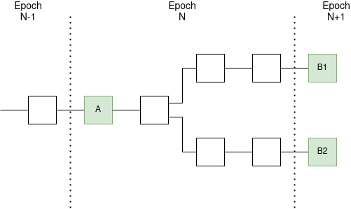
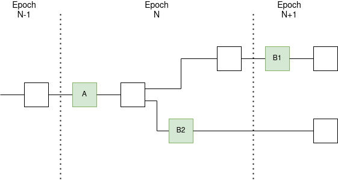
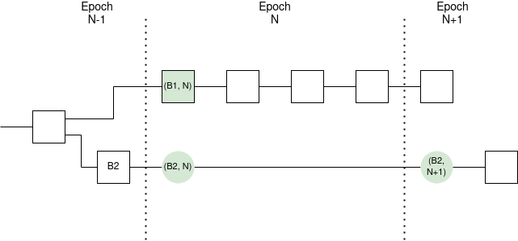
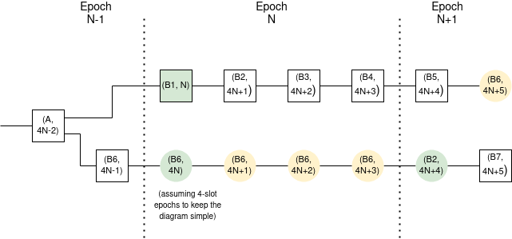

# Ethereum 2.0 Phase 0 -- Beacon Chain Fork Choice

**Notice**: This document was written in Aug 2020.

## Table of contents
<!-- TOC -->
<!-- START doctoc generated TOC please keep comment here to allow auto update -->
<!-- DON'T EDIT THIS SECTION, INSTEAD RE-RUN doctoc TO UPDATE -->


- [Introduction](#introduction)
- [Fork choice](#fork-choice)
  - [Configuration](#configuration)
  - [Helpers](#helpers)
    - [`LatestMessage`](#latestmessage)
    - [`Store`](#store)
    - [`get_forkchoice_store`](#get_forkchoice_store)
    - [`get_slots_since_genesis`](#get_slots_since_genesis)
    - [`get_current_slot`](#get_current_slot)
    - [`compute_slots_since_epoch_start`](#compute_slots_since_epoch_start)
    - [`get_ancestor`](#get_ancestor)
    - [`get_latest_attesting_balance`](#get_latest_attesting_balance)
    - [`filter_block_tree`](#filter_block_tree)
    - [`get_filtered_block_tree`](#get_filtered_block_tree)
    - [`get_head`](#get_head)
    - [`should_update_justified_checkpoint`](#should_update_justified_checkpoint)
    - [`on_attestation` helpers](#on_attestation-helpers)
      - [`validate_on_attestation`](#validate_on_attestation)
      - [`store_target_checkpoint_state`](#store_target_checkpoint_state)
      - [`update_latest_messages`](#update_latest_messages)
  - [Handlers](#handlers)
    - [`on_tick`](#on_tick)
    - [`on_block`](#on_block)
    - [`on_attestation`](#on_attestation)

<!-- END doctoc generated TOC please keep comment here to allow auto update -->
<!-- /TOC -->

## Introduction

This document is the beacon chain **fork choice rule** specification, part of Ethereum 2.0 Phase 0. It describes the mechanism for how to choose what is the "canonical" chain in the event that there are multiple conflicting versions of the chain to choose from. All blockchains have the possibility of temporary disagreement, either because of malicious behavior (eg. a block proposer publishing two different blocks at the same time), or just network latency (eg. a block being delayed by a few seconds, causing it to be broadcasted around the same time as the _next_ block that gets published by someone else). In such cases, some mechanism is needed to choose which of the two (or more) chains represents the "actual" history and state of the system (this chain is called the **canonical chain**).

PoW chains (Bitcoin, Ethereum 1.0, etc) typically use some variant of the **longest chain rule**: if there is a disagreement between chains, pick the chain that is the longest.


In practice, "[total difficulty](https://ethereum.stackexchange.com/questions/7068/difficulty-and-total-difficulty)" is used instead of length, though for most intuitive analysis, thinking about length is typically sufficient. PoS chains can also use the longest chain rule; however, PoS opens the door to much better fork choice rules that provide much stronger properties than the longest chain rule.

The fork choice rule can be viewed as being part of the **consensus algorithm**, the other part of the consensus algorithm being the rules that determine what messages each participant should send to the network (see the [honest validator doc](https://github.com/ethereum/eth2.0-specs/blob/dev/specs/phase0/validator.md#beacon-chain-responsibilities) for more info). In eth2, the consensus algorithm is Casper FFG + LMD GHOST, sometimes called [Gasper](https://arxiv.org/abs/2003.03052).

* See here for the original paper describing Casper FFG: https://arxiv.org/abs/1710.09437
* See here for a description of LMD GHOST (ignore the section on detecting finality, as that is specific to Casper CBC, whereas the fork choice rule is shared between CBC and FFG): https://vitalik.ca/general/2018/12/05/cbc_casper.html

The goal of Casper FFG and LMD GHOST is to combine together the benefits of two major types of PoS design: **longest-chain-based** (or Nakamoto-based), as used by Peercoin, NXT, [Ouroboros](https://cardano.org/ouroboros/) and many other designs, and **traditional BFT based**, as used by [Tendermint](https://tendermint.com/docs/introduction/what-is-tendermint.html) and others. Longest chain systems have the benefit that they are low-overhead, even with a very high number of participants. Traditional BFT systems have the key benefit that they have a concept of **finality**: once a block is **finalized**, it can no longer be reverted, no matter what other participants in the network do. If >1/3 of participants in the network behave maliciously, different nodes could be tricked into accepting different conflicting blocks as finalized. However, to cause such a situation, those participants would have to misbehave in a very unambiguous and provable way, allowing them to be **slashed** (all their coins taken away as a penalty), making attacks extremely expensive. Additionally, traditional BFT systems reach finality quickly, though at the cost of high overhead and a low maximum participant count.

Eth2 combines together the advantages of both. It includes a traditional-BFT-inspired finality system (Casper FFG), though running at a rate of ~13 minutes per cycle (note: time to finality = 2 epochs = 2 * 32 * 12 sec) instead of a few seconds per cycle, allowing potentially over a million participants. To progress the chain between these epochs, LMD GHOST is used.


The core idea of LMD GHOST is that at each fork, instead of choosing the side that contains a longer chain, we choose the side that has more total support from validators, counting only the most recent message of each validator as support. This is heavily inspired by [Zohar and Sompolinsky's original GHOST paper](https://eprint.iacr.org/2013/881), but it adapts the design from its original PoW context to our new PoS context. LMD GHOST is powerful because it easily generalizes to much more than one "vote" being sent in parallel.

This is a very valuable feature for us, because Casper FFG [already requires every validator](https://github.com/ethereum/annotated-spec/blob/master/beacon-chain.md#how-does-eth2-proof-of-stake-work) to send one attestation per epoch, meaning that hundreds of attestations are already being sent every second. We piggyback on those messages and ask them to include additional information voting on the current head of the chain. The result of this is that when a block is published, within seconds there are hundreds of signed messages from validators (**attestations**) confirming the block, and after even one slot (12 seconds) it's very difficult to revert a block. Anyone seeking even stronger ironclad confirmation can simply wait for finality after two epochs (~12 minutes).

The approximate approach that we take to combining Casper FFG and LMD GHOST is:

1. Use the Casper FFG rules to compute finalized blocks. If a block becomes finalized, all future canonical chains must pass through this block.
2. Use the Casper FFG rules to keep track of the **latest justified checkpoint** (LJC) that is a descendant of the latest accepted finalized checkpoint.
3. Use the LMD GHOST rules, starting from the LJC as a root, to compute the chain head.

This combination of steps, particularly rule (2), is implemented to ensure that new blocks that validators create by following the rules actually will continually finalize new blocks with Casper FFG, even if temporary exceptional situations (eg. involving attacks or extremely high network latency) take place.

### Checkpoints vs blocks

Note also that Casper FFG deals with **checkpoints** and the **checkpoint tree**, whereas LMD GHOST deals with blocks and the **block tree**. One simple way to think about this is that the checkpoint tree is a compressed version of the block tree, where we only consider blocks at the start of an epoch, and where checkpoint A is a parent of checkpoint B if block A is the ancestor of B in the block tree that begins the epoch before B:



_Green blocks are the checkpoints; in the checkpoint tree, A is the parent of B1 and B2._

But to approach a more realistic picture we need to account for an important scenario: when there are skipped slots. If a chain has a skipped block at some slot, we take the most recent block before that slot in that chain as the epoch boundary block:



In any case where there is divergence between multiple chains, skipped slots will be frequent, because proposer selection and slashing rules forbid multiple blocks from being created in the same slot (unless two chains diverge for more than four epochs)! Note also that if we want to compute the _post-state_ of a checkpoint, we would have to run [the `process_slots` function](https://github.com/ethereum/annotated-spec/blob/master/beacon-chain.md#state-transition) up to the first slot of the epoch to process the empty slots.

Another important edge case is when there is more than an entire epoch of skipped slots. To cover this edge case, we think about a checkpoint as a (block, slot) pair, not a blocks; this means that the same block could be part of multiple checkpoints that an attestation could validly reference:



In this case, the block B2 corresponds to two checkpoints, `(B2, N)` and `(B2, N+1)`, one for each epoch. In general, the most helpful model for understanding Ethereum state transitions may actually be the full state transition tree, where we look at all possible `(block, slot)` pairs:



If you're a mathematician, you could view both the block tree and the checkpoint tree as [graph minors](https://en.wikipedia.org/wiki/Graph_minor) of the state transition tree. Casper FFG works over the checkpoint tree, and LMD GHOST works over the block tree. For convenience, we'll use the phrase "**latest justified block**" (LJB) to refer to the block referenced in the latest justified checkpoint; because LMD GHOST works over the block tree we'll keep the discussion to blocks, though the actual data structures will talk about the latest justified checkpoint. Note that while one block may map to multiple checkpoints, a checkpoint only references one block, so this language is unambiguous.

Now, let's go through the specification...

## Fork choice

One important thing to note is that the fork choice _is not a pure function_; that is, what you accept as a canonical chain does not depend just on what data you also have, but also when you received it. The main reason this is done is to enforce finality: if you accept a block as finalized, then you will never revert it, even if you later see a conflicting block as finalized. Such a situation would only happen in cases where there is an active >1/3 attack on the chain; in such cases, we expect extra-protocol measures to be required to get all clients back on the same chain. There are also other deviations from purity, particularly a "sticky" choice of latest justified block, where the latest justified block can only change near the beginning of an epoch; this is done to prevent certain kinds of "bouncing attacks".

We implement this fork choice by defining a `store` that contains received fork-choice-relevant information, as well as some "memory variables", and a function `get_head(store)`.

At genesis, let `store = get_forkchoice_store(genesis_state)` and update `store` by running:

- `on_tick(store, time)` whenever `time > store.time` where `time` is the current Unix time
- `on_block(store, block)` whenever a block `block: SignedBeaconBlock` is received
- `on_attestation(store, attestation)` whenever an attestation `attestation` is received

Any of the above handlers that trigger an unhandled exception (e.g. a failed assert or an out-of-range list access) are considered invalid. Invalid calls to handlers must not modify `store`.

*Notes*:

1) **Leap seconds**: Slots will last `SECONDS_PER_SLOT + 1` or `SECONDS_PER_SLOT - 1` seconds around leap seconds. This is automatically handled by [UNIX time](https://en.wikipedia.org/wiki/Unix_time).
2) **Honest clocks**: Honest nodes are assumed to have clocks synchronized within `SECONDS_PER_SLOT` seconds of each other.
3) **Eth1 data**: The large `ETH1_FOLLOW_DISTANCE` specified in the [honest validator document](https://github.com/ethereum/eth2.0-specs/blob/dev/specs/phase0/validator.md) should ensure that `state.latest_eth1_data` of the canonical Ethereum 2.0 chain remains consistent with the canonical Ethereum 1.0 chain. If not, emergency manual intervention will be required.
4) **Manual forks**: Manual forks may arbitrarily change the fork choice rule but are expected to be enacted at epoch transitions, with the fork details reflected in `state.fork`.
5) **Implementation**: The implementation found in this specification is constructed for ease of understanding rather than for optimization in computation, space, or any other resource. A number of optimized alternatives can be found [here](https://github.com/protolambda/lmd-ghost).

### Configuration

| Name | Value | Unit | Duration |
| - | - | :-: | :-: |
| `SAFE_SLOTS_TO_UPDATE_JUSTIFIED` | `2**3` (= 8) | slots | 96 seconds |

The justified checkpoint can only be changed in the first 8 slots of an epoch; see below for reasoning why this is done.

### Helpers

Here, we define the data structure for the `store`. It only has one new subtype, the `LatestMessage` (the vote in the latest [meaning highest-epoch] valid attestation received from a validator).

#### `LatestMessage`

```python
@dataclass(eq=True, frozen=True)
class LatestMessage(object):
    epoch: Epoch
    root: Root
```

#### `Store`

```python
@dataclass
class Store(object):
    time: uint64
    genesis_time: uint64
    justified_checkpoint: Checkpoint
    finalized_checkpoint: Checkpoint
    best_justified_checkpoint: Checkpoint
    blocks: Dict[Root, BeaconBlock] = field(default_factory=dict)
    block_states: Dict[Root, BeaconState] = field(default_factory=dict)
    checkpoint_states: Dict[Checkpoint, BeaconState] = field(default_factory=dict)
    latest_messages: Dict[ValidatorIndex, LatestMessage] = field(default_factory=dict)
```

The members variables here are as follows:

* `time`: the current time
* `genesis_time`: the time of the genesis block of the chain
* `justified_checkpoint`: the Casper FFG justified checkpoint that is used as the root of the LMD GHOST fork choice
* `finalized_checkpoint`: the last finalized checkpoint; this block and its ancestors cannot be reverted
* `best_justified_checkpoint`: the justified checkpoint that we will switch to at the start of the next epoch (see [this section](#should_update_justified_checkpoint) for why we store this variable temporarily and only switch over the `justified_checkpoint` at the start of the next epoch)
* `blocks`: all blocks that we know about. Note that each `Block` contains a `parent_root`, so this contains the full "block tree" so we can get parents and children for any block
* `block_states`: the post-state of every block that we know about. We need this for a few reasons: (i) to verify any new incoming block that claims that block as a parent, (ii) to be able to get the current and previous justified checkpoint of a block when running `filter_block_tree`, and (iii) to compute the end-of-epoch checkpoint states.
* `checkpoint_states`: the post-state of every checkpoint. This could be different from the post-state of the block referenced by the checkpoint in the case where there are skipped slots; one would need to run the state transition function through the empty slots to get to the end-of-epoch state. Note particularly the extreme case where there is more than an entire epoch of skipped slots between a block and its child, so there are _multiple_ checkpoints referring to that block, with different epoch numbers and different states.
* `latest_messages`: the latest epoch and block voted for by each validator.

Note that in reality, instead of storing the post-states of all blocks and checkpoints that they know about, clients may simply store only the latest state, opting to reprocess blocks or process a saved journal of state changes if they want to process older blocks. This sacrifices computing efficiency in exceptional cases, but saves greatly on storage.

#### `get_forkchoice_store`

This function initializes the `store` given a particular block that the fork choice would start from. This should be the most recent finalized block that the client knows about from extra-protocol sources; at the beginning, it would just be the genesis.

*Note* With regards to fork choice, block headers are interchangeable with blocks. The spec is likely to move to headers for reduced overhead in test vectors and better encapsulation. Full implementations store blocks as part of their database and will often use full blocks when dealing with production fork choice.

_The block for `anchor_root` is incorrectly initialized to the block header, rather than the full block. This does not affect functionality but will be cleaned up in subsequent releases._

```python
def get_forkchoice_store(anchor_state: BeaconState) -> Store:
    anchor_block_header = copy(anchor_state.latest_block_header)
    if anchor_block_header.state_root == Bytes32():
        anchor_block_header.state_root = hash_tree_root(anchor_state)
    anchor_root = hash_tree_root(anchor_block_header)
    anchor_epoch = get_current_epoch(anchor_state)
    justified_checkpoint = Checkpoint(epoch=anchor_epoch, root=anchor_root)
    finalized_checkpoint = Checkpoint(epoch=anchor_epoch, root=anchor_root)
    return Store(
        time=uint64(anchor_state.genesis_time + SECONDS_PER_SLOT * anchor_state.slot),
        genesis_time=anchor_state.genesis_time,
        justified_checkpoint=justified_checkpoint,
        finalized_checkpoint=finalized_checkpoint,
        best_justified_checkpoint=justified_checkpoint,
        blocks={anchor_root: anchor_block_header},
        block_states={anchor_root: copy(anchor_state)},
        checkpoint_states={justified_checkpoint: copy(anchor_state)},
    )
```

#### `get_slots_since_genesis`

```python
def get_slots_since_genesis(store: Store) -> int:
    return (store.time - store.genesis_time) // SECONDS_PER_SLOT
```

#### `get_current_slot`

```python
def get_current_slot(store: Store) -> Slot:
    return Slot(GENESIS_SLOT + get_slots_since_genesis(store))
```

#### `compute_slots_since_epoch_start`

```python
def compute_slots_since_epoch_start(slot: Slot) -> int:
    return slot - compute_start_slot_at_epoch(compute_epoch_at_slot(slot))
```

Compute which slot of the current epoch we are in (returns 0...31).

#### `get_ancestor`

```python
def get_ancestor(store: Store, root: Root, slot: Slot) -> Root:
    block = store.blocks[root]
    if block.slot > slot:
        return get_ancestor(store, block.parent_root, slot)
    elif block.slot == slot:
        return root
    else:
        # root is older than queried slot, thus a skip slot. Return most recent root prior to slot
        return root
```

Get the ancestor of block `root` (we refer to all blocks by their root in the fork choice spec) at the given `slot` (eg. if `root` was at slot 105 and `slot = 100`, and the chain has no skipped slots in between, it would return the block's fifth ancestor).

#### `get_latest_attesting_balance`

```python
def get_latest_attesting_balance(store: Store, root: Root) -> Gwei:
    state = store.checkpoint_states[store.justified_checkpoint]
    active_indices = get_active_validator_indices(state, get_current_epoch(state))
    return Gwei(sum(
        state.validators[i].effective_balance for i in active_indices
        if (i in store.latest_messages
            and get_ancestor(store, store.latest_messages[i].root, store.blocks[root].slot) == root)
    ))
```

Get the total ETH attesting to a given block or its descendants, considering only latest attestations and active validators. This is the main function that is used to choose between two children of a block in LMD GHOST. Recall the diagram from above:


In this diagram, we assume that each of the last five block proposals (the blue ones) carries one attestation, which specifies that block as the head, and we assume each block is created by a different validator, and all validators have the same deposit size. The number in each square represents the latest attesting balance of that block. In eth2, blocks and attestations are separate, and there will be hundreds of attestations supporting each block, but otherwise the principle is the same.

#### `filter_block_tree`

Here, we implement an important but subtle deviation from the "LMD GHOST starting from the latest justified block" rule mentioned above. To motivate this deviation, consider the following attack:

* There exists a justified block B, with two descendants, C1 and C2
* B is justified, but the evidence of these justifications somehow only got included in the C1 chain, not the C2 chain
* The C1 chain starts off favored by the LMD GHOST fork choice. Suppose that 49% of validators attest to C1, using B as the latest justified block, as the C1 chain recognizes B as justified
* The fork choice switches to favoring C2 for some reason (eg. the other 51% of validators attested to C2 in that epoch). C2 does not recognize B as justified (and after two epochs can't recognize B as justified as it's too late to include evidence), so some earlier block A is used as the latest justified block instead.

Now, all validators see C2 as the canonical chain, and the system is stuck: for a new block to be finalized, 67% of validators must make an attestation `[A -> C2]` (or `[A -> child(C2)]`), but only 51% can do this freely; at least 16% are constrained because they already voted `[B -> C1]`, and `[A -> C2]` violates the no-double-vote rule and `[A -> child(C2)]` violates the no-surround rule. Hence, the system can only progress if 16% voluntarily slash themselves.

The fix is the following. We restrict the fork choice to only looking at descendants of B that actually recognize B as their latest justified block (or more precisely, leaves in the block tree where B is their latest justified block, as well as their ancestors). A client only accepts a block B locally as a latest justified block if there is an actual descendant block that recognizes it as such, so we know there must be at least one such chain. With this fix, C2 would not even be considered a viable candidate descendant of B until it (or one of its descendants) recognizes B as justified, so the above situation would resolve by simply favoring C1.

See [section 4.6 of the Gasper paper](https://arxiv.org/pdf/2003.03052.pdf) for more details.

```python
def filter_block_tree(store: Store, block_root: Root, blocks: Dict[Root, BeaconBlock]) -> bool:
    block = store.blocks[block_root]
    children = [
        root for root in store.blocks.keys()
        if store.blocks[root].parent_root == block_root
    ]

    # If any children branches contain expected finalized/justified checkpoints,
    # add to filtered block-tree and signal viability to parent.
    if any(children):
        filter_block_tree_result = [filter_block_tree(store, child, blocks) for child in children]
        if any(filter_block_tree_result):
            blocks[block_root] = block
            return True
        return False

    # If leaf block, check finalized/justified checkpoints as matching latest.
    head_state = store.block_states[block_root]

    correct_justified = (
        store.justified_checkpoint.epoch == GENESIS_EPOCH
        or head_state.current_justified_checkpoint == store.justified_checkpoint
    )
    correct_finalized = (
        store.finalized_checkpoint.epoch == GENESIS_EPOCH
        or head_state.finalized_checkpoint == store.finalized_checkpoint
    )
    # If expected finalized/justified, add to viable block-tree and signal viability to parent.
    if correct_justified and correct_finalized:
        blocks[block_root] = block
        return True

    # Otherwise, branch not viable
    return False
```

#### `get_filtered_block_tree`

`filter_block_tree` above is an impure function; it takes as input a key/value dict, which it passes along to its recursive calls to fill in the dict. `get_filtered_block_tree` is a pure function that wraps around it. Additionally, instead of requiring the `root` to be passed as an explicit argument, it gets the justified checkpoint directly from the `store` (which contains, among other things, the full block tree).

```python
def get_filtered_block_tree(store: Store) -> Dict[Root, BeaconBlock]:
    """
    Retrieve a filtered block tree from ``store``, only returning branches
    whose leaf state's justified/finalized info agrees with that in ``store``.
    """
    base = store.justified_checkpoint.root
    blocks: Dict[Root, BeaconBlock] = {}
    filter_block_tree(store, base, blocks)
    return blocks
```

#### `get_head`

The main fork choice rule function: gets the head of the chain.

```python
def get_head(store: Store) -> Root:
    # Get filtered block tree that only includes viable branches
    blocks = get_filtered_block_tree(store)
    # Execute the LMD-GHOST fork choice
    head = store.justified_checkpoint.root
    justified_slot = compute_start_slot_at_epoch(store.justified_checkpoint.epoch)
    while True:
        children = [
            root for root in blocks.keys()
            if blocks[root].parent_root == head and blocks[root].slot > justified_slot
        ]
        if len(children) == 0:
            return head
        # Sort by latest attesting balance with ties broken lexicographically
        head = max(children, key=lambda root: (get_latest_attesting_balance(store, root), root))
```

This follows the following procedure:

1. Get the latest justified block hash, call it `B` (this is implicit in `get_filtered_block_tree`)
2. Get the subtree of blocks rooted in `B` (done by `get_filtered_block_tree`)
3. Filter that for blocks whose slot exceeds the slot of `B` (technically, this check is no longer necessary ever since (2) was introduced so may be removed)
4. Walk down the tree, at each step where a block has multiple children selecting the child with the stronger support (ie. higher `get_latest_attesting_balance`)

From here on below, we have the functions for _updating_ the `store`.

#### `should_update_justified_checkpoint`

```python
def should_update_justified_checkpoint(store: Store, new_justified_checkpoint: Checkpoint) -> bool:
    """
    To address the bouncing attack, only update conflicting justified
    checkpoints in the fork choice if in the early slots of the epoch.
    Otherwise, delay incorporation of new justified checkpoint until next epoch boundary.

    See https://ethresear.ch/t/prevention-of-bouncing-attack-on-ffg/6114 for more detailed analysis and discussion.
    """
    if compute_slots_since_epoch_start(get_current_slot(store)) < SAFE_SLOTS_TO_UPDATE_JUSTIFIED:
        return True

    justified_slot = compute_start_slot_at_epoch(store.justified_checkpoint.epoch)
    if not get_ancestor(store, new_justified_checkpoint.root, justified_slot) == store.justified_checkpoint.root:
        return False

    return True
```

The idea here is that we want to only change the last-justified-block within the first 1/3 of an epoch. This prevents "bouncing attacks" of the following form:

1. Start from a scenario where in epoch N, 62% of validators support block A, and in epoch N+1, 62% of validators support block B. Suppose that the attacker has 5% of total stake. This scenario requires very exceptional networking conditions to get into; the point of the attack, however, is that if we get into such a scenario the attacker could perpetuate it, permanently preventing finality.
2. Due to LMD GHOST, B is favored, and so validators are continuing to vote for B. However, the attacker suddenly publishes attestations worth 5% of total stake tagged with epoch N for block A, causing A to get justified.
3. In epoch N+2, A is justified and so validators are attesting to A', a descendant of A. When A' gets to 62% support, the attacker publishes attestations worth 5% of total stake for B. Now B is justified, and favored by the fork choice.
4. In epoch N+3, B is justified, and so validators are attesting to B', a descendant of B. When B' gets to 62% support, the attacker publishes attestations worth 5% of total stake for A'....

This could continue forever, bouncing permanently between the two chains preventing any new block from being finalized. This attack can happen because the combined use of LMD GHOST and Casper FFG creates a discontinuity, where a small shift in support for a block can outweigh a large amount of support for another block, if that small shift pushes it past the 2/3 threshold needed for justification. We block the attack by only allowing the latest justified block to change near the beginning of an epoch; this way, there is a full 2/3 of an epoch during which honest validators agree on the head and have the opportunity to justify a block and thereby further cement it, at the same time causing the LMD GHOST rule to strongly favor that head. This sets up that block to most likely be finalized in the next epoch.

See [Ryuya Nakamura's ethresear.ch post](https://ethresear.ch/t/prevention-of-bouncing-attack-on-ffg/6114) for more discussion.

#### `on_attestation` helpers

##### `validate_on_attestation`

When a client receives an attestation (either from a block or directly on the wire), it should first perform some checks, and reject the attestation if it does not pass those checks.

```python
def validate_on_attestation(store: Store, attestation: Attestation) -> None:
    target = attestation.data.target

    # Attestations must be from the current or previous epoch
    current_epoch = compute_epoch_at_slot(get_current_slot(store))
    # Use GENESIS_EPOCH for previous when genesis to avoid underflow
    previous_epoch = current_epoch - 1 if current_epoch > GENESIS_EPOCH else GENESIS_EPOCH
    # If attestation target is from a future epoch, delay consideration until the epoch arrives
    assert target.epoch in [current_epoch, previous_epoch]
    assert target.epoch == compute_epoch_at_slot(attestation.data.slot)

    # Attestations target be for a known block. If target block is unknown, delay consideration until the block is found
    assert target.root in store.blocks

    # Attestations must be for a known block. If block is unknown, delay consideration until the block is found
    assert attestation.data.beacon_block_root in store.blocks
    # Attestations must not be for blocks in the future. If not, the attestation should not be considered
    assert store.blocks[attestation.data.beacon_block_root].slot <= attestation.data.slot

    # LMD vote must be consistent with FFG vote target
    target_slot = compute_start_slot_at_epoch(target.epoch)
    assert target.root == get_ancestor(store, attestation.data.beacon_block_root, target_slot)

    # Attestations can only affect the fork choice of subsequent slots.
    # Delay consideration in the fork choice until their slot is in the past.
    assert get_current_slot(store) >= attestation.data.slot + 1
```

We do the following checks:

1. Check that the attestation is from either the current or the previous epoch (we ignore attestations that come too late). This is done to prevent bounce attacks (see [above](#should_update_justified_checkpoint)) from "saving up" epochs and flipping back and forth between chains many times.
2. Check that the attestation is attesting to a block which the client has already received and verified (if it is not, the attestation may be saved for some time, in case that block is later found)
3. Check that the attestation is attesting to a block which is at or before the slot of the attestation (ie. can't attest to future blocks)
4. Check that the vote for the head block is consistent with the vote for the target
5. Check that the attestation's slot itself is not in the future

##### `store_target_checkpoint_state`

```python
def store_target_checkpoint_state(store: Store, target: Checkpoint) -> None:
    # Store target checkpoint state if not yet seen
    if target not in store.checkpoint_states:
        base_state = copy(store.block_states[target.root])
        if base_state.slot < compute_start_slot_at_epoch(target.epoch):
            process_slots(base_state, compute_start_slot_at_epoch(target.epoch))
        store.checkpoint_states[target] = base_state
```

Update the `checkpoint_states` dict, which is a convenience dict that stores the end-of-epoch states for each checkpoint. Most of the time, this is the same as the post-state of the last block in an epoch, but in the case where there are skipped slots, the state would need to process through the empty slots first. See the [Store definition](#Store) for more details.

##### `update_latest_messages`

```python
def update_latest_messages(store: Store, attesting_indices: Sequence[ValidatorIndex], attestation: Attestation) -> None:
    target = attestation.data.target
    beacon_block_root = attestation.data.beacon_block_root
    for i in attesting_indices:
        if i not in store.latest_messages or target.epoch > store.latest_messages[i].epoch:
            store.latest_messages[i] = LatestMessage(epoch=target.epoch, root=beacon_block_root)
```

In the latest messages dict, update the latest message of each validator who participated in the given attestation.

### Handlers

#### `on_tick`

```python
def on_tick(store: Store, time: uint64) -> None:
    previous_slot = get_current_slot(store)

    # update store time
    store.time = time

    current_slot = get_current_slot(store)
    # Not a new epoch, return
    if not (current_slot > previous_slot and compute_slots_since_epoch_start(current_slot) == 0):
        return
    # Update store.justified_checkpoint if a better checkpoint is known
    if store.best_justified_checkpoint.epoch > store.justified_checkpoint.epoch:
        store.justified_checkpoint = store.best_justified_checkpoint
```

This function runs on each tick (ie. per second). At the end of each epoch, update the justified checkpoint used in the fork choice.

#### `on_block`

```python
def on_block(store: Store, signed_block: SignedBeaconBlock) -> None:
    block = signed_block.message
    # Parent block must be known
    assert block.parent_root in store.block_states
    # Make a copy of the state to avoid mutability issues
    pre_state = copy(store.block_states[block.parent_root])
    # Blocks cannot be in the future. If they are, their consideration must be delayed until the are in the past.
    assert get_current_slot(store) >= block.slot

    # Check that block is later than the finalized epoch slot (optimization to reduce calls to get_ancestor)
    finalized_slot = compute_start_slot_at_epoch(store.finalized_checkpoint.epoch)
    assert block.slot > finalized_slot
    # Check block is a descendant of the finalized block at the checkpoint finalized slot
    assert get_ancestor(store, block.parent_root, finalized_slot) == store.finalized_checkpoint.root

    # Check the block is valid and compute the post-state
    state = state_transition(pre_state, signed_block, True)
    # Add new block to the store
    store.blocks[hash_tree_root(block)] = block
    # Add new state for this block to the store
    store.block_states[hash_tree_root(block)] = state

    # Update justified checkpoint
    if state.current_justified_checkpoint.epoch > store.justified_checkpoint.epoch:
        if state.current_justified_checkpoint.epoch > store.best_justified_checkpoint.epoch:
            store.best_justified_checkpoint = state.current_justified_checkpoint
        if should_update_justified_checkpoint(store, state.current_justified_checkpoint):
            store.justified_checkpoint = state.current_justified_checkpoint

    # Update finalized checkpoint
    if state.finalized_checkpoint.epoch > store.finalized_checkpoint.epoch:
        store.finalized_checkpoint = state.finalized_checkpoint

        # Potentially update justified if different from store
        if store.justified_checkpoint != state.current_justified_checkpoint:
            # Update justified if new justified is later than store justified
            if state.current_justified_checkpoint.epoch > store.justified_checkpoint.epoch:
                store.justified_checkpoint = state.current_justified_checkpoint
                return

            # Update justified if store justified is not in chain with finalized checkpoint
            finalized_slot = compute_start_slot_at_epoch(store.finalized_checkpoint.epoch)
            ancestor_at_finalized_slot = get_ancestor(store, store.justified_checkpoint.root, finalized_slot)
            if ancestor_at_finalized_slot != store.finalized_checkpoint.root:
                store.justified_checkpoint = state.current_justified_checkpoint
```

Upon receiving a block, first do a few checks:

1. Check that we know about the block's parent (if we don't, we can temporarily save the block in case we find the parent later)
2. Check that the block is not from a slot that is still in the future (if it is, we can pretend to not hear about the block until time progresses to the point that the block is no longer from the future)
3. Check that the block slot is later than the last finalized block's slot, and that the block is a descendant of the last finalized block (an optimization to reduce unnecessary work from blocks that can clearly no longer possibly become canonical)
4. Check that the block's post-state root is correct and the state transition passes

We then add the block to the DB. We also update the justified and finalized checkpoints. The idea is that if the justified checkpoint known by the received block has a higher epoch number than the justified checkpoint we know about, we accept that justified checkpoint. If we are [in the first 1/3](#should_update_justified_checkpoint) of an epoch, we accept it immediately, otherwise, we put it in `store.best_justified_checkpoint` so it can be updated into `store.justified_checkpoint` [at the end](#on_tick) of the epoch.

If the received block knows about a finalized checkpoint with a higher epoch number than what we know about, we accept it, and we also immediately update the justified checkpoint if either (i) the justified checkpoint provided in the block is more recent than the one we know about, or (ii) the one we know about is not compatible with the new finalized block. Note that there is a theoretical possibility that condition (ii) causes the justified checkpoint to go backwards (change from a later epoch to an earlier epoch), but for this to happen, there would need to be a finalized block B with a justified child B', with a justified block A' on a conflicting chain pointing to some earlier finalized block A, which implies a slashable 1/3 attack due to the no-surround rule. In such a case, anyone who referenced A' as an LJB may not be able to build on top of B', so some validators who participated on the "wrong chain" may need to suffer some level of inactivity leak.

#### `on_attestation`

```python
def on_attestation(store: Store, attestation: Attestation) -> None:
    """
    Run ``on_attestation`` upon receiving a new ``attestation`` from either within a block or directly on the wire.

    An ``attestation`` that is asserted as invalid may be valid at a later time,
    consider scheduling it for later processing in such case.
    """
    validate_on_attestation(store, attestation)
    store_target_checkpoint_state(store, attestation.data.target)

    # Get state at the `target` to fully validate attestation
    target_state = store.checkpoint_states[attestation.data.target]
    indexed_attestation = get_indexed_attestation(target_state, attestation)
    assert is_valid_indexed_attestation(target_state, indexed_attestation)

    # Update latest messages for attesting indices
    update_latest_messages(store, indexed_attestation.attesting_indices, attestation)
```

Called upon receiving an attestation. This function simply combines together the helper functions above:

* Validate the attestation
* Compute the state of the target checkpoint that the attestation references
* Check that the attestation signature is valid (this requires the target state to compute the validator set)
* Update the `latest_messages` dict.
