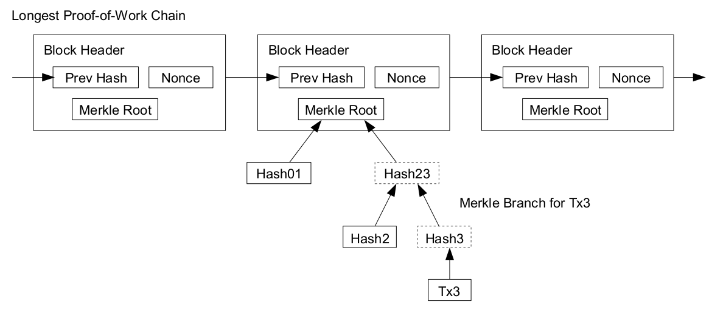

# Ethereum 2.0 Phase 1 -- The Beacon Chain with Shards

**Notice**: This document was written in Aug 2020.

## Table of contents

<!-- START doctoc generated TOC please keep comment here to allow auto update -->
<!-- DON'T EDIT THIS SECTION, INSTEAD RE-RUN doctoc TO UPDATE -->
**Table of Contents**

- [Introduction](#introduction)
- [Custom types](#custom-types)
- [Configuration](#configuration)
  - [Misc](#misc)
  - [Shard block configs](#shard-block-configs)
  - [Gwei values](#gwei-values)
  - [Initial values](#initial-values)
  - [Time parameters](#time-parameters)
  - [Domain types](#domain-types)
- [Updated containers](#updated-containers)
  - [Extended `AttestationData`](#extended-attestationdata)
  - [Extended `Attestation`](#extended-attestation)
  - [Extended `PendingAttestation`](#extended-pendingattestation)
  - [Extended `IndexedAttestation`](#extended-indexedattestation)
  - [Extended `AttesterSlashing`](#extended-attesterslashing)
  - [Extended `Validator`](#extended-validator)
  - [Extended `BeaconBlockBody`](#extended-beaconblockbody)
  - [Extended `BeaconBlock`](#extended-beaconblock)
    - [Extended `SignedBeaconBlock`](#extended-signedbeaconblock)
  - [Extended `BeaconState`](#extended-beaconstate)
- [New containers](#new-containers)
  - [`ShardBlock`](#shardblock)
  - [`SignedShardBlock`](#signedshardblock)
  - [`ShardBlockHeader`](#shardblockheader)
  - [`ShardState`](#shardstate)
  - [`ShardTransition`](#shardtransition)
  - [`CompactCommittee`](#compactcommittee)
  - [`AttestationCustodyBitWrapper`](#attestationcustodybitwrapper)
- [Helper functions](#helper-functions)
  - [Misc](#misc-1)
    - [`compute_previous_slot`](#compute_previous_slot)
    - [`pack_compact_validator`](#pack_compact_validator)
    - [`unpack_compact_validator`](#unpack_compact_validator)
    - [`committee_to_compact_committee`](#committee_to_compact_committee)
    - [`compute_shard_from_committee_index`](#compute_shard_from_committee_index)
    - [`compute_offset_slots`](#compute_offset_slots)
    - [`compute_updated_gasprice`](#compute_updated_gasprice)
    - [`compute_committee_source_epoch`](#compute_committee_source_epoch)
  - [Beacon state accessors](#beacon-state-accessors)
    - [`get_active_shard_count`](#get_active_shard_count)
    - [`get_online_validator_indices`](#get_online_validator_indices)
    - [`get_shard_committee`](#get_shard_committee)
    - [`get_light_client_committee`](#get_light_client_committee)
    - [`get_shard_proposer_index`](#get_shard_proposer_index)
    - [`get_committee_count_delta`](#get_committee_count_delta)
    - [`get_start_shard`](#get_start_shard)
    - [`get_latest_slot_for_shard`](#get_latest_slot_for_shard)
    - [`get_offset_slots`](#get_offset_slots)
  - [Predicates](#predicates)
    - [`is_on_time_attestation`](#is_on_time_attestation)
    - [`is_winning_attestation`](#is_winning_attestation)
    - [`optional_aggregate_verify`](#optional_aggregate_verify)
    - [`optional_fast_aggregate_verify`](#optional_fast_aggregate_verify)
  - [Block processing](#block-processing)
    - [Operations](#operations)
      - [New Attestation processing](#new-attestation-processing)
        - [`validate_attestation`](#validate_attestation)
        - [Updated `process_attestation`](#updated-process_attestation)
      - [Shard transition processing](#shard-transition-processing)
        - [`apply_shard_transition`](#apply_shard_transition)
        - [`process_crosslink_for_shard`](#process_crosslink_for_shard)
        - [`process_crosslinks`](#process_crosslinks)
        - [`verify_empty_shard_transition`](#verify_empty_shard_transition)
        - [`process_shard_transitions`](#process_shard_transitions)
      - [New default validator for deposits](#new-default-validator-for-deposits)
    - [Light client processing](#light-client-processing)
  - [Epoch transition](#epoch-transition)
    - [Phase 1 final updates](#phase-1-final-updates)
    - [Custody game updates](#custody-game-updates)
    - [Online-tracking](#online-tracking)
    - [Light client committee updates](#light-client-committee-updates)

<!-- END doctoc generated TOC please keep comment here to allow auto update -->

## Introduction

This document describes the extensions made to the Phase 0 design of The Beacon Chain to facilitate the new features that are being added in phase 1. By far the most important feature in phase 1 is **sharding**.

### How does eth2 sharding work?

In the current (eth1) architecture, the blockchain is simply a chain of blocks, with each block pointing to the previous block. Each block contains transactions, and the history is just all of these transactions, in the order in which they appear in the chain.



The eth2 architecture, starting from phase 1, is slightly more involved: instead of having one chain of blocks, we have a **beacon chain** *and* N (currently 64) **shard chains**.

The beacon chain is a central chain which everyone stores, downloads and verifies, and which functions roughly like an eth1 chain (except using proof of stake instead of proof of work). The beacon chain contains two kinds of information:

* Consensus-critical information (eg. who the current proof of stake validators are, what rewards and penalties have been assigned to them, deposits and withdrawals...)
* Pointers (ie. hashes) to shard chain blocks and shard state

The shard chains contain all of the user-level transactions (except proof of stake-related functions). Each block in each shard is only fully downloaded and verified by a small portion of nodes. Users can choose which shard they publish transactions or contracts to. It is possible to move coins or contracts between shards, but only asynchronously (meaning, with a small delay of 1 slot).

The shard chains and the beacon chain are tightly coupled with each other, connected through hash-linking and crosslinks:

<a id="shardchains_diagram" />


For a shard block to be considered part of the "canonical history" it must be (i) [available](https://github.com/ethereum/research/wiki/A-note-on-data-availability-and-erasure-coding), (ii) valid and (iii) referenced in the beacon chain via a **crosslink**. A crosslink is a set of signatures of a shard block, signed by a randomly selected **committee** of ~128 **validators** (consensus-participating PoS nodes) which attests to the shard block's validity. Because there is too much data in the shards for any single node to verify all of it (unless that node is very high-powered, which eg. an exchange may still want to run), eth2 instead relies on this random committee verification as proxy evidence that the shard block header that gets included in the beacon chain points to something which is available and valid.

**NB: if the beacon chain ends up linking to an invalid shard block (this can only realistically happen in a 51% attack or similar extreme scenario), that beacon chain is invalid and should not be considered as a candidate in the [fork choice](../phase0/fork-choice.md). Invalid transactions (or state transitions) by definition can never be part of the canonical history.**

This is an important philosophical point; it basically means that a 51% attack _by definition_ cannot make an invalid chain canonical, though what it potentially _can_ do (eg. by having committees crosslink invalid shard blocks) is trick nodes into accepting a non-canonical chain. Light clients are vulnerable to such attacks in non-sharded blockchains too; in sharded blockchains, every client is a light client. That said, there are techniques other than committees that try to provide a second layer of defense to ensure availability, most notably [data availability proofs](https://arxiv.org/abs/1809.09044).

## Custom types

We define the following Python custom types for type hinting and readability:

| Name | SSZ equivalent | Description |
| - | - | - |
| `Shard` | `uint64` | a shard number |
| `OnlineEpochs` | `uint8` | a one-byte number representing the number of epochs a validator needs to fail to be part of a shard committee before they are not taken into account for the 2/3 threshold (this is done to ensure shard blocks keep getting included even in >1/3 online scenarios) |

## Configuration

Configuration is not namespaced. Instead it is strictly an extension; no constants of phase 0 change, but new constants are adopted for changing behaviors.

### Misc

| Name | Value | Description |
| - | - | - |
| `MAX_SHARDS` | `2**10` (= 1024) | The long-run maximum number of shards that we are planning for. 1024 is picked because it seems like a realistic long-term maximum, though note that the spec would need to be changed (particularly, reducing the validator deposit size would likely be required) to make a 1024-shard chain work effectively |
| `LIGHT_CLIENT_COMMITTEE_SIZE` | `2**7` (= 128) | The size of the committee that signs the block in such a way as to facilitate light-client access to the beacon chain |
| `GASPRICE_ADJUSTMENT_COEFFICIENT` | `2**3` (= 8) | The [EIP 1559](https://notes.ethereum.org/@vbuterin/BkSQmQTS8) per-block gasprice adjustment coefficient (the gasprice adjusts by a maximum of 1/8 per block) |

### Shard block configs

| Name | Value | Unit | Notes |
| - | - | - | - |
| `MAX_SHARD_BLOCK_SIZE` | `2**20` (= 1,048,576) | bytes | - |
| `TARGET_SHARD_BLOCK_SIZE` | `2**18` (= 262,144) |  bytes | The EIP 1559 implementation here targets blocks being 1/4 full. Note that in phase 2, counting bytes will be replaced with counting gas used. |
| `SHARD_BLOCK_OFFSETS` | `[1, 2, 3, 5, 8, 13, 21, 34, 55, 89, 144, 233]` | - | If a shard block is not included in the beacon chain, we try again in the next slot, but after three failed slots we start skipping slots. This serves two functions: (i) it ensures that a single state transition need only contain a maximum of 12 blocks, and (ii) in the case where there are very few validators, and so each shard is only processed very infrequently, many slots get skipped so the load of the chain is reduced. |
| `MAX_SHARD_BLOCKS_PER_ATTESTATION` | `len(SHARD_BLOCK_OFFSETS)` | - | A shard state transition can have a theoretical maximum of 12 blocks, if it gets crosslinked >=233 slots after the previous shard block in that shard was crosslinked. |
| `BYTES_PER_CUSTODY_CHUNK` | `2**12` (= 4,096) | bytes | See the [proof of custody game](#) for more details. |
| `CUSTODY_RESPONSE_DEPTH` | `ceillog2(MAX_SHARD_BLOCK_SIZE // BYTES_PER_CUSTODY_CHUNK)` | - | 

### Gwei values

| Name | Value |
| - | - |
| `MAX_GASPRICE` | `Gwei(2**14)` (= 16,384) | Gwei | 
| `MIN_GASPRICE` | `Gwei(2**3)` (= 8) | Gwei | 

### Initial values

| Name | Value |
| - | - |
| `NO_SIGNATURE` | `BLSSignature(b'\x00' * 96)` | 

### Time parameters

| Name | Value | Unit | Duration | Explanation | 
| - | - | :-: | :-: | :-: |
| `ONLINE_PERIOD` | `OnlineEpochs(2**3)` (= 8) | online epochs | ~51 mins | For a client's balance to be taken as part of the 2/3 threshold used to calculate if there were sufficient attestations to crosslink a shard block, the client must have been online at least once in the last 8 epochs |
| `LIGHT_CLIENT_COMMITTEE_PERIOD` | `Epoch(2**8)` (= 256) | epochs | ~27 hours | Swap the light client committee every ~27 hours; this means that a light client syncing the chain needs to only download one block and committee per 27 hours, making minimal light client load very light, while allowing the committee to still rotate reasonable frequently. |

### Domain types

New domain tags for objects introduced in phase 1:

| Name | Value |
| - | - |
| `DOMAIN_SHARD_PROPOSAL` | `DomainType('0x80000000')` |
| `DOMAIN_SHARD_COMMITTEE` | `DomainType('0x81000000')` |
| `DOMAIN_LIGHT_CLIENT` | `DomainType('0x82000000')` |
| `DOMAIN_CUSTODY_BIT_SLASHING` | `DomainType('0x83000000')` |
| `DOMAIN_LIGHT_SELECTION_PROOF` | `DomainType('0x84000000')` |
| `DOMAIN_LIGHT_AGGREGATE_AND_PROOF` | `DomainType('0x85000000')` |

## Updated containers

The following containers have updated definitions in Phase 1. The definitions are largely the same as those in phase 0, except a few new fields got added to the end to keep track of phase 1-relevant data. Readers are encouraged to skip straight to [the new containers section](#new-containers), and use this section only as a reference.

### Extended `AttestationData`

```python
class AttestationData(Container):
    slot: Slot
    index: CommitteeIndex
    # LMD GHOST vote
    beacon_block_root: Root
    # FFG vote
    source: Checkpoint
    target: Checkpoint
    # Shard vote
    shard: Shard
    # Current-slot shard block root
    shard_head_root: Root
    # Shard transition root
    shard_transition_root: Root
```

### Extended `Attestation`

```python
class Attestation(Container):
    aggregation_bits: Bitlist[MAX_VALIDATORS_PER_COMMITTEE]
    data: AttestationData
    signature: BLSSignature
```

### Extended `PendingAttestation`

```python
class PendingAttestation(Container):
    aggregation_bits: Bitlist[MAX_VALIDATORS_PER_COMMITTEE]
    data: AttestationData
    inclusion_delay: Slot
    proposer_index: ValidatorIndex
    # Phase 1
    crosslink_success: boolean
```

### Extended `IndexedAttestation`

```python
class IndexedAttestation(Container):
    attesting_indices: List[ValidatorIndex, MAX_VALIDATORS_PER_COMMITTEE]
    data: AttestationData
    signature: BLSSignature
```

### Extended `AttesterSlashing`

Note that the `attestation_1` and `attestation_2` have a new `IndexedAttestation` definition.

```python
class AttesterSlashing(Container):
    attestation_1: IndexedAttestation
    attestation_2: IndexedAttestation
```

### Extended `Validator`

```python
class Validator(Container):
    pubkey: BLSPubkey
    withdrawal_credentials: Bytes32  # Commitment to pubkey for withdrawals
    effective_balance: Gwei  # Balance at stake
    slashed: boolean
    # Status epochs
    activation_eligibility_epoch: Epoch  # When criteria for activation were met
    activation_epoch: Epoch
    exit_epoch: Epoch
    withdrawable_epoch: Epoch  # When validator can withdraw funds
    # Custody game
    # next_custody_secret_to_reveal is initialised to the custody period
    # (of the particular validator) in which the validator is activated
    # = get_custody_period_for_validator(...)
    next_custody_secret_to_reveal: uint64
    # TODO: The max_reveal_lateness doesn't really make sense anymore.
    # So how do we incentivise early custody key reveals now?
    all_custody_secrets_revealed_epoch: Epoch  # to be initialized to FAR_FUTURE_EPOCH
```

### Extended `BeaconBlockBody`

```python
class BeaconBlockBody(Container):
    randao_reveal: BLSSignature
    eth1_data: Eth1Data  # Eth1 data vote
    graffiti: Bytes32  # Arbitrary data
    # Slashings
    proposer_slashings: List[ProposerSlashing, MAX_PROPOSER_SLASHINGS]
    attester_slashings: List[AttesterSlashing, MAX_ATTESTER_SLASHINGS]
    # Attesting
    attestations: List[Attestation, MAX_ATTESTATIONS]
    # Entry & exit
    deposits: List[Deposit, MAX_DEPOSITS]
    voluntary_exits: List[SignedVoluntaryExit, MAX_VOLUNTARY_EXITS]
    # Custody game
    chunk_challenges: List[CustodyChunkChallenge, MAX_CUSTODY_CHUNK_CHALLENGES]
    chunk_challenge_responses: List[CustodyChunkResponse, MAX_CUSTODY_CHUNK_CHALLENGE_RESPONSES]
    custody_key_reveals: List[CustodyKeyReveal, MAX_CUSTODY_KEY_REVEALS]
    early_derived_secret_reveals: List[EarlyDerivedSecretReveal, MAX_EARLY_DERIVED_SECRET_REVEALS]
    custody_slashings: List[SignedCustodySlashing, MAX_CUSTODY_SLASHINGS]
    # Shards
    shard_transitions: Vector[ShardTransition, MAX_SHARDS]
    # Light clients
    light_client_bits: Bitvector[LIGHT_CLIENT_COMMITTEE_SIZE]
    light_client_signature: BLSSignature
```

### Extended `BeaconBlock`

Note that the `body` has a new `BeaconBlockBody` definition.

```python
class BeaconBlock(Container):
    slot: Slot
    proposer_index: ValidatorIndex
    parent_root: Root
    state_root: Root
    body: BeaconBlockBody
```

#### Extended `SignedBeaconBlock`

Note that the `message` has a new `BeaconBlock` definition.

```python
class SignedBeaconBlock(Container):
    message: BeaconBlock
    signature: BLSSignature
```

### Extended `BeaconState`

Note that aside from the new additions, `Validator` and `PendingAttestation` have new definitions.

```python
class BeaconState(Container):
    # Versioning
    genesis_time: uint64
    genesis_validators_root: Root
    slot: Slot
    fork: Fork
    # History
    latest_block_header: BeaconBlockHeader
    block_roots: Vector[Root, SLOTS_PER_HISTORICAL_ROOT]
    state_roots: Vector[Root, SLOTS_PER_HISTORICAL_ROOT]
    historical_roots: List[Root, HISTORICAL_ROOTS_LIMIT]
    # Eth1
    eth1_data: Eth1Data
    eth1_data_votes: List[Eth1Data, EPOCHS_PER_ETH1_VOTING_PERIOD * SLOTS_PER_EPOCH]
    eth1_deposit_index: uint64
    # Registry
    validators: List[Validator, VALIDATOR_REGISTRY_LIMIT]
    balances: List[Gwei, VALIDATOR_REGISTRY_LIMIT]
    # Randomness
    randao_mixes: Vector[Root, EPOCHS_PER_HISTORICAL_VECTOR]
    # Slashings
    slashings: Vector[Gwei, EPOCHS_PER_SLASHINGS_VECTOR]  # Per-epoch sums of slashed effective balances
    # Attestations
    previous_epoch_attestations: List[PendingAttestation, MAX_ATTESTATIONS * SLOTS_PER_EPOCH]
    current_epoch_attestations: List[PendingAttestation, MAX_ATTESTATIONS * SLOTS_PER_EPOCH]
    # Finality
    justification_bits: Bitvector[JUSTIFICATION_BITS_LENGTH]  # Bit set for every recent justified epoch
    previous_justified_checkpoint: Checkpoint  # Previous epoch snapshot
    current_justified_checkpoint: Checkpoint
    finalized_checkpoint: Checkpoint
    # Phase 1
    current_epoch_start_shard: Shard
    shard_states: List[ShardState, MAX_SHARDS]
    online_countdown: List[OnlineEpochs, VALIDATOR_REGISTRY_LIMIT]  # not a raw byte array, considered its large size.
    current_light_committee: CompactCommittee
    next_light_committee: CompactCommittee
    # Custody game
    # Future derived secrets already exposed; contains the indices of the exposed validator
    # at RANDAO reveal period % EARLY_DERIVED_SECRET_PENALTY_MAX_FUTURE_EPOCHS
    exposed_derived_secrets: Vector[List[ValidatorIndex, MAX_EARLY_DERIVED_SECRET_REVEALS * SLOTS_PER_EPOCH],
                                    EARLY_DERIVED_SECRET_PENALTY_MAX_FUTURE_EPOCHS]
    custody_chunk_challenge_records: List[CustodyChunkChallengeRecord, MAX_CUSTODY_CHUNK_CHALLENGE_RECORDS]
    custody_chunk_challenge_index: uint64
```

## New containers

The following containers are new in Phase 1.

### `ShardBlock`

```python
class ShardBlock(Container):
    shard_parent_root: Root
    beacon_parent_root: Root
    slot: Slot
    shard: Shard
    proposer_index: ValidatorIndex
    body: ByteList[MAX_SHARD_BLOCK_SIZE]
```

This is a shard block. The fields are as follows:

* `shard_parent_root`: the parent shard block in the same shard
* `beacon_parent_root`: the beacon block that the shard block is pointing to (remember [this diagram](#shardchains_diagram))
* `slot`: the current slot
* `shard`: what shard the shard block is in
* `proposer_index`: the validator index of the proposer of this block
* `body`: the block contents, as a byte list (in phase 2, this data will be parsed as a list of transactions, but we are simply treating it as a byte list here; this is done to maximize friendliness for data availability proofs, which work best over "unstructured" data)

Note that a shard block directly references both the previous slot's beacon block and the previous shard block in the same shard. If the system is running "perfectly smoothly", the latter is unnecessary, as the beacon block would already include a crosslink from the previous shard block. However, we want to facilitate fast block times within a shard even in the case where crosslinks are failing (which could happen either because of extremely high latency or because >1/3 of validators are offline), and so we include a direct pointer to the previous shard block just in case.

Note also that shard blocks do NOT contain a post-state root like beacon blocks do. This is because states are handled by the [`ShardTransition` object](#ShardTransition). Note that this particularly means that block _proposers_ do not commit to the post-state of a block, only crosslink participants do.

### `SignedShardBlock`

```python
class SignedShardBlock(Container):
    message: ShardBlock
    signature: BLSSignature
```

Shard block plus the signature from its proposer.

### `ShardBlockHeader`

```python
class ShardBlockHeader(Container):
    shard_parent_root: Root
    beacon_parent_root: Root
    slot: Slot
    shard: Shard
    proposer_index: ValidatorIndex
    body_root: Root
```

The shard block header, replacing the body with its root. This gets included in the beacon chain when there is a crosslink.

### `ShardState`

```python
class ShardState(Container):
    slot: Slot
    gasprice: Gwei
    latest_block_root: Root
```

In phase 1, there is no transaction execution in shards, only data storage, so the shard state is fairly boring. It stores the slot so that the chain knows how long ago the most recent crosslink in any given shard was, which is needed to validate the next crosslink, as the next crosslink is supposed to contain all shard blocks since that slot. The latest block root is stored so that the shard state transition function can verify that the next shard block included the correct `shard_parent_root` (remember that the state transition function is `f(state, block) -> new_state`; it has no direct access to the parent block). The `gasprice` is equivalent to the [basefee in EIP 1559](https://notes.ethereum.org/Wjr1SnW-QaST7phX9C5wkg?view).

### `ShardTransition`

```python
class ShardTransition(Container):
    # Starting from slot
    start_slot: Slot
    # Shard block lengths
    shard_block_lengths: List[uint64, MAX_SHARD_BLOCKS_PER_ATTESTATION]
    # Shard data roots
    # The root is of ByteList[MAX_SHARD_BLOCK_SIZE]
    shard_data_roots: List[Bytes32, MAX_SHARD_BLOCKS_PER_ATTESTATION]
    # Intermediate shard states
    shard_states: List[ShardState, MAX_SHARD_BLOCKS_PER_ATTESTATION]
    # Proposer signature aggregate
    proposer_signature_aggregate: BLSSignature
```

A `ShardTransition` object declares what changes are made to a shard state in a crosslink. The simplest way to think about this data structure is as two lists:

* A list of `ShardBlockHeader` objects
* A list of `ShardState` objects

Where the first `ShardState` is the state after applying the first `ShardBlockHeader` (or rather, the full shard block referenced by the header), the second `ShardState` is the state after applying the second shard block, etc. This data structure is not quite like this in practice mainly for compression reasons: we can greatly reduce the amount of data that goes on-chain by taking out extraneous data that can be re-calculated (slot, shard, proposer index), BLS-aggregating all the signatures and not including the parent roots as those are part of the `ShardState` or known in the beacon chain. The `apply_shard_transition` function will actually reconstruct the `ShardBlockHeader`s.

We need to commit to all block headers and intermediate states, so that we can later verify the incorrectness of individual state transitions in fraud proofs if needed.

### `CompactCommittee`

```python
class CompactCommittee(Container):
    pubkeys: List[BLSPubkey, MAX_VALIDATORS_PER_COMMITTEE]
    compact_validators: List[uint64, MAX_VALIDATORS_PER_COMMITTEE]
```

This is a compact representation of a committee, which a light client can download to determine the light client committee for either the present or next light client period (see [here](#light_client_aside) for more details on what light client committees do). The `CompactCommittee` object stores, for each validator in the committee, that validator's pubkey and a "compact validator" object, a `uint8` containing the validator's balance, index and whether or not they have been slashed (see [`pack_compact_validator`](#pack_compact_validator) and [`unpack_compact_validator`](#unpack_compact_validator)). The total size is 48+8=56 bytes per validator, or a total of 56\*128 bytes = 7 kB for a light client committee of 128 validators.

## Helper functions

### Misc

#### `compute_previous_slot`

```python
def compute_previous_slot(slot: Slot) -> Slot:
    if slot > 0:
        return Slot(slot - 1)
    else:
        return Slot(0)
```

Computes the previous slot, with an exception in slot 0 to prevent underflow.

#### `pack_compact_validator`

```python
def pack_compact_validator(index: ValidatorIndex, slashed: bool, balance_in_increments: uint64) -> uint64:
    """
    Create a compact validator object representing index, slashed status, and compressed balance.
    Takes as input balance-in-increments (// EFFECTIVE_BALANCE_INCREMENT) to preserve symmetry with
    the unpacking function.
    """
    return (index << 16) + (slashed << 15) + balance_in_increments
```

#### `unpack_compact_validator`

```python
def unpack_compact_validator(compact_validator: uint64) -> Tuple[ValidatorIndex, bool, uint64]:
    """
    Return validator index, slashed, balance // EFFECTIVE_BALANCE_INCREMENT
    """
    return (
        ValidatorIndex(compact_validator >> 16),
        bool((compact_validator >> 15) % 2),
        compact_validator & (2**15 - 1),
    )
```

#### `committee_to_compact_committee`

```python
def committee_to_compact_committee(state: BeaconState, committee: Sequence[ValidatorIndex]) -> CompactCommittee:
    """
    Given a state and a list of validator indices, outputs the ``CompactCommittee`` representing them.
    """
    validators = [state.validators[i] for i in committee]
    compact_validators = [
        pack_compact_validator(i, v.slashed, v.effective_balance // EFFECTIVE_BALANCE_INCREMENT)
        for i, v in zip(committee, validators)
    ]
    pubkeys = [v.pubkey for v in validators]
    return CompactCommittee(pubkeys=pubkeys, compact_validators=compact_validators)
```

Computes a compact representation of a committee; used to generate the `CompactCommittee` object used to commit to the light client committees in the beacon state. See also [here](#CompactCommittee) and [here](#light_client_aside) for more details on what this mechanism is and how it's used.

#### `compute_shard_from_committee_index`

```python
def compute_shard_from_committee_index(state: BeaconState, index: CommitteeIndex, slot: Slot) -> Shard:
    active_shards = get_active_shard_count(state)
    return Shard((index + get_start_shard(state, slot)) % active_shards)
```

If there is more than 8,388,608 ETH validating (= 32 ETH per validator * 64 shards * 32 shards per epoch * 128 validators per committee), them in every slot there will be a committee for each of the 64 shards. If there is less than this amount of ETH validating, then we assign less than 64 committees per slot, which means that not every shard will be eligible for a crosslink in every slot. If this happens, we rotate through the shards; for example, if there are 25 committees per slot, then slot 0 would be eligible to have crosslinks for shards 0...24, slot 1 for shards 25...49, and slot 2 for shards 50...63 and wrapping around to 0...10, etc.

This function converts the index of a committee (are we talking about the zeroth committee, the first, the fifth, the twelfth?) into which shard that committee is responsible for at the given slot.

#### `compute_offset_slots`

```python
def compute_offset_slots(start_slot: Slot, end_slot: Slot) -> Sequence[Slot]:
    """
    Return the offset slots that are greater than ``start_slot`` and less than ``end_slot``.
    """
    return [Slot(start_slot + x) for x in SHARD_BLOCK_OFFSETS if start_slot + x < end_slot]
```

When a shard fails to crosslink in a given slot, it can still produce a new block in the next slot, and a crosslink would be able to include both blocks. However, if a shard does not crosslink for a long time, we deliberately start skipping slots in the shard chain. For example, if the last time a shard was crosslinked is in slot 100, then the eligible slots for shard blocks are: 101, 102, 103, 105, 108.... From there the space between eligible slots increases exponentially.

This is done for two reasons:

1. Ensure that a shard transition can include a maximum of 12 shard blocks, bounding the cost of verifying the shard transition even in exceptional cases.
2. In the case that there are very few validators, automatically decrease the load of the shard chains, ensuring that the remaining validators would still be able to validate (the shard workload would be at most ~10 times the normal amount, in the case of one committee and hence one shard being crosslinked every 64 slots).

The `SHARD_BLOCK_OFFSETS` array details the list of offsets (offset = number of slots since the last crosslinked slot) during which a shard block is valid.

#### `compute_updated_gasprice`

```python
def compute_updated_gasprice(prev_gasprice: Gwei, shard_block_length: uint64) -> Gwei:
    if shard_block_length > TARGET_SHARD_BLOCK_SIZE:
        delta = (prev_gasprice * (shard_block_length - TARGET_SHARD_BLOCK_SIZE)
                 // TARGET_SHARD_BLOCK_SIZE // GASPRICE_ADJUSTMENT_COEFFICIENT)
        return min(prev_gasprice + delta, MAX_GASPRICE)
    else:
        delta = (prev_gasprice * (TARGET_SHARD_BLOCK_SIZE - shard_block_length)
                 // TARGET_SHARD_BLOCK_SIZE // GASPRICE_ADJUSTMENT_COEFFICIENT)
        return max(prev_gasprice, MIN_GASPRICE + delta) - delta
```

Updates the gasprice based on [EIP 1559 formulas](https://notes.ethereum.org/@vbuterin/BkSQmQTS8).

#### `compute_committee_source_epoch`

```python
def compute_committee_source_epoch(epoch: Epoch, period: uint64) -> Epoch:
    """
    Return the source epoch for computing the committee.
    """
    source_epoch = epoch - epoch % period
    if source_epoch >= period:
        source_epoch -= period  # `period` epochs lookahead
    return source_epoch
```

This function is used to facilitate computing **shard proposer committees** (NOT crosslink committees!) as well as **light client committees**. Both of these committees only change once per ~1 day, and it is desired that the committees are predictable ~1 day in advance.

This function computes the epoch at the start of the previous period (unless we're in the first period of the whole system, in which case we it just returns the epoch at the start of the current period, ie. 0). The seed and the active validator set used to compute these committees is taken from this epoch, so that users can compute these committees in advance.

### Beacon state accessors

#### `get_active_shard_count`

```python
def get_active_shard_count(state: BeaconState) -> uint64:
    return len(state.shard_states)  # May adapt in the future, or change over time.
```

Gets the current number of active shards (now 64, may be changed in the future).

#### `get_online_validator_indices`

```python
def get_online_validator_indices(state: BeaconState) -> Set[ValidatorIndex]:
    active_validators = get_active_validator_indices(state, get_current_epoch(state))
    return set(i for i in active_validators if state.online_countdown[i] != 0)  # non-duplicate
```

Gets the validator indices that have been online recently (ie. at least once in the past 8 epochs). Only these validators are counted toward crosslink committees, to ensure that even in the case where >1/3 of validator goes offline crosslink committees can continue to happen.

#### `get_shard_committee`

```python
def get_shard_committee(beacon_state: BeaconState, epoch: Epoch, shard: Shard) -> Sequence[ValidatorIndex]:
    """
    Return the shard committee of the given ``epoch`` of the given ``shard``.
    """
    source_epoch = compute_committee_source_epoch(epoch, SHARD_COMMITTEE_PERIOD)
    active_validator_indices = get_active_validator_indices(beacon_state, source_epoch)
    seed = get_seed(beacon_state, source_epoch, DOMAIN_SHARD_COMMITTEE)
    active_shard_count = get_active_shard_count(beacon_state)
    return compute_committee(
        indices=active_validator_indices,
        seed=seed,
        index=shard,
        count=active_shard_count,
    )
```

Computes the **shard proposer committee** (NOT the same as the crosslink committee). The proposer of a shard block is randomly sampled from the shard proposer committee, which changes only once per ~1 day (with committees being computable 1 day ahead of time). The slow changeovers and advance warning period are done because being a proposer requires holding state, and state may be large (in the gigabytes) so it cannot be downloaded quickly enough to be able to reliably change shards more often than ~once per day.

#### `get_light_client_committee`

```python
def get_light_client_committee(beacon_state: BeaconState, epoch: Epoch) -> Sequence[ValidatorIndex]:
    """
    Return the light client committee of no more than ``LIGHT_CLIENT_COMMITTEE_SIZE`` validators.
    """
    source_epoch = compute_committee_source_epoch(epoch, LIGHT_CLIENT_COMMITTEE_PERIOD)
    active_validator_indices = get_active_validator_indices(beacon_state, source_epoch)
    seed = get_seed(beacon_state, source_epoch, DOMAIN_LIGHT_CLIENT)
    return compute_committee(
        indices=active_validator_indices,
        seed=seed,
        index=0,
        count=get_active_shard_count(beacon_state),
    )[:LIGHT_CLIENT_COMMITTEE_SIZE]
```

Computes the **light client committee**; see [here](#light_client_aside) for more details on what this is.

#### `get_shard_proposer_index`

```python
def get_shard_proposer_index(beacon_state: BeaconState, slot: Slot, shard: Shard) -> ValidatorIndex:
    """
    Return the proposer's index of shard block at ``slot``.
    """
    epoch = compute_epoch_at_slot(slot)
    committee = get_shard_committee(beacon_state, epoch, shard)
    seed = hash(get_seed(beacon_state, epoch, DOMAIN_SHARD_COMMITTEE) + uint_to_bytes(slot))
    r = bytes_to_uint64(seed[:8])
    return committee[r % len(committee)]
```

Computes the validator index for the proposer of a given shard block in a given slot. Randomly samples from the [shard proposer committee](#get_shard_committee) that changes once per day.

#### `get_committee_count_delta`

```python
def get_committee_count_delta(state: BeaconState, start_slot: Slot, stop_slot: Slot) -> uint64:
    """
    Return the sum of committee counts in range ``[start_slot, stop_slot)``.
    """
    return sum(
        get_committee_count_per_slot(state, compute_epoch_at_slot(Slot(slot)))
        for slot in range(start_slot, stop_slot)
    )
```

Returns the total sum of committee counts in the given range of slots. This is used as a helper function by [`get_start_shard`](#get_start_shard) below.

#### `get_start_shard`

```python
def get_start_shard(state: BeaconState, slot: Slot) -> Shard:
    """
    Return the start shard at ``slot``.
    """
    current_epoch_start_slot = compute_start_slot_at_epoch(get_current_epoch(state))
    active_shard_count = get_active_shard_count(state)
    if current_epoch_start_slot == slot:
        return state.current_epoch_start_shard
    elif slot > current_epoch_start_slot:
        # Current epoch or the next epoch lookahead
        shard_delta = get_committee_count_delta(state, start_slot=current_epoch_start_slot, stop_slot=slot)
        return Shard((state.current_epoch_start_shard + shard_delta) % active_shard_count)
    else:
        # Previous epoch
        shard_delta = get_committee_count_delta(state, start_slot=slot, stop_slot=current_epoch_start_slot)
        max_committees_per_epoch = MAX_COMMITTEES_PER_SLOT * SLOTS_PER_EPOCH
        return Shard(
            # Ensure positive
            (state.current_epoch_start_shard + max_committees_per_epoch * active_shard_count - shard_delta)
            % active_shard_count
        )
```

Computes the starting shard of a historical epoch (that is, the shard that committee 0 in that slot is assigned to; see [here](#compute_shard_from_committee_index) for why this is done). This is done by keeping track of the `current_epoch_start_shard` in the state, and then computing historical committee counts for all slots between the current slot and the desired slot and walking backwards through them; eg. if the current start shard is 23, and we want the start shard from three slots ago, and the committee counts for the last three slots were 10, 10 and 11, then we can compute the result as `23 - 10 - 10 - 11 = -8`, wrapping around modulo 64 to get shard `(-8) % 64 = 56`.

#### `get_latest_slot_for_shard`

```python
def get_latest_slot_for_shard(state: BeaconState, shard: Shard) -> Slot:
    """
    Return the latest slot number of the given ``shard``.
    """
    return state.shard_states[shard].slot
```

Get the most recent slot which was crosslinked in a given shard.

Note that there is one subtlety here: what this method actually returns is the slot _before_ the slot in which the crosslink was included (equivalently, the slot _of the attestation_ which made the crosslink). Normally, a crosslink included in slot `N` would reference a shard block of slot `N-1`, and so this method would return `N-1`, but if the crosslink only references some earlier slot `N-k` because later slots are skipped, then the method returns `N-1` anyway, even though that's not the slot of the most recent _shard block_ that was crosslinked to.

#### `get_offset_slots`

```python
def get_offset_slots(state: BeaconState, shard: Shard) -> Sequence[Slot]:
    """
    Return the offset slots of the given ``shard``.
    The offset slot are after the latest slot and before current slot. 
    """
    return compute_offset_slots(get_latest_slot_for_shard(state, shard), state.slot)
```

Given the most recent slot which was crosslinked in a given shard (computed by `get_latest_slot_for_shard`), computes the slots of the next slots that are eligible for a crosslink on that shard.

### Predicates

#### `is_on_time_attestation`

```python
def is_on_time_attestation(state: BeaconState,
                           attestation_data: AttestationData) -> bool:
    """
    Check if the given ``attestation_data`` is on-time.
    """
    return attestation_data.slot == compute_previous_slot(state.slot)
```

Only attestations from slot N-1 may be counted toward a crosslink in slot N. Attestations included after more than one slot are still useful for Casper FFG purposes (see [phase 0](../phase0/beacon-chain.md)), but they cannot contribute to crosslinking shard blocks. This was done mainly for simplicity and to minimize the number of edge cases, by preventing crosslinks from coming in to the beacon chain out-of-order.

#### `is_winning_attestation`

```python
def is_winning_attestation(state: BeaconState,
                           attestation: PendingAttestation,
                           committee_index: CommitteeIndex,
                           winning_root: Root) -> bool:
    """
    Check if on-time ``attestation`` helped contribute to the successful crosslink of
    ``winning_root`` formed by ``committee_index`` committee.
    """
    return (
        is_on_time_attestation(state, attestation.data)
        and attestation.data.index == committee_index
        and attestation.data.shard_transition_root == winning_root
    )
```

Determines if an attestation (or rather, a `PendingAttestation`) contributed to a successful crosslink (by being an on-time attestation that contributed to a crosslink that got sufficient votes). This check is used to extend validator reward calculations to also reward crosslink contributions.

#### `optional_aggregate_verify`

```python
def optional_aggregate_verify(pubkeys: Sequence[BLSPubkey],
                              messages: Sequence[Bytes32],
                              signature: BLSSignature) -> bool:
    """
    If ``pubkeys`` is an empty list, the given ``signature`` should be a stub ``NO_SIGNATURE``.
    Otherwise, verify it with standard BLS AggregateVerify API.
    """
    if len(pubkeys) == 0:
        return signature == NO_SIGNATURE
    else:
        return bls.AggregateVerify(pubkeys, messages, signature)
```

A BLS aggregate signature verification that explicitly supports the "zero messages, zero signatures" case; needed to verify shard transitions (which may contain zero blocks) and light client committees (which may contain 0 members).

#### `optional_fast_aggregate_verify`

```python
def optional_fast_aggregate_verify(pubkeys: Sequence[BLSPubkey], message: Bytes32, signature: BLSSignature) -> bool:
    """
    If ``pubkeys`` is an empty list, the given ``signature`` should be a stub ``NO_SIGNATURE``.
    Otherwise, verify it with standard BLS FastAggregateVerify API.
    """
    if len(pubkeys) == 0:
        return signature == NO_SIGNATURE
    else:
        return bls.FastAggregateVerify(pubkeys, message, signature)
```

Same as `optional_aggregate_verify` but for the "many pubkeys, single message" case.

### Block processing

```python
def process_block(state: BeaconState, block: BeaconBlock) -> None:
    process_block_header(state, block)
    process_randao(state, block.body)
    process_eth1_data(state, block.body)
    process_light_client_aggregate(state, block.body)
    process_operations(state, block.body)
```

This is the function that processes a beacon block, as before, except `process_light_client_aggregate` is added (for processing light client signatures) and `process_operations` is modified (to support phase 1-specific data structures).

#### Operations

```python
def process_operations(state: BeaconState, body: BeaconBlockBody) -> None:
    # Verify that outstanding deposits are processed up to the maximum number of deposits
    assert len(body.deposits) == min(MAX_DEPOSITS, state.eth1_data.deposit_count - state.eth1_deposit_index)

    def for_ops(operations: Sequence[Any], fn: Callable[[BeaconState, Any], None]) -> None:
        for operation in operations:
            fn(state, operation)

    for_ops(body.proposer_slashings, process_proposer_slashing)
    for_ops(body.attester_slashings, process_attester_slashing)
    # New attestation processing
    for_ops(body.attestations, process_attestation)
    for_ops(body.deposits, process_deposit)
    for_ops(body.voluntary_exits, process_voluntary_exit)

    # See custody game spec.
    process_custody_game_operations(state, body)

    process_shard_transitions(state, body.shard_transitions, body.attestations)

    # TODO process_operations(body.shard_receipt_proofs, process_shard_receipt_proofs)
```

Modified from phase 0 to add (i) a new `process_attestation` method, which covers the new modified type of attestation, and (ii) `process_custody_game_operations`  and `process_shard_transitions`.

##### New Attestation processing

###### `validate_attestation`

```python
def validate_attestation(state: BeaconState, attestation: Attestation) -> None:
    data = attestation.data
    assert data.index < get_committee_count_per_slot(state, data.target.epoch)
    assert data.index < get_active_shard_count(state)
    assert data.target.epoch in (get_previous_epoch(state), get_current_epoch(state))
    assert data.target.epoch == compute_epoch_at_slot(data.slot)
    assert data.slot + MIN_ATTESTATION_INCLUSION_DELAY <= state.slot <= data.slot + SLOTS_PER_EPOCH

    committee = get_beacon_committee(state, data.slot, data.index)
    assert len(attestation.aggregation_bits) == len(committee)

    if data.target.epoch == get_current_epoch(state):
        assert data.source == state.current_justified_checkpoint
    else:
        assert data.source == state.previous_justified_checkpoint

    # Type 1: on-time attestations
    if is_on_time_attestation(state, data):
        # Correct parent block root
        assert data.beacon_block_root == get_block_root_at_slot(state, compute_previous_slot(state.slot))
        # Correct shard number
        shard = compute_shard_from_committee_index(state, data.index, data.slot)
        assert data.shard == shard
        # NOTE: We currently set `PHASE_1_FORK_SLOT` to `GENESIS_SLOT` for test vectors.
        if data.slot > GENESIS_SLOT:
            # On-time attestations should have a non-empty shard transition root
            assert data.shard_transition_root != hash_tree_root(ShardTransition())
        else:
            assert data.shard_transition_root == hash_tree_root(ShardTransition())
    # Type 2: no shard transition
    else:
        # Ensure delayed attestation
        assert data.slot < compute_previous_slot(state.slot)
        # Late attestations cannot have a shard transition root
        assert data.shard_transition_root == Root()

    # Signature check
    assert is_valid_indexed_attestation(state, get_indexed_attestation(state, attestation))
```

The main change from the phase 0 `validate_attestation` is the addition of new code to handle shard crosslinks. Note that, for efficiency reasons, an attestation does not itself contain the entire `ShardTransition` object that describes the shard chain transition that it is committing to. Instead, an attestation contains only a `shard_transition_root`. In the beacon block, there is a separate list of `ShardTransition` objects that lists the "winning" `ShardTransition` for each shard (ie. the shard transition that actually takes effect).

Note that a delayed attestation (ie. an attestation from more than 1 slot ago) MUST commit to an empty `ShardTransition` root, as delayed attestations cannot contribute to shard transitions. This empty root requirement is introduced for efficiency purposes; the goal is to prevent old attestations from taking up unneeded space and verification time by having different root hashes. This does come at the cost that validators who did not get their attestations included on time will have to rebroadcast a new attestation containing an empty root.

###### Updated `process_attestation`

```python
def process_attestation(state: BeaconState, attestation: Attestation) -> None:
    validate_attestation(state, attestation)
    # Store pending attestation for epoch processing
    pending_attestation = PendingAttestation(
        aggregation_bits=attestation.aggregation_bits,
        data=attestation.data,
        inclusion_delay=state.slot - attestation.data.slot,
        proposer_index=get_beacon_proposer_index(state),
        crosslink_success=False,  # To be filled in during process_shard_transitions
    )
    if attestation.data.target.epoch == get_current_epoch(state):
        state.current_epoch_attestations.append(pending_attestation)
    else:
        state.previous_epoch_attestations.append(pending_attestation)
```

The main difference from phase 0 is the `crosslink_success` variable, which starts off `False`, but then can be set to `True` by the `process_shard_transitions` method that gets called at the end of every slot. The intent behind this separation of computations is that there could be two different attestations (eg. this could happen because two attestations reference two beacon roots, or because a block proposer received two different attestations that partially overlap with each other, and so cannot be cleanly aggregated together) that collectively contribute to a `ShardTransition` passing the threshold.

Hence, `process_attestation` simply records information about who participated, and `process_shard_transitions` does calculations on the combined data at the end of each slot (similar to how Casper FFG calculations are also processed with a delay, at the end of each epoch).

##### Shard transition processing

###### `apply_shard_transition`

```python
def apply_shard_transition(state: BeaconState, shard: Shard, transition: ShardTransition) -> None:
    # TODO: only need to check it once when phase 1 starts
    assert state.slot > PHASE_1_FORK_SLOT

    # Correct data root count
    offset_slots = get_offset_slots(state, shard)
    assert (
        len(transition.shard_data_roots)
        == len(transition.shard_states)
        == len(transition.shard_block_lengths)
        == len(offset_slots)
    )
    assert transition.start_slot == offset_slots[0]

    headers = []
    proposers = []
    prev_gasprice = state.shard_states[shard].gasprice
    shard_parent_root = state.shard_states[shard].latest_block_root
    for i, offset_slot in enumerate(offset_slots):
        shard_block_length = transition.shard_block_lengths[i]
        shard_state = transition.shard_states[i]
        # Verify correct calculation of gas prices and slots
        assert shard_state.gasprice == compute_updated_gasprice(prev_gasprice, shard_block_length)
        assert shard_state.slot == offset_slot
        # Collect the non-empty proposals result
        is_empty_proposal = shard_block_length == 0
        if not is_empty_proposal:
            proposal_index = get_shard_proposer_index(state, offset_slot, shard)
            # Reconstruct shard headers
            header = ShardBlockHeader(
                shard_parent_root=shard_parent_root,
                beacon_parent_root=get_block_root_at_slot(state, offset_slot),
                slot=offset_slot,
                shard=shard,
                proposer_index=proposal_index,
                body_root=transition.shard_data_roots[i]
            )
            shard_parent_root = hash_tree_root(header)
            headers.append(header)
            proposers.append(proposal_index)
        else:
            # Must have a stub for `shard_data_root` if empty slot
            assert transition.shard_data_roots[i] == Root()

        prev_gasprice = shard_state.gasprice

    pubkeys = [state.validators[proposer].pubkey for proposer in proposers]
    signing_roots = [
        compute_signing_root(header, get_domain(state, DOMAIN_SHARD_PROPOSAL, compute_epoch_at_slot(header.slot)))
        for header in headers
    ]
    # Verify combined proposer signature
    assert optional_aggregate_verify(pubkeys, signing_roots, transition.proposer_signature_aggregate)

    # Save updated state
    state.shard_states[shard] = transition.shard_states[len(transition.shard_states) - 1]
    state.shard_states[shard].slot = compute_previous_slot(state.slot)
```

Processes the shard transitions declared in a `ShardTransition` object, verifies the shard block headers and applies the state transitions to the `shard_states` in the `BeaconState`. Note that because shard blocks are not fully included into the beacon chain (only their headers are), this only does a part of the verification; it does not check the availability and validity of the shard block bodies (note that even in phase 1, there is one validity criterion: that the declared block size equals the actual block size).

The state transitions and verifications that _are_ processed here are:

* EIP 1559 gasprice adjustments
* BLS signature verification

The signature verification is done in the aggregate; we don't care whether or not the _individual_ signatures of the shard blocks are available, rather we just combine the signatures together and verify them at once. Checking that each shard block's parent root and beacon block root are correct is done implicitly, by simply plugging the expected beacon and parent root in when _reconstructing_ the shard header; if the reconstructed shard header does not match the original, then the signatures, when verifies against the reconstructed shard headers, will not verify correctly.

###### `process_crosslink_for_shard`

```python
def process_crosslink_for_shard(state: BeaconState,
                                committee_index: CommitteeIndex,
                                shard_transition: ShardTransition,
                                attestations: Sequence[Attestation]) -> Root:
    on_time_attestation_slot = compute_previous_slot(state.slot)
    committee = get_beacon_committee(state, on_time_attestation_slot, committee_index)
    online_indices = get_online_validator_indices(state)
    shard = compute_shard_from_committee_index(state, committee_index, on_time_attestation_slot)

    # Loop over all shard transition roots
    shard_transition_roots = set([a.data.shard_transition_root for a in attestations])
    for shard_transition_root in sorted(shard_transition_roots):
        transition_attestations = [a for a in attestations if a.data.shard_transition_root == shard_transition_root]
        transition_participants: Set[ValidatorIndex] = set()
        for attestation in transition_attestations:
            participants = get_attesting_indices(state, attestation.data, attestation.aggregation_bits)
            transition_participants = transition_participants.union(participants)

        enough_online_stake = (
            get_total_balance(state, online_indices.intersection(transition_participants)) * 3 >=
            get_total_balance(state, online_indices.intersection(committee)) * 2
        )
        # If not enough stake, try next transition root
        if not enough_online_stake:
            continue

        # Attestation <-> shard transition consistency
        assert shard_transition_root == hash_tree_root(shard_transition)

        # Check `shard_head_root` of the winning root
        last_offset_index = len(shard_transition.shard_states) - 1
        shard_head_root = shard_transition.shard_states[last_offset_index].latest_block_root
        for attestation in transition_attestations:
            assert attestation.data.shard_head_root == shard_head_root

        # Apply transition
        apply_shard_transition(state, shard, shard_transition)
        # Apply proposer reward and cost
        beacon_proposer_index = get_beacon_proposer_index(state)
        estimated_attester_reward = sum([get_base_reward(state, attester) for attester in transition_participants])
        proposer_reward = Gwei(estimated_attester_reward // PROPOSER_REWARD_QUOTIENT)
        increase_balance(state, beacon_proposer_index, proposer_reward)
        states_slots_lengths = zip(
            shard_transition.shard_states,
            get_offset_slots(state, shard),
            shard_transition.shard_block_lengths
        )
        for shard_state, slot, length in states_slots_lengths:
            proposer_index = get_shard_proposer_index(state, slot, shard)
            decrease_balance(state, proposer_index, shard_state.gasprice * length)

        # Return winning transition root
        return shard_transition_root

    # No winning transition root, ensure empty and return empty root
    assert shard_transition == ShardTransition()
    return Root()
```

A helper function to [`process_crosslinks`](#process_crosslinks) below. Takes as input a `ShardTransition` and a set of attestations for that shard. For each `shard_transition_root`, computes the total number of validators whose attestations reference that root. If this number is sufficient (at least 2/3 of validators who participated at least once in the last 8 epochs) then it checks that the provided `ShardTransition` (ie. the `ShardTransition` included for that shard in the beacon block) matches the `shard_transition_root`, and applies that `ShardTransition` and charges the block proposers who participated in it their EIP 1559 fees.

###### `process_crosslinks`

```python
def process_crosslinks(state: BeaconState,
                       shard_transitions: Sequence[ShardTransition],
                       attestations: Sequence[Attestation]) -> None:
    on_time_attestation_slot = compute_previous_slot(state.slot)
    committee_count = get_committee_count_per_slot(state, compute_epoch_at_slot(on_time_attestation_slot))
    for committee_index in map(CommitteeIndex, range(committee_count)):
        # All attestations in the block for this committee/shard and current slot
        shard = compute_shard_from_committee_index(state, committee_index, on_time_attestation_slot)
        # Since the attestations are validated, all `shard_attestations` satisfy `attestation.data.shard == shard`
        shard_attestations = [
            attestation for attestation in attestations
            if is_on_time_attestation(state, attestation.data) and attestation.data.index == committee_index
        ]
        winning_root = process_crosslink_for_shard(
            state, committee_index, shard_transitions[shard], shard_attestations
        )
        if winning_root != Root():
            # Mark relevant pending attestations as creating a successful crosslink
            for pending_attestation in state.current_epoch_attestations:
                if is_winning_attestation(state, pending_attestation, committee_index, winning_root):
                    pending_attestation.crosslink_success = True
```

For each shard that is processed in this slot, see if there are enough attestations to support a specific `ShardTransition` being crosslinked. If there are, process that `ShardTransition`, and mark the attestations' `crosslink_success` as `True` so they can be rewarded at the end of the epoch.

###### `verify_empty_shard_transition`

```python
def verify_empty_shard_transition(state: BeaconState, shard_transitions: Sequence[ShardTransition]) -> bool:
    """
    Verify that a `shard_transition` in a block is empty if an attestation was not processed for it.
    """
    for shard in range(get_active_shard_count(state)):
        if state.shard_states[shard].slot != compute_previous_slot(state.slot):
            if shard_transitions[shard] != ShardTransition():
                return False
    return True
```

Verify that in all slots where there was no `ShardTransition` processed, the `ShardTransition` in the block is empty. This function is technically not necessary for correctness, but enforcing this restriction improves efficiency by making it impossible to use the `ShardTransition` as a way to stuff blocks with extraneous data.

###### `process_shard_transitions`

```python
def process_shard_transitions(state: BeaconState,
                              shard_transitions: Sequence[ShardTransition],
                              attestations: Sequence[Attestation]) -> None:
    # NOTE: We currently set `PHASE_1_FORK_SLOT` to `GENESIS_SLOT` for test vectors.
    if compute_previous_slot(state.slot) > GENESIS_SLOT:
        # Process crosslinks
        process_crosslinks(state, shard_transitions, attestations)

    # Verify the empty proposal shard states
    assert verify_empty_shard_transition(state, shard_transitions)
```

Does all shard transition-related processing; combines together the above few methods.

##### New default validator for deposits

```python
def get_validator_from_deposit(state: BeaconState, deposit: Deposit) -> Validator:
    amount = deposit.data.amount
    effective_balance = min(amount - amount % EFFECTIVE_BALANCE_INCREMENT, MAX_EFFECTIVE_BALANCE)
    next_custody_secret_to_reveal = get_custody_period_for_validator(
        ValidatorIndex(len(state.validators)),
        get_current_epoch(state),
    )

    return Validator(
        pubkey=deposit.data.pubkey,
        withdrawal_credentials=deposit.data.withdrawal_credentials,
        activation_eligibility_epoch=FAR_FUTURE_EPOCH,
        activation_epoch=FAR_FUTURE_EPOCH,
        exit_epoch=FAR_FUTURE_EPOCH,
        withdrawable_epoch=FAR_FUTURE_EPOCH,
        effective_balance=effective_balance,
        next_custody_secret_to_reveal=next_custody_secret_to_reveal,
        all_custody_secrets_revealed_epoch=FAR_FUTURE_EPOCH,
    )
```

A new deposit processing function, to reflect that the `Validator` class has changed in phase 1 with a new variable. Nothing else about the depositing procedure has changed.

<a id="light_client_aside" />

#### `[Aside: light client committees]`

Eth2 includes a **light client committee** system, where every ~1 day (1/8 eek to be precise) a random committee of 128 validators is selected, whose job it is to continually sign the current beacon block for as long as that committee is in place. Additionally, the beacon chain state stores a commitment to a compact form of the light client committee (see [`CompactCommittee`](#CompactCommittee)), which allows a light client that knows the block header of a block to get and verify a compact Merkle proof that gives them the light client committee for either the current light client committee period or the next period.

This allows for light clients to use a highly efficient syncing process to sync up to the current head:


Basically, if a light client has already synced up to some historical block at time T, then it can download the committee for T + 1 day, which is Merkle-hashed into the beacon chain state (see [`BeaconState.next_light_committee`](#BeaconState)). It can then use this committee to verify light client signatures from blocks at time T + 1 day, which then tells the client what the block at time T + 1 day was. The client can repeat this procedure, at a cost of only a few kilobytes per day, until it syncs to the head.

#### Light client processing

```python
def process_light_client_aggregate(state: BeaconState, block_body: BeaconBlockBody) -> None:
    committee = get_light_client_committee(state, get_current_epoch(state))
    previous_slot = compute_previous_slot(state.slot)
    previous_block_root = get_block_root_at_slot(state, previous_slot)

    total_reward = Gwei(0)
    signer_pubkeys = []
    for bit_index, participant_index in enumerate(committee):
        if block_body.light_client_bits[bit_index]:
            signer_pubkeys.append(state.validators[participant_index].pubkey)
            if not state.validators[participant_index].slashed:
                increase_balance(state, participant_index, get_base_reward(state, participant_index))
                total_reward += get_base_reward(state, participant_index)

    increase_balance(state, get_beacon_proposer_index(state), Gwei(total_reward // PROPOSER_REWARD_QUOTIENT))

    signing_root = compute_signing_root(previous_block_root,
                                        get_domain(state, DOMAIN_LIGHT_CLIENT, compute_epoch_at_slot(previous_slot)))
    assert optional_fast_aggregate_verify(signer_pubkeys, signing_root, block_body.light_client_signature)
```

Verifies that the light client signature is correct, and rewards every committee member who participated in it.

#### Light client committee updates

```python
def process_light_client_committee_updates(state: BeaconState) -> None:
    """
    Update light client committees.
    """
    next_epoch = compute_epoch_at_slot(Slot(state.slot + 1))
    if next_epoch % LIGHT_CLIENT_COMMITTEE_PERIOD == 0:
        state.current_light_committee = state.next_light_committee
        new_committee = get_light_client_committee(state, next_epoch + LIGHT_CLIENT_COMMITTEE_PERIOD)
        state.next_light_committee = committee_to_compact_committee(state, new_committee)
```

Updates the commitment to the light client committee in the `BeaconState` once per ~1 day.

### Epoch transition

This epoch transition overrides the phase0 epoch transition:

```python
def process_epoch(state: BeaconState) -> None:
    process_justification_and_finalization(state)
    process_rewards_and_penalties(state)
    process_registry_updates(state)
    process_reveal_deadlines(state)
    process_challenge_deadlines(state)
    process_slashings(state)
    process_final_updates(state)  # phase 0 final updates
    process_phase_1_final_updates(state)
```

#### Phase 1 final updates

```python
def process_phase_1_final_updates(state: BeaconState) -> None:
    process_custody_final_updates(state)
    process_online_tracking(state)
    process_light_client_committee_updates(state)

    # Update current_epoch_start_shard
    state.current_epoch_start_shard = get_start_shard(state, Slot(state.slot + 1))
```

#### Custody game updates

`process_reveal_deadlines`, `process_challenge_deadlines` and `process_custody_final_updates` are defined in [the Custody Game spec](./custody-game.md), 

#### Online-tracking

```python
def process_online_tracking(state: BeaconState) -> None:
    # Slowly remove validators from the "online" set if they do not show up
    for index in range(len(state.validators)):
        if state.online_countdown[index] != 0:
            state.online_countdown[index] = state.online_countdown[index] - 1

    # Process pending attestations
    for pending_attestation in state.current_epoch_attestations + state.previous_epoch_attestations:
        for index in get_attesting_indices(state, pending_attestation.data, pending_attestation.aggregation_bits):
            state.online_countdown[index] = ONLINE_PERIOD
```

Maintains `state.online_countdown`, the in-state array that keeps track of which validators have been recently online and hence should be counted toward participation in crosslink committees.
